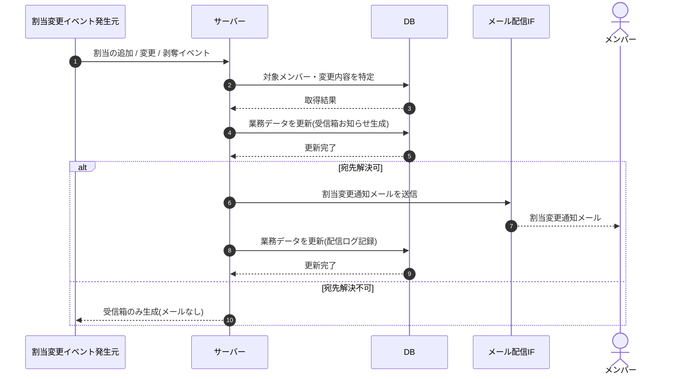

# SEQ-094: メンバー割当変更通知

> **このページは、業務ユースケース UC-061（メンバー割当変更通知）のシーケンス図を定義します。**

| ID | シーケンス名 |
|----|----|
| SEQ-094 | メンバー割当変更通知 |

| 関連項目 | 内容 |
|----|----| 
| 業務ユースケース | [UC-061](../../01_requirements/04_business_usecases/UC-061.md#UC-061) |
| イベント | — |
| 関連画面 | — |
| 関連API | [API-020](../02_backend/03_apis/API-020.md#API-020) / [API-058](../02_backend/03_apis/API-058.md#API-058) |
| テーブル | [TBL-022](../02_backend/04_database/TBL-022.md#TBL-022) / [TBL-026](../02_backend/04_database/TBL-026.md#TBL-026) |
| エラー(ERR) | — |
| メッセージ(MSG) | — |

## 概要

メンバーのプロジェクト別役割割当が追加・変更・剥奪されたことを契機に、当該メンバーへお知らせ受信箱(「運営お知らせ」種別・「通常」重要度)とメールで変更を通知する。宛先が解決できない場合は受信箱のみ生成し、メール送信は行わない。

## シーケンス図

## 例外フロー

- **宛先解決不可**: 対象メンバーの通知宛先が解決できない場合は受信箱お知らせのみ生成し、メール送信は行わない。
- **メール配信失敗**: 受信箱お知らせは生成済みとし、メール送信失敗は配信ログに失敗として記録する。再送は通知再送ユースケースが扱う。

## 備考

- 本図は基本設計レベルの抽象度(ユーザー / 画面 / サーバー、システム起点は外部システム・スケジューラ・バッチを加える)で記述する。DB 操作は DB アクターへのメッセージで表し、テーブル別 CRUD は本図に書かず 関連テーブル 欄で示す。
- 図の出典は業務ユースケース [UC-061](../../01_requirements/04_business_usecases/UC-061.md#UC-061)。画面イベントとの対応は UC-061 を参照。
