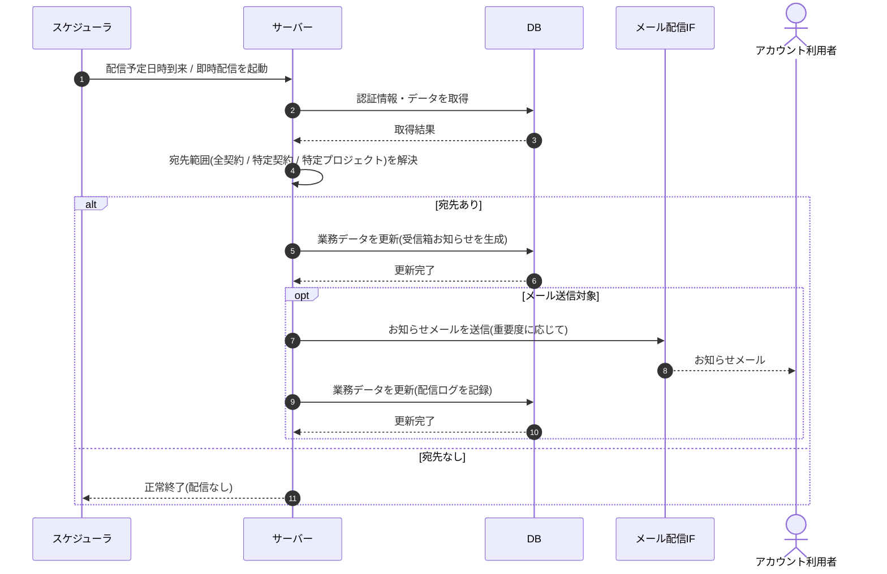

# SEQ-094: 運営お知らせ配信

> **このページは、業務ユースケース UC-063（運営お知らせ配信）のシーケンス図を定義します。**

## 項目

| 項目 | 内容 |
|---|---|
| SEQ ID | `SEQ-094` |
| 対応業務ユースケース | [UC-063](../../01_requirements/04_business_usecases/UC-063.md#UC-063) |
| 業務要件 (BR) | [BR-076](../../01_requirements/01_business_requirement/05_notification-br.md#BR-076) ・ [BR-078](../../01_requirements/01_business_requirement/05_notification-br.md#BR-078) ・ [BR-108](../../01_requirements/01_business_requirement/05_notification-br.md#BR-108) ・ [BR-111](../../01_requirements/01_business_requirement/05_notification-br.md#BR-111) |
| 機能要件 (FR) | [FR-122](../../01_requirements/02_functional_requirement/05_notification-fr.md#FR-122) ・ [FR-155](../../01_requirements/02_functional_requirement/05_notification-fr.md#FR-155) |
| 画面イベント (EVT) | — |
| 関連画面 | — |
| 関連 API | [API-048](../02_backend/03_apis/API-048.md#API-048) ・ [API-058](../02_backend/03_apis/API-058.md#API-058) |
| 関連テーブル | [TBL-010](../02_backend/04_database/TBL-010.md#TBL-010) ・ [TBL-022](../02_backend/04_database/TBL-022.md#TBL-022) ・ [TBL-026](../02_backend/04_database/TBL-026.md#TBL-026) |
| エラー (ERR) | — |
| メッセージ (MSG) | [MSG-012](../06_messages/MSG-012.md#MSG-012) |

## 概要

配信予定日時の到来または即時配信イベントを契機に、運営お知らせを対象範囲のアカウント利用者へ受信箱お知らせとして生成し、重要度に応じてメールを送信する。対象が存在しなければ生成・送信を行わず正常終了する。

## シーケンス図

## 例外フロー

- **宛先なし**: 該当するアカウント利用者が存在しない場合は受信箱生成・メール送信を行わず正常終了する。
- **メール配信失敗**: 受信箱お知らせは生成済みとし、メール送信失敗は配信ログへ失敗として記録する。再送は別ユースケースが扱う。
- **抑制リスト該当宛先**: バウンス / 苦情で抑制対象の宛先へはメールを送らず、受信箱お知らせのみ生成する。

## 備考

- 本図は基本設計レベルの抽象度(ユーザー / 画面 / サーバー、システム起点は外部システム・スケジューラ・バッチを加える)で記述する。DB 操作は DB アクターへのメッセージで表し、テーブル別 CRUD は本図に書かず 関連テーブル 欄で示す。
- 図の出典は業務ユースケース [UC-063](../../01_requirements/04_business_usecases/UC-063.md#UC-063)。画面イベントとの対応は UC-063 を参照。
