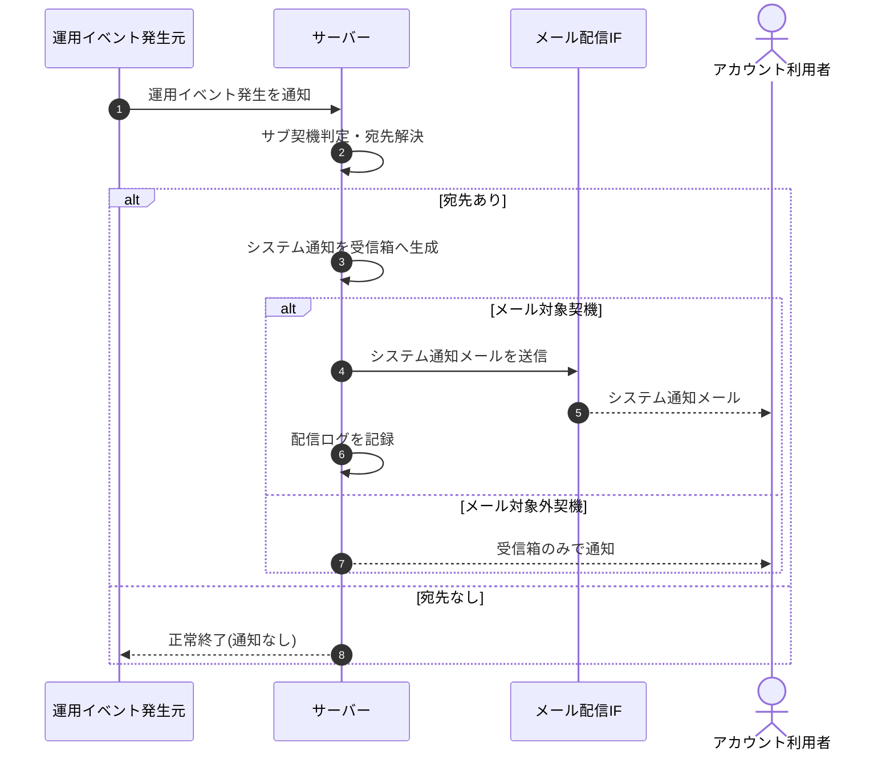

# SEQ-095: 運用イベントのシステム通知自動生成

> **このページは、業務ユースケース UC-065（運用イベントのシステム通知自動生成）のシーケンス図を定義します。**

*版数 v2.0 ・ 更新 2026-06-23 ・ ステータス ドラフト*

## 項目

| 項目 | 内容 |
|---|---|
| SEQ ID | `SEQ-095` |
| 対応業務ユースケース | [UC-065](../../01_requirements/04_business_usecases/UC-065.md#UC-065) |
| 業務要件 (BR) | [BR-076](../../01_requirements/01_business_requirement/05_notification-br.md#BR-076) ・ [BR-080](../../01_requirements/01_business_requirement/05_notification-br.md#BR-080) ・ [BR-111](../../01_requirements/01_business_requirement/05_notification-br.md#BR-111) ・ [BR-112](../../01_requirements/01_business_requirement/05_notification-br.md#BR-112) |
| 機能要件 (FR) | [FR-123](../../01_requirements/02_functional_requirement/05_notification-fr.md#FR-123) ・ [FR-113](../../01_requirements/02_functional_requirement/05_notification-fr.md#FR-113) |
| 画面イベント (EVT) | — |
| 関連画面 | — |
| 関連 API | [API-048](../02_backend/03_apis/API-048.md#API-048) ・ [API-058](../02_backend/03_apis/API-058.md#API-058) |
| 関連テーブル | [TBL-022](../02_backend/04_database/TBL-022.md#TBL-022) ・ [TBL-026](../02_backend/04_database/TBL-026.md#TBL-026) |
| エラー (ERR) | — |
| メッセージ (MSG) | [MSG-013](../06_messages/MSG-013.md#MSG-013) |

## 概要

運用イベント(利用上限接近・AI 利用上限到達・通知失敗急増・サスペンション・復元・規約改定・価格改定 等)の発生を契機に、対象アカウント利用者の受信箱へ「システム通知」のお知らせを自動生成し、メール対象の契機ではシステム通知メールも送信して配信ログを記録する。

## シーケンス図

## 例外フロー

- **宛先なし**: 対象アカウント利用者が解決できない場合は通知を生成せず、正常終了する。
- **メール配信失敗**: 受信箱お知らせは生成済みとし、メール送信失敗は配信ログに失敗として記録する(再送は通知再送ユースケースが扱う)。

## 備考

- 本図は基本設計レベルの抽象度(ユーザー / 画面 / サーバー、システム起点は外部システム・スケジューラ・バッチを加える)で記述する。DB 操作はサーバー自己メッセージで表し、テーブル別 CRUD は本図に書かず 関連テーブル 欄で示す。
- 図の出典は業務ユースケース [UC-065](../../01_requirements/04_business_usecases/UC-065.md#UC-065)。画面イベントとの対応は UC-065 を参照。
