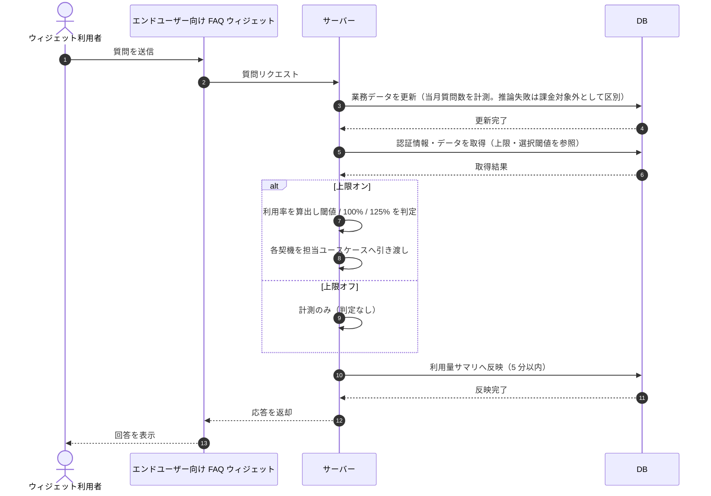

# SEQ-096: 利用量リアルタイム集計・UI 反映

> **このページは、業務ユースケース UC-051（利用量リアルタイム集計・UI 反映）のシーケンス図を定義します。**

| ID | 業務ユースケースID | イベント(画面ID EVT-NN) | テーブルID |
|----|----|----|----|
| SEQ-096 | [UC-051](../../01_requirements/04_business_usecases/UC-051.md#UC-051) | — | [TBL-006](../02_backend/04_database/TBL-006.md#TBL-006) ・ [TBL-009](../02_backend/04_database/TBL-009.md#TBL-009) ・ [TBL-017](../02_backend/04_database/TBL-017.md#TBL-017) ・ [TBL-020](../02_backend/04_database/TBL-020.md#TBL-020) ・ [TBL-025](../02_backend/04_database/TBL-025.md#TBL-025) ・ [TBL-026](../02_backend/04_database/TBL-026.md#TBL-026) |

## 概要

ウィジェット利用者の質問送信到達を契機に、サーバーが利用量をリアルタイムに計測し、上限オンのプロジェクトでは利用率に応じてアラート閾値・100% 停止・125% の各契機を判定する。集計結果は管理画面向け利用量サマリへ 5 分以内に反映される。

## シーケンス図

## 例外フロー

- **入力不正**: 必須パラメータ不足など要求が不正な場合はエラーを返す（[ERR-001](../05_errors/ERR-001.md#ERR-001)）。
- **権限なし**: 管理画面サマリ参照時に当該プロジェクトへの権限がない場合は拒否する（[ERR-019](../05_errors/ERR-019.md#ERR-019)）。
- **上限オフ**: 質問数上限がオフのプロジェクトは利用率算出・閾値判定・停止を行わず、計測のみ行う。
- **推論失敗**: 推論失敗の質問はカウントするが課金対象外として区別して保持し、請求集計から除外する。

## 備考

- 本図は基本設計レベルの抽象度(ユーザー / 画面 / サーバー、システム起点は外部システム・スケジューラ・バッチを加える)で記述する。DB 操作は DB アクターへのメッセージで表し、テーブル別 CRUD は本図に書かず 関連テーブル 欄で示す。
- 図の出典は業務ユースケース [UC-051](../../01_requirements/04_business_usecases/UC-051.md#UC-051)。画面イベントとの対応は UC-051 を参照。
