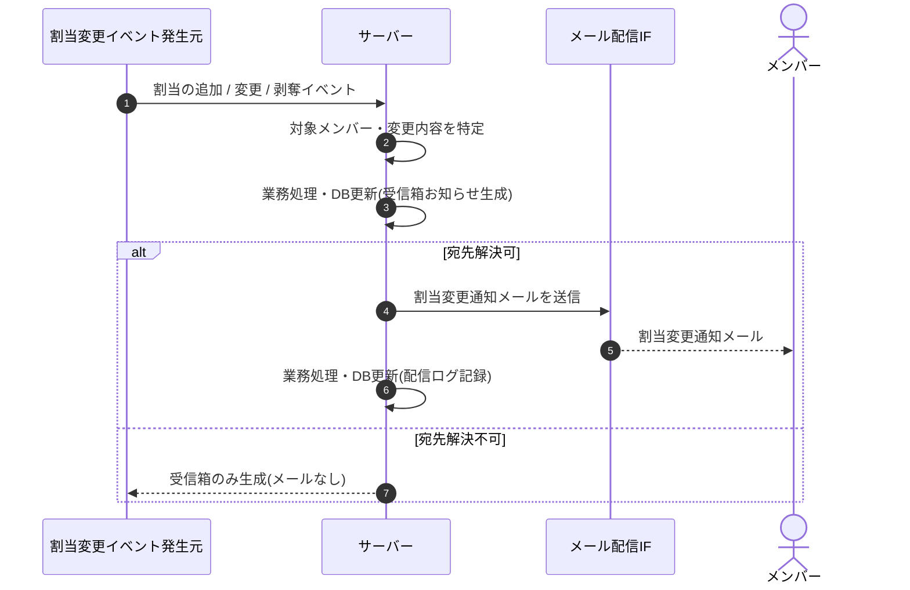

<!-- portal-top -->
[設計ポータル](../../README.md) ／ [基本設計](../index.md) ／ [シーケンス設計](index.md) ／ **SEQ-096: メンバー割当変更通知**
<!-- /portal-top -->

# SEQ-096: メンバー割当変更通知

> **このページは、業務ユースケース UC-066（メンバー割当変更通知）のシーケンス図を定義します。**

*版数 v2.0 ・ 更新 2026-06-23 ・ ステータス ドラフト*

## 項目

| 項目 | 内容 |
|---|---|
| SEQ ID | `SEQ-096` |
| 対応業務ユースケース | [UC-066](../../01_requirements/04_business_usecases/UC-066.md#UC-066) |
| 業務要件 (BR) | [BR-079](../../01_requirements/01_business_requirement/05_notification-br.md#BR-079) ・ [BR-076](../../01_requirements/01_business_requirement/05_notification-br.md#BR-076) ・ [BR-111](../../01_requirements/01_business_requirement/05_notification-br.md#BR-111) |
| 機能要件 (FR) | [FR-125](../../01_requirements/02_functional_requirement/05_notification-fr.md#FR-125) ・ [FR-014](../../01_requirements/02_functional_requirement/01_account-fr.md#FR-014) ・ [FR-013](../../01_requirements/02_functional_requirement/01_account-fr.md#FR-013) ・ [FR-016](../../01_requirements/02_functional_requirement/01_account-fr.md#FR-016) ・ [FR-017](../../01_requirements/02_functional_requirement/01_account-fr.md#FR-017) ・ [FR-035](../../01_requirements/02_functional_requirement/01_account-fr.md#FR-035) |
| 画面イベント (EVT) | — |
| 関連画面 | — |
| 関連 API | [API-020](../02_backend/03_apis/API-020.md#API-020) ・ [API-058](../02_backend/03_apis/API-058.md#API-058) |
| 関連テーブル | [TBL-022](../02_backend/04_database/TBL-022.md#TBL-022) ・ [TBL-026](../02_backend/04_database/TBL-026.md#TBL-026) |
| エラー (ERR) | — |
| メッセージ (MSG) | — |

## 概要

メンバーのプロジェクト別役割割当が追加・変更・剥奪されたことを契機に、当該メンバーへお知らせ受信箱(「運営お知らせ」種別・「通常」重要度)とメールで変更を通知する。宛先が解決できない場合は受信箱のみ生成し、メール送信は行わない。

## シーケンス図

## 例外フロー

- **宛先解決不可**: 対象メンバーの通知宛先が解決できない場合は受信箱お知らせのみ生成し、メール送信は行わない。
- **メール配信失敗**: 受信箱お知らせは生成済みとし、メール送信失敗は配信ログに失敗として記録する。再送は通知再送ユースケースが扱う。

## 備考

- 本図は基本設計レベルの抽象度(ユーザー / 画面 / サーバー、システム起点は外部システム・スケジューラ・バッチを加える)で記述する。DB 操作はサーバー自己メッセージで表し、テーブル別 CRUD は本図に書かず 関連テーブル 欄で示す。
- 図の出典は業務ユースケース [UC-066](../../01_requirements/04_business_usecases/UC-066.md#UC-066)。画面イベントとの対応は UC-066 を参照。

---

<!-- portal-bottom -->
[← シーケンス設計](index.md) ・ [基本設計](../index.md) ・ [↑ 設計ポータル](../../README.md)
<!-- /portal-bottom -->
