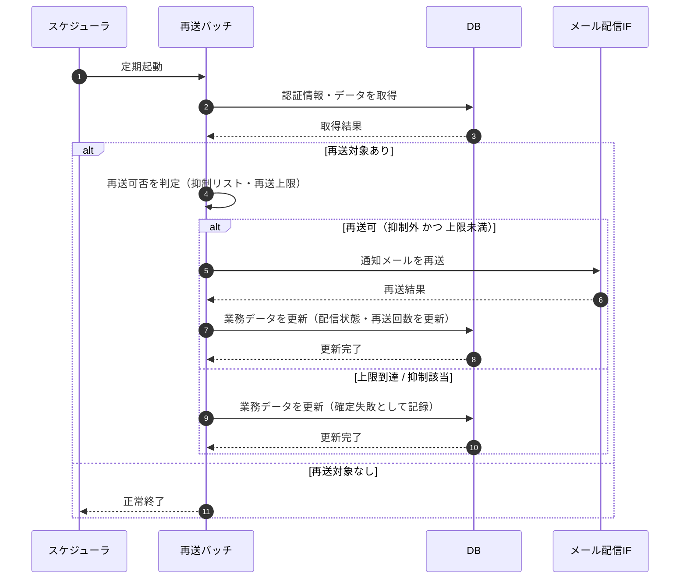

# SEQ-096: 通知再送

> **このページは、業務ユースケース UC-062（通知再送）のシーケンス図を定義します。**

| ID | シーケンス名 |
|----|----|
| SEQ-096 | 通知再送 |

| 関連項目 | 内容 |
|----|----| 
| 業務ユースケース | [UC-062](../../01_requirements/04_business_usecases/UC-062.md#UC-062) |
| イベント | — |
| 関連画面 | — |
| 関連API | [API-058](../02_backend/03_apis/API-058.md#API-058) |
| テーブル | [TBL-026](../02_backend/04_database/TBL-026.md#TBL-026) |
| エラー(ERR) | [ERR-001](../05_errors/ERR-001.md#ERR-001) / [ERR-019](../05_errors/ERR-019.md#ERR-019) |
| メッセージ(MSG) | — |

## 概要

スケジューラが定期起動する再送バッチが、配信に失敗した通知メールを検出し、抑制リスト該当外かつ再送上限未満の対象を上限の範囲内で再送する。再送結果に応じて配信状態と再送回数を更新し、上限到達分・抑制該当分は確定失敗として記録する。

## シーケンス図

## 例外フロー

- **再送上限到達**: 再送回数が上限に到達した対象は再送せず、確定失敗として記録する。
- **抑制リスト該当**: 抑制リスト（バウンス / 苦情）に載った宛先は再送しない。
- **再送も失敗**: 再送が失敗した対象は再送回数を加算し、上限未到達なら次回バッチで再評価する。

## 備考

- 本図は基本設計レベルの抽象度（ユーザー / 画面 / サーバー、システム起点は外部システム・スケジューラ・バッチを加える）で記述する。DB 操作は DB アクターへのメッセージで表し、テーブル別 CRUD は本図に書かず 関連テーブル 欄で示す。
- 図の出典は業務ユースケース [UC-062](../../01_requirements/04_business_usecases/UC-062.md#UC-062)。画面イベントとの対応は UC-062 を参照。
