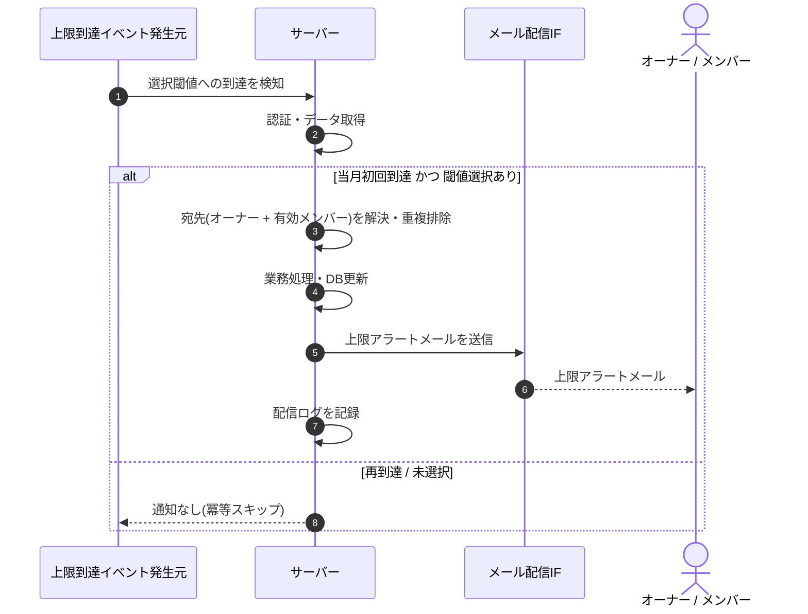

# SEQ-097: 質問数上限アラート通知

> **このページは、業務ユースケース UC-057（質問数上限アラート通知）のシーケンス図を定義します。**

## 項目

| 項目 | 内容 |
|---|---|
| SEQ ID | `SEQ-097` |
| 対応業務ユースケース | [UC-057](../../01_requirements/04_business_usecases/UC-057.md#UC-057) |
| 業務要件 (BR) | [BR-063](../../01_requirements/01_business_requirement/03_usage-br.md#BR-063) |
| 機能要件 (FR) | [FR-094](../../01_requirements/02_functional_requirement/03_usage-fr.md#FR-094) ・ [FR-093](../../01_requirements/02_functional_requirement/03_usage-fr.md#FR-093) |
| 画面イベント (EVT) | — |
| 関連画面 | — |
| 関連 API | [API-046](../02_backend/03_apis/API-046.md#API-046) ・ [API-058](../02_backend/03_apis/API-058.md#API-058) |
| 関連テーブル | [TBL-009](../02_backend/04_database/TBL-009.md#TBL-009) ・ [TBL-020](../02_backend/04_database/TBL-020.md#TBL-020) ・ [TBL-022](../02_backend/04_database/TBL-022.md#TBL-022) ・ [TBL-026](../02_backend/04_database/TBL-026.md#TBL-026) |
| エラー (ERR) | — |
| メッセージ (MSG) | [MSG-013](../06_messages/MSG-013.md#MSG-013) |

## 概要

プロジェクトの当月質問数が選択された上限アラート閾値へ当月初回到達したことを契機に、オーナーと有効メンバーへアラートメールと受信箱お知らせを送信する。同一プロジェクト・同一請求月・同一閾値の通知は受信者ごとに 1 回で、二重通知を発生させない。

## シーケンス図

## 例外フロー

- **当月再到達**: 同一プロジェクト・同一請求月・同一閾値で既に通知済みの場合は、通知せず冪等にスキップする。
- **全閾値未選択**: アラート閾値が一つも選択されていない場合は通知しない（受付停止判定は別途行う）。
- **メール配信失敗**: 受信箱お知らせは生成済みとし、メール送信失敗は配信ログに失敗として記録する。再送は通知再送が扱う。

## 詳細設計への移管候補

| 内容 | 移管先候補 | 理由 |
|---|---|---|
| 当月初回到達判定の冪等性キー（プロジェクト・請求月・閾値の組） | 詳細設計 | 基本設計では分岐条件として表し、キー構成・重複判定の実装は詳細設計へ委ねる |
| 宛先の重複排除（ユーザー ID と正規化メールアドレス） | 詳細設計 | 宛先解決の内部ロジックは基本設計の抽象度を超えるため |

## 備考

- 本図は基本設計レベルの抽象度(ユーザー / 画面 / サーバー、システム起点は外部システム・スケジューラ・バッチを加える)で記述する。DB 操作はサーバー自己メッセージで表し、テーブル別 CRUD は本図に書かず 関連テーブル 欄で示す。
- 図の出典は業務ユースケース [UC-057](../../01_requirements/04_business_usecases/UC-057.md#UC-057)。画面イベントとの対応は UC-057 を参照。
