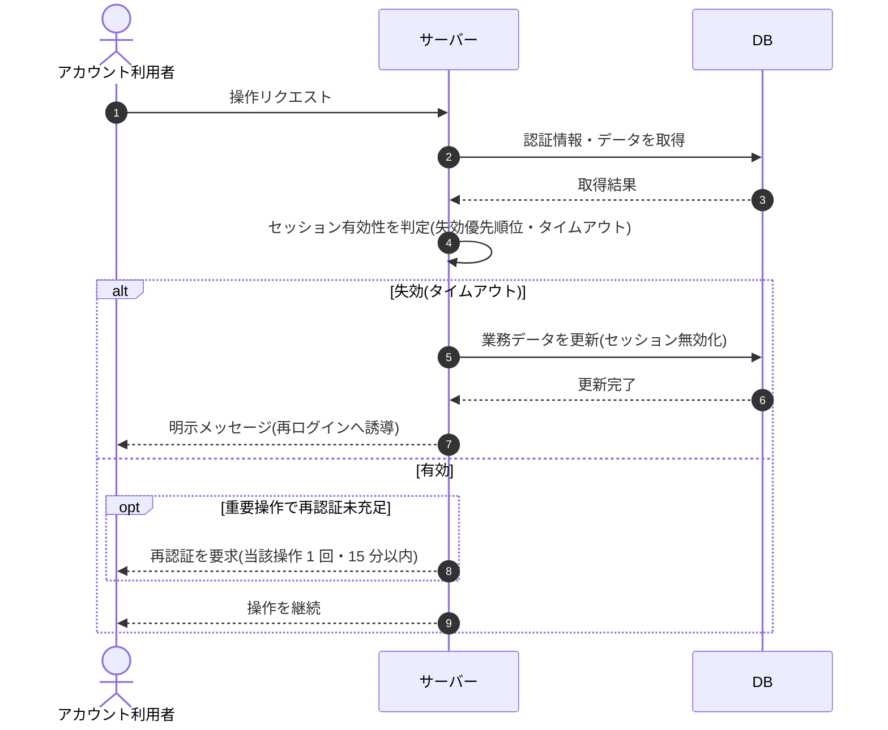

# SEQ-100: セッション失効・再認証

> **このページは、業務ユースケース UC-067（セッション失効・再認証）のシーケンス図を定義します。**

| ID | シーケンス名 |
|----|----|
| SEQ-100 | セッション失効・再認証 |

| 関連項目 | 内容 |
|----|----| 
| 業務ユースケース | [UC-067](../../01_requirements/04_business_usecases/UC-067.md#UC-067) |
| イベント | — |
| 関連画面 | — |
| 関連API | [API-002](../02_backend/03_apis/API-002.md#API-002) / [API-003](../02_backend/03_apis/API-003.md#API-003) |
| テーブル | [TBL-013](../02_backend/04_database/TBL-013.md#TBL-013) |
| エラー(ERR) | [ERR-002](../05_errors/ERR-002.md#ERR-002) / [ERR-003](../05_errors/ERR-003.md#ERR-003) / [ERR-004](../05_errors/ERR-004.md#ERR-004) |
| メッセージ(MSG) | — |

## 概要

アカウント利用者の操作リクエストを契機に、失効の優先順位とタイムアウト（無操作・絶対）に従ってセッションの有効性を判定する。失効済みは無効化して再ログインへ誘導し、有効でも重要操作で再認証が未充足なら再認証を要求する。

## シーケンス図

## 例外フロー

- **同時失効**: 操作実行中にセッションが失効した場合は当該操作を許可せず、明示メッセージで再ログインへ誘導する。
- **再認証期限切れ**: 再認証が 15 分を超過、または別操作で消費済みの場合は再認証未充足として要求する。

## 備考

- 本図は基本設計レベルの抽象度(ユーザー / 画面 / サーバー、システム起点は外部システム・スケジューラ・バッチを加える)で記述する。DB 操作は DB アクターへのメッセージで表し、テーブル別 CRUD は本図に書かず 関連テーブル 欄で示す。
- 図の出典は業務ユースケース [UC-067](../../01_requirements/04_business_usecases/UC-067.md#UC-067)。画面イベントとの対応は UC-067 を参照。
