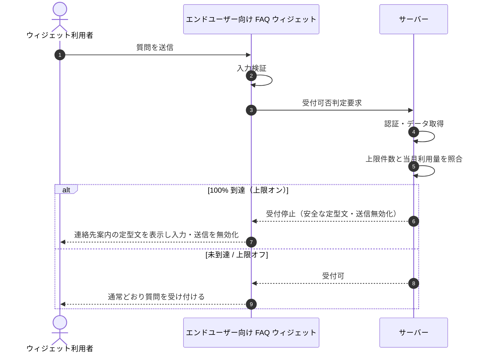

<!-- portal-top -->
[設計ポータル](../../README.md) ／ [基本設計](../index.md) ／ [シーケンス設計](index.md) ／ **SEQ-100: 上限到達ウィジェット受付停止**
<!-- /portal-top -->

# SEQ-100: 上限到達ウィジェット受付停止

> **このページは、業務ユースケース UC-058（上限到達ウィジェット受付停止）のシーケンス図を定義します。**

*版数 v2.0 ・ 更新 2026-06-23 ・ ステータス ドラフト*

## 項目

| 項目 | 内容 |
|---|---|
| SEQ ID | `SEQ-100` |
| 対応業務ユースケース | [UC-058](../../01_requirements/04_business_usecases/UC-058.md#UC-058) |
| 業務要件 (BR) | [BR-062](../../01_requirements/01_business_requirement/03_usage-br.md#BR-062) |
| 機能要件 (FR) | [FR-089](../../01_requirements/02_functional_requirement/03_usage-fr.md#FR-089) ・ [FR-087](../../01_requirements/02_functional_requirement/03_usage-fr.md#FR-087) |
| 画面イベント (EVT) | — |
| 関連画面 | [SCR-030](../01_frontend/01_screens/SCR-030.md#SCR-030) |
| 関連 API | [API-046](../02_backend/03_apis/API-046.md#API-046) |
| 関連テーブル | [TBL-009](../02_backend/04_database/TBL-009.md#TBL-009) ・ [TBL-020](../02_backend/04_database/TBL-020.md#TBL-020) |
| エラー (ERR) | — |
| メッセージ (MSG) | — |

## 概要

ウィジェット利用者の質問送信検証時に、当該プロジェクトの月次質問数が上限件数の 100% に到達しているかをサーバーが判定する。到達済みなら新規受付を停止して安全な定型文を返し入力・送信を無効化する一方、契約は `active` を維持し、未到達・上限オフなら通常どおり受け付ける。

## シーケンス図

## 例外フロー

- **上限オフ / 未到達**: 上限がオフ、または 100% 未到達のプロジェクトは受付を停止せず通常受付する。
- **集計遅延（100% 超検知）**: 集計遅延・誤差で 100% 超を検知した場合も受付は停止のままとし、最終ガードの追加通知契機へ引き渡す。

## 備考

- 本図は基本設計レベルの抽象度（ユーザー / 画面 / サーバー、システム起点は外部システム・スケジューラ・バッチを加える）で記述する。DB 操作はサーバー自己メッセージで表し、テーブル別 CRUD は本図に書かず 関連テーブル 欄で示す。
- 図の出典は業務ユースケース [UC-058](../../01_requirements/04_business_usecases/UC-058.md#UC-058)。画面イベントとの対応は UC-058 を参照。

---

<!-- portal-bottom -->
[← シーケンス設計](index.md) ・ [基本設計](../index.md) ・ [↑ 設計ポータル](../../README.md)
<!-- /portal-bottom -->
