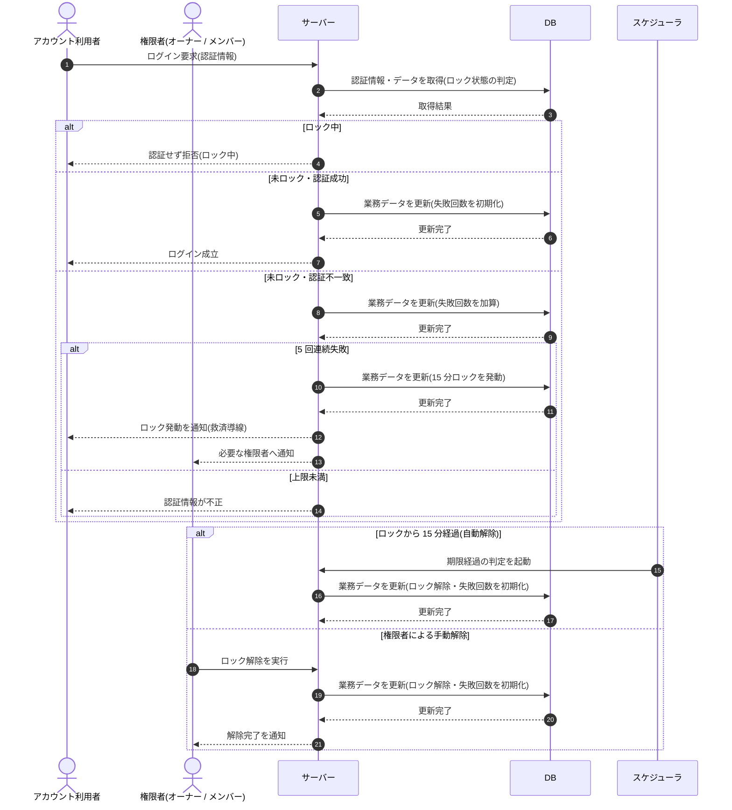

# SEQ-100: ログイン失敗ロックアウト・解除

> **このページは、業務ユースケース UC-068（ログイン失敗ロックアウト・解除）のシーケンス図を定義します。**

| ID | シーケンス名 |
|----|----|
| SEQ-100 | ログイン失敗ロックアウト・解除 |

| 関連項目 | 内容 |
|----|----| 
| 業務ユースケース | [UC-068](../../01_requirements/04_business_usecases/UC-068.md#UC-068) |
| イベント | — |
| 関連画面 | — |
| 関連API | [API-002](../02_backend/03_apis/API-002.md#API-002) |
| テーブル | — |
| エラー(ERR) | [ERR-002](../05_errors/ERR-002.md#ERR-002) / [ERR-003](../05_errors/ERR-003.md#ERR-003) / [ERR-004](../05_errors/ERR-004.md#ERR-004) |
| メッセージ(MSG) | [MSG-005](../06_messages/MSG-005.md#MSG-005) |

## 概要

連続ログイン失敗による総当たり攻撃を 5 回 / 15 分のロックで抑止し、ロック中の到達は認証せず拒否する。ロックは時間経過の自動解除または権限者の手動解除で解け、解除後は失敗回数を初期化して試行を再受付する。

## シーケンス図

## 例外フロー

- ロック中に追加のログイン試行が到達しても認証は行わず、一律にロック中として拒否する。
- 解除直後に再び 5 回連続失敗した場合は、改めて 15 分のロックを発動する。

## 備考

- 本図は基本設計レベルの抽象度(ユーザー / 画面 / サーバー、システム起点は外部システム・スケジューラ・バッチを加える)で記述する。DB 操作は DB アクターへのメッセージで表し、テーブル別 CRUD は本図に書かず 関連テーブル 欄で示す。
- 図の出典は業務ユースケース [UC-068](../../01_requirements/04_business_usecases/UC-068.md#UC-068)。画面イベントとの対応は UC-068 を参照。
