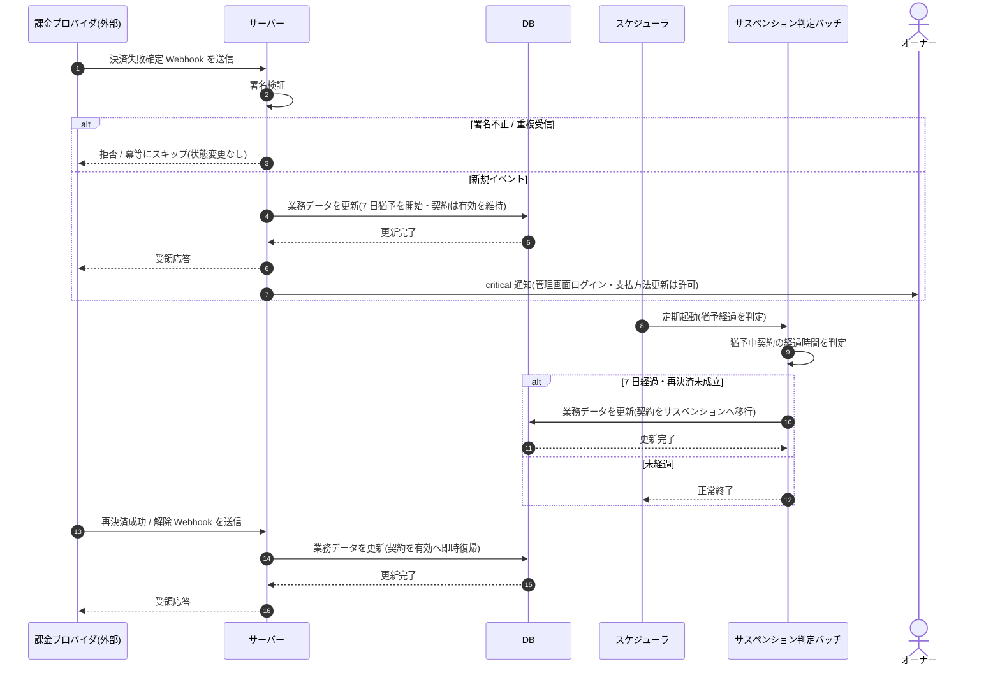

# SEQ-101: 決済失敗→猶予→サスペンション

> **このページは、業務ユースケース UC-059（決済失敗→猶予→サスペンション）のシーケンス図を定義します。**

## 項目

| 項目 | 内容 |
|---|---|
| SEQ ID | `SEQ-101` |
| トレーサビリティID | [TR-059](../00_traceability/index.md#TR-059) |
| 画面イベント (EVT) | — |
| 関連画面 | — |
| 関連 API | [API-045](../02_backend/03_apis/API-045.md#API-045) |
| 関連テーブル | [TBL-002](../02_backend/04_database/TBL-002.md#TBL-002) |
| エラー (ERR) | [ERR-001](../05_errors/ERR-001.md#ERR-001) ・ [ERR-017](../05_errors/ERR-017.md#ERR-017) ・ [ERR-030](../05_errors/ERR-030.md#ERR-030) |
| メッセージ (MSG) | [MSG-008](../06_messages/MSG-008.md#MSG-008) ・ [MSG-009](../06_messages/MSG-009.md#MSG-009) |

## 概要

課金プロバイダからの決済失敗確定 Webhook を起点に 7 日間の猶予を開始し、スケジューラ起動のバッチが猶予経過を判定して再決済未成立の契約を `suspended` へ移行する。再決済成功 / 解除の Webhook を受けた時点で契約は `active` へ即時復帰する。

## シーケンス図

## 例外フロー

- **署名検証失敗**: 受信イベントを処理せず拒否し、契約状態・猶予を変更しない。
- **重複受信**: 同一イベントの再受信は冪等性キー `(provider, event_id)`([TBL-032](../02_backend/04_database/TBL-032.md#TBL-032) の一意制約 `uq_billing_wh_event` を正本)で重複と判定し、受信記録のみ残して猶予開始・状態遷移を重複適用しない(取込スキップ)。詳細は [SYS-006](../02_backend/01_system/SYS-006.md#SYS-006) を参照。
- **猶予中の再決済成功**: 7 日経過前に再決済成功の通知を受けた場合はサスペンションへ移行せず、猶予を解除して有効を維持する。

## 詳細設計への移管候補

| 内容 | 移管先候補 | 理由 |
|---|---|---|
| 冪等性キー `(provider, event_id)` の境界近傍(ほぼ同時の重複到達)での競合制御 | 詳細設計 | キー自体は基本設計で確定([TBL-032](../02_backend/04_database/TBL-032.md#TBL-032) `uq_billing_wh_event`)。一意制約違反時の競合解決・リトライ方式は実装で確定する |
| 猶予経過判定バッチの走査単位・実行間隔 | 詳細設計 | 基本設計では定期起動とし、対象抽出条件・バッチ周期は実装で確定する |

## 備考

- 本図は基本設計レベルの抽象度(ユーザー / 画面 / サーバー、システム起点は外部システム・スケジューラ・バッチを加える)で記述する。DB 操作は DB アクターへのメッセージで表し、テーブル別 CRUD は本図に書かず 関連テーブル 欄で示す。
- 図の出典は業務ユースケース [UC-059](../../01_requirements/04_business_usecases/UC-059.md#UC-059)。画面イベントとの対応は UC-059 を参照。
