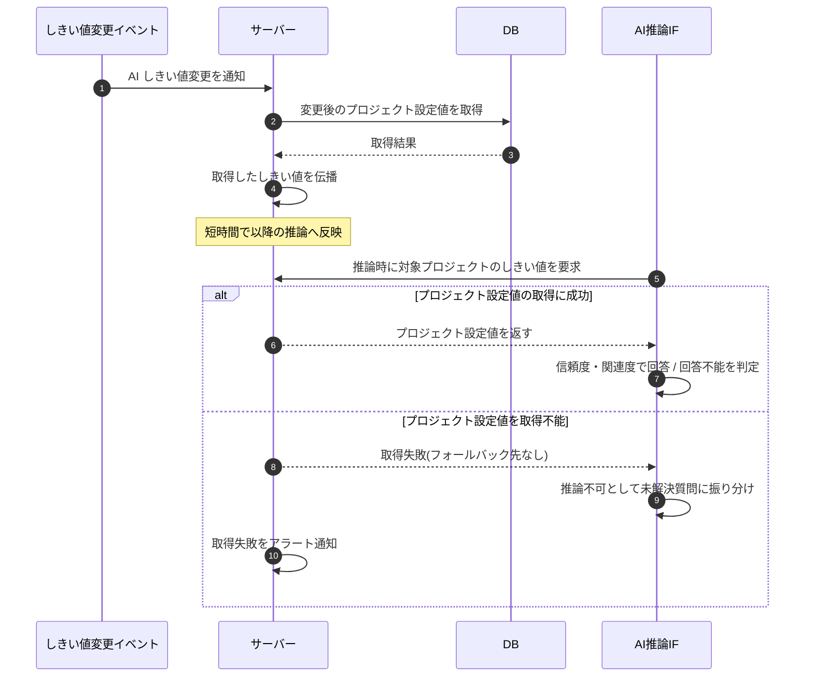

# SEQ-102: AI しきい値変更の伝播・フォールバック

> **このページは、業務ユースケース UC-047（AI しきい値変更の伝播・フォールバック）のシーケンス図を定義します。**

| ID | 業務ユースケースID | イベント(画面ID EVT-NN) | テーブルID |
|----|----|----|----|
| SEQ-102 | [UC-047](../../01_requirements/04_business_usecases/UC-047.md#UC-047) | — | [TBL-004](../02_backend/04_database/TBL-004.md#TBL-004) ・ [TBL-031](../02_backend/04_database/TBL-031.md#TBL-031) |

## 概要

プロジェクトの AI しきい値が変更されると伝播処理がサーバーへ反映し、以降の推論は対象プロジェクトの設定値を参照して回答 / 回答不能を判定する。しきい値は作成時必須でフォールバック先を持たないため、プロジェクト設定値を取得できない場合は推論不可として扱い、取得失敗時はアラート通知する。

## シーケンス図

## 例外フロー

- プロジェクト設定値を取得できないときは、フォールバック先がないため回答可否判定を行わず推論不可として扱い、未解決質問に振り分ける。
- 取得失敗時はアラート通知する。

## 詳細設計への移管候補

| 内容 | 移管先候補 | 理由 |
|---|---|---|
| しきい値キャッシュの具体的な伝播方式・反映遅延の上限 | 詳細設計 | 基本設計では「短時間で伝播」の抽象度に留め、配信機構の実装は詳細設計で定める |
| 取得失敗時の推論不可振り分けの具体手順(reason code 等) | 詳細設計 | 基本設計では「推論不可として未解決質問に振り分け」の抽象度に留め、内部表現は詳細設計で定める |

## 備考

- 本図は基本設計レベルの抽象度(ユーザー / 画面 / サーバー、システム起点は外部システム・スケジューラ・バッチを加える)で記述する。DB 操作は DB アクターへのメッセージで表し、テーブル別 CRUD は本図に書かず 関連テーブル 欄で示す。
- 図の出典は業務ユースケース [UC-047](../../01_requirements/04_business_usecases/UC-047.md#UC-047)。画面イベントとの対応は UC-047 を参照。
