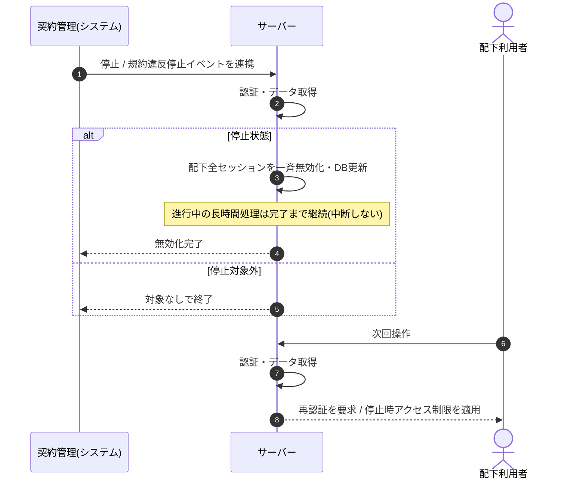

<!-- portal-top -->
[設計ポータル](../../README.md) ／ [基本設計](../index.md) ／ [シーケンス設計](index.md) ／ **SEQ-104: 契約停止時セッション一斉無効化**
<!-- /portal-top -->

# SEQ-104: 契約停止時セッション一斉無効化

> **このページは、業務ユースケース UC-074（契約停止時セッション一斉無効化）のシーケンス図を定義します。**

*版数 v2.0 ・ 更新 2026-06-23 ・ ステータス ドラフト*

## 項目

| 項目 | 内容 |
|---|---|
| SEQ ID | `SEQ-104` |
| 対応業務ユースケース | [UC-074](../../01_requirements/04_business_usecases/UC-074.md#UC-074) |
| 業務要件 (BR) | 要確認 |
| 機能要件 (FR) | [FR-011](../../01_requirements/02_FunctionalRequirement/01_account-fr.md#FR-011) ・ [FR-008](../../01_requirements/02_FunctionalRequirement/01_account-fr.md#FR-008) |
| 画面イベント (EVT) | — |
| 関連画面 | — |
| 関連 API | [API-003](../02_backend/03_apis/API-003.md#API-003) |
| 関連テーブル | [TBL-002](../02_backend/04_database/TBL-002.md#TBL-002) ・ [TBL-013](../02_backend/04_database/TBL-013.md#TBL-013) |
| エラー (ERR) | — |
| メッセージ (MSG) | 要確認 |

## 概要

契約の停止（手動停止 / 規約違反停止）イベントを契機に、配下利用者の全セッションを速やかに一斉無効化する。進行中の長時間処理は中断せず完了まで継続させ、停止後の次回操作で再認証を要求し停止時アクセス制限を適用する。

## シーケンス図

## 例外フロー

- 一斉無効化の進行中に配下利用者の操作が到達しても、無効化済みのセッションでは再認証が要求される。
- 無効化時点で進行中の長時間処理は中断せず、完了後の次回操作で再認証を要求する。

## 備考

- 本図は基本設計レベルの抽象度(ユーザー / 画面 / サーバー、システム起点は外部システム・スケジューラ・バッチを加える)で記述する。DB 操作はサーバー自己メッセージで表し、テーブル別 CRUD は本図に書かず 関連テーブル 欄で示す。
- 図の出典は業務ユースケース [UC-074](../../01_requirements/04_business_usecases/UC-074.md#UC-074)。画面イベントとの対応は UC-074 を参照。

---

<!-- portal-bottom -->
[← シーケンス設計](index.md) ・ [基本設計](../index.md) ・ [↑ 設計ポータル](../../README.md)
<!-- /portal-bottom -->
