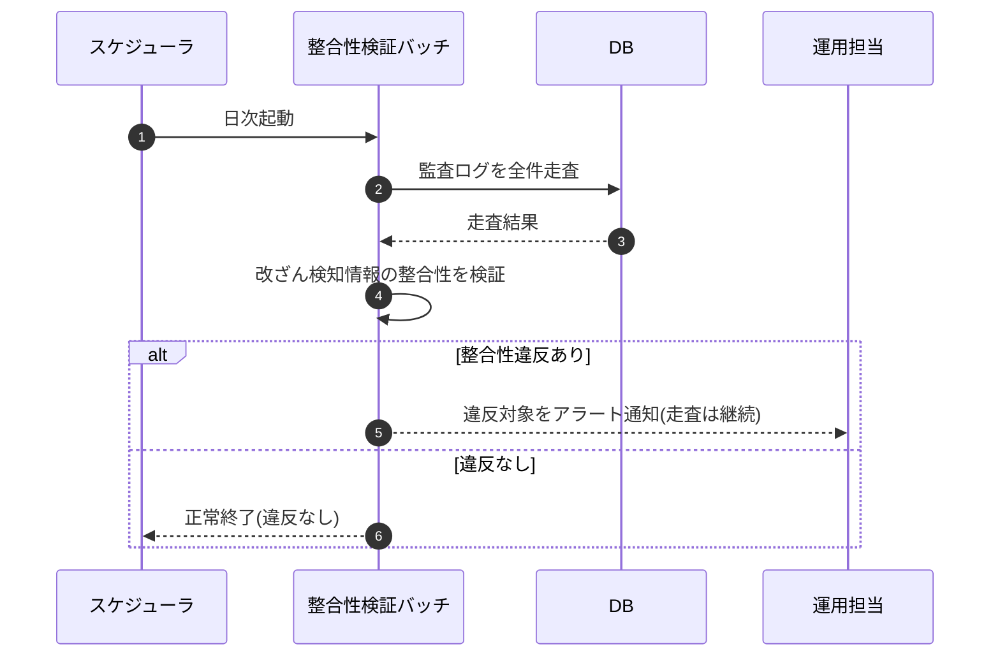

# SEQ-107: 監査ログ整合性検証(日次)

> **このページは、業務ユースケース UC-075（監査ログ整合性検証(日次)）のシーケンス図を定義します。**

## 項目

| 項目 | 内容 |
|---|---|
| SEQ ID | `SEQ-107` |
| 対応業務ユースケース | [UC-075](../../01_requirements/04_business_usecases/UC-075.md#UC-075) |
| 業務要件 (BR) | [BR-104](../../01_requirements/01_business_requirement/06_security-br.md#BR-104) |
| 機能要件 (FR) | [FR-147](../../01_requirements/02_functional_requirement/06_security-fr.md#FR-147) ・ [FR-151](../../01_requirements/02_functional_requirement/06_security-fr.md#FR-151) |
| 画面イベント (EVT) | — |
| 関連画面 | — |
| 関連 API | — |
| 関連テーブル | [TBL-027](../02_backend/04_database/TBL-027.md#TBL-027) |
| エラー (ERR) | — |
| メッセージ (MSG) | — |

## 概要

スケジューラが日次で整合性検証バッチを起動し、監査ログを全件走査して改ざん検知情報の整合性を検証する。整合性違反を検出した対象はアラート通知し、違反が無ければ正常終了する。

## シーケンス図

## 例外フロー

- 整合性違反の検出: 改ざん・欠落の疑いを検出した対象を特定し、アラート通知する。検証は中断せず残りの全件走査を継続する。
- 対象なし: 検証対象の監査ログが無い場合は検証を行わず、正常終了する。

## 備考

- 本図は基本設計レベルの抽象度(ユーザー / 画面 / サーバー、システム起点は外部システム・スケジューラ・バッチを加える)で記述する。DB 操作は DB アクターへのメッセージで表し、テーブル別 CRUD は本図に書かず 関連テーブル 欄で示す。
- 図の出典は業務ユースケース [UC-075](../../01_requirements/04_business_usecases/UC-075.md#UC-075)。画面イベントとの対応は UC-075 を参照。
