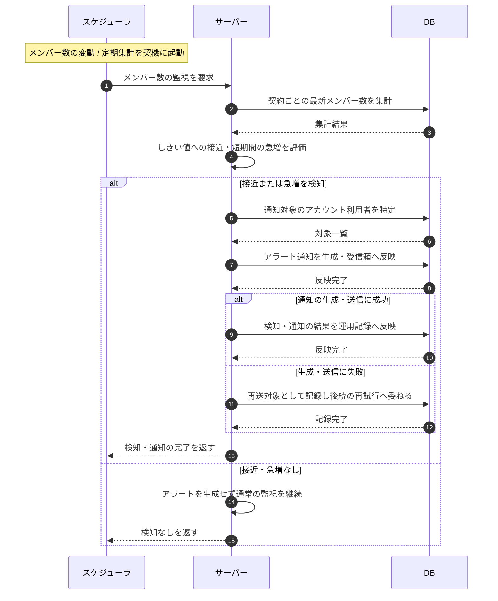

# SEQ-108: メンバー数の上限接近・急増の検知と通知

> **このページは、業務ユースケース UC-048(システムがメンバー数の上限接近・急増を検知して通知する)のシーケンス図を定義します。**

## 項目

| 項目 | 内容 |
|---|---|
| SEQ ID | `SEQ-108` |
| トレーサビリティID | [TR-048](../00_traceability/index.md#TR-048) |
| 画面イベント (EVT) | — |
| 関連画面 | — |
| 関連 API | — |
| 関連テーブル | [TBL-002](../02_backend/04_database/TBL-002.md#TBL-002) ・ [TBL-003](../02_backend/04_database/TBL-003.md#TBL-003) ・ [TBL-022](../02_backend/04_database/TBL-022.md#TBL-022) ・ [TBL-026](../02_backend/04_database/TBL-026.md#TBL-026) |
| エラー (ERR) | — |
| メッセージ (MSG) | [MSG-013](../06_messages/MSG-013.md#MSG-013) |

## 概要

メンバー数の変動または定期集計を契機に、サーバーが契約ごとの最新メンバー数を集計し、しきい値への接近と短期間の急増を評価する。検知した場合は対象のアカウント利用者を特定して受信箱アラートを生成し、検知・通知の結果を運用記録として残す。接近も急増も認められない場合はアラートを生成せず監視を継続し、通知の生成・送信に失敗した場合は再送対象として記録する。

## シーケンス図

## 例外フロー

- アラート通知の生成・送信に失敗した場合は、当該通知を再送対象として記録し、後続の再試行に委ねる。

## 備考

- 本図は基本設計レベルの抽象度(システム起点は外部システム・スケジューラ・バッチを参加者に置く)で記述する。DB 操作は DB アクターへのメッセージで表し、テーブル別 CRUD は本図に書かず 関連テーブル 欄で示す。
- しきい値の具体値・急増判定の期間は本図に書かず、機能要件 [FR-033](../../01_requirements/02_functional_requirement/01_account-fr.md#FR-033) および業務ルールに委ねる。
- 図の出典は業務ユースケース [UC-048](../../01_requirements/04_business_usecases/UC-048.md#UC-048)。
