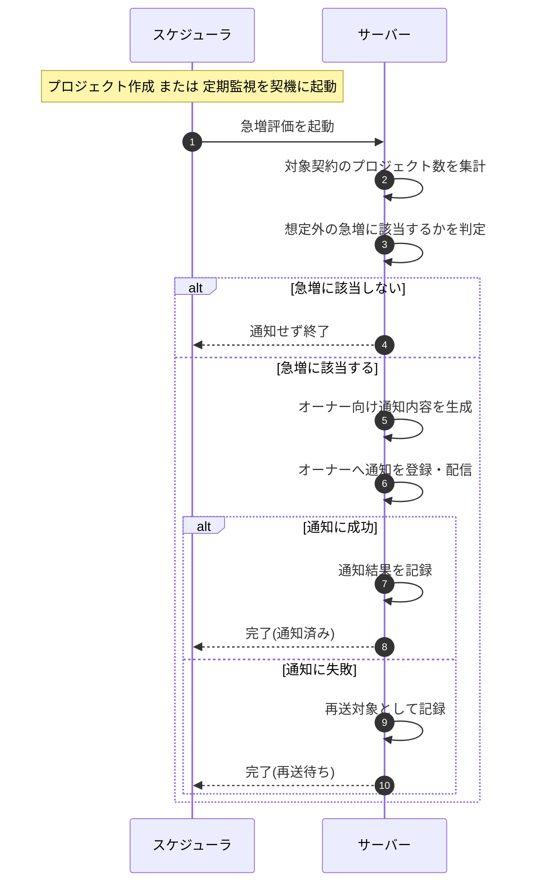

<!-- portal-top -->
[設計ポータル](../../README.md) ／ [基本設計](../index.md) ／ [シーケンス設計](index.md) ／ **SEQ-109: プロジェクト数急増検知通知**
<!-- /portal-top -->

# SEQ-109: プロジェクト数急増検知通知

> **このページは、業務ユースケース UC-050(システムがプロジェクト数の急増を検知してオーナーへ通知する)のシーケンス図を定義します。**

*版数 v1.0 ・ 更新 2026-06-23 ・ ステータス ドラフト*

## 項目

| 項目 | 内容 |
|---|---|
| SEQ ID | `SEQ-109` |
| 対応業務ユースケース | [UC-050](../../01_requirements/04_business_usecases/UC-050.md#UC-050) |
| 業務要件 (BR) | [BR-027](../../01_requirements/01_business_requirement/01_account-br.md#BR-027) |
| 機能要件 (FR) | [FR-046](../../01_requirements/02_functional_requirement/01_account-fr.md#FR-046) |
| 画面イベント (EVT) | — |
| 関連画面 | — |
| 関連 API | — |
| 関連テーブル | [TBL-004](../02_backend/04_database/TBL-004.md#TBL-004) ・ [TBL-022](../02_backend/04_database/TBL-022.md#TBL-022) ・ [TBL-026](../02_backend/04_database/TBL-026.md#TBL-026) ・ [TBL-028](../02_backend/04_database/TBL-028.md#TBL-028) |
| エラー (ERR) | — |
| メッセージ (MSG) | [MSG-013](../06_messages/MSG-013.md#MSG-013) |

## 概要

プロジェクトの新規作成または定期監視を契機に、サーバーが対象契約のプロジェクト数を集計し、想定外の急激な増加に該当するかを判定する。急増に該当する場合はオーナー向けの通知内容を生成して届け、結果を記録する。増加が緩やかで基準に達しない場合は通知せず終了し、通知の生成または送信に失敗した場合は再送対象として記録する。

## シーケンス図

## 例外フロー

- **通知の生成または送信失敗**: サーバーは当該通知を再送対象として記録し、後続の監視・再送で改めて通知できるようにする。1 件の失敗は他契約の評価・通知に影響しない。

## 備考

- 本図は基本設計レベルの抽象度(システム起点は外部システム・スケジューラ・バッチを参加者に置く)で記述する。DB 操作はサーバー自己メッセージで表し、テーブル別 CRUD は本図に書かず 関連テーブル 欄で示す。
- 図の出典は業務ユースケース [UC-050](../../01_requirements/04_business_usecases/UC-050.md#UC-050)。

---

<!-- portal-bottom -->
[← シーケンス設計](index.md) ・ [基本設計](../index.md) ・ [↑ 設計ポータル](../../README.md)
<!-- /portal-bottom -->
