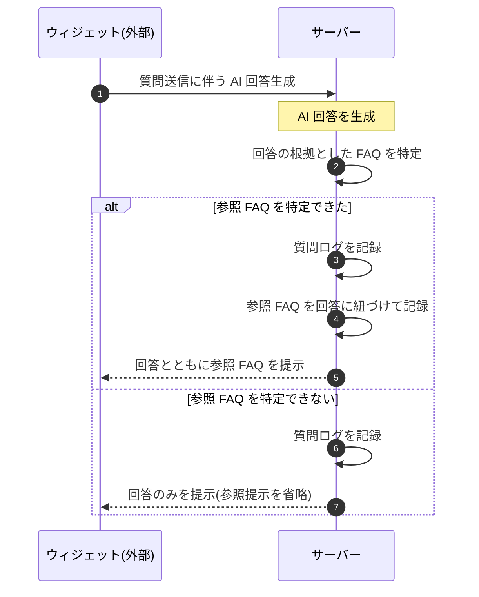

# SEQ-110: 参照FAQ記録・提示

> **このページは、業務ユースケース UC-053(システムが回答に利用したFAQを記録し参照提示する)のシーケンス図を定義します。**

*版数 v1.0 ・ 更新 2026-06-23 ・ ステータス ドラフト*

## 項目

| 項目 | 内容 |
|---|---|
| SEQ ID | `SEQ-110` |
| 対応業務ユースケース | [UC-053](../../01_requirements/04_business_usecases/UC-053.md#UC-053) |
| 業務要件 (BR) | [BR-037](../../01_requirements/01_business_requirement/02_faq-ai-br.md#BR-037) |
| 機能要件 (FR) | [FR-060](../../01_requirements/02_functional_requirement/02_faq-ai-fr.md#FR-060) |
| 画面イベント (EVT) | — |
| 関連画面 | — |
| 関連 API | [API-038](../02_backend/03_apis/API-038.md#API-038) |
| 関連テーブル | [TBL-006](../02_backend/04_database/TBL-006.md#TBL-006) ・ [TBL-025](../02_backend/04_database/TBL-025.md#TBL-025) ・ [TBL-016](../02_backend/04_database/TBL-016.md#TBL-016) |
| エラー (ERR) | — |
| メッセージ (MSG) | — |

## 概要

ウィジェット質問送信に伴い AI 回答を生成したサーバーが、回答の根拠とした参照 FAQ を特定し、質問ログと参照 FAQ を記録したうえで、回答とともに参照 FAQ をウィジェット利用者へ提示する。参照 FAQ を特定できない場合は提示を省略し、回答のみを提示する。

## シーケンス図

## 備考

- 本図は基本設計レベルの抽象度(システム起点は外部システム・スケジューラ・バッチを参加者に置く)で記述する。DB 操作はサーバー自己メッセージで表し、テーブル別 CRUD は本図に書かず 関連テーブル 欄で示す。
- 図の出典は業務ユースケース [UC-053](../../01_requirements/04_business_usecases/UC-053.md#UC-053)。
