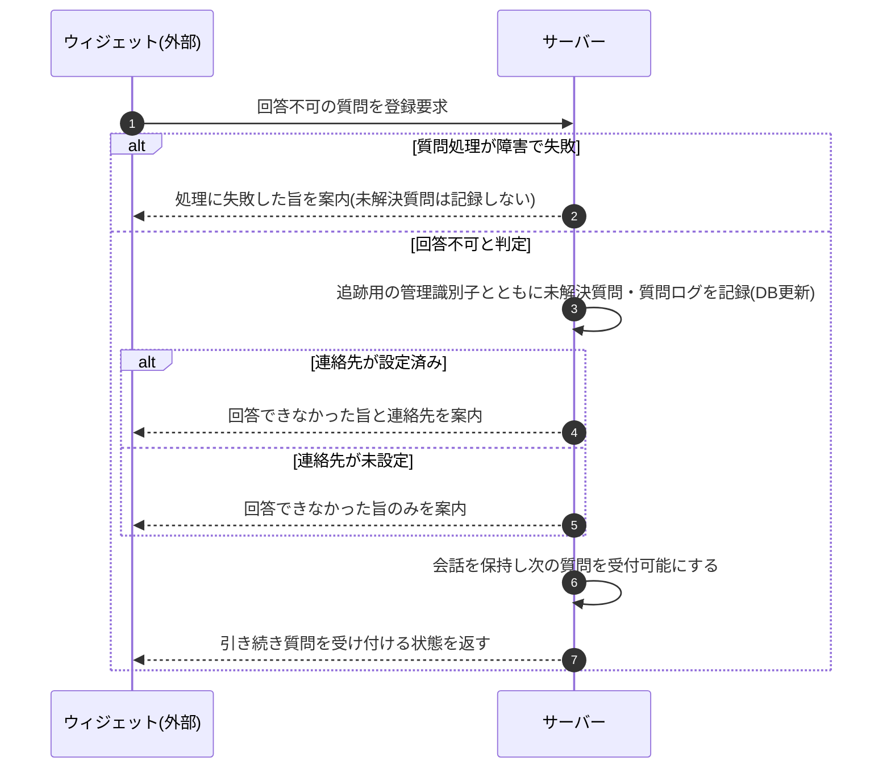

<!-- portal-top -->
[設計ポータル](../../README.md) ／ [基本設計](../index.md) ／ [シーケンス設計](index.md) ／ **SEQ-111: 回答不可時の未解決質問登録・案内処理**
<!-- /portal-top -->

# SEQ-111: 回答不可時の未解決質問登録・案内処理

> **このページは、業務ユースケース UC-054(システムが回答不可時に未解決質問を登録し案内する)のシーケンス図を定義します。**

*版数 v1.0 ・ 更新 2026-06-23 ・ ステータス ドラフト*

## 項目

| 項目 | 内容 |
|---|---|
| SEQ ID | `SEQ-111` |
| 対応業務ユースケース | [UC-054](../../01_requirements/04_business_usecases/UC-054.md#UC-054) |
| 業務要件 (BR) | [BR-040](../../01_requirements/01_BusinessRequirement/02_faq-ai-br.md#BR-040) ・ [BR-044](../../01_requirements/01_BusinessRequirement/02_faq-ai-br.md#BR-044) ・ [BR-054](../../01_requirements/01_BusinessRequirement/02_faq-ai-br.md#BR-054) ・ [BR-055](../../01_requirements/01_BusinessRequirement/02_faq-ai-br.md#BR-055) |
| 機能要件 (FR) | [FR-063](../../01_requirements/02_FunctionalRequirement/02_faq-ai-fr.md#FR-063) ・ [FR-064](../../01_requirements/02_FunctionalRequirement/02_faq-ai-fr.md#FR-064) ・ [FR-136](../../01_requirements/02_FunctionalRequirement/04_widget-fr.md#FR-136) |
| 画面イベント (EVT) | — |
| 関連画面 | — |
| 関連 API | [API-039](../02_backend/03_apis/API-039.md#API-039) |
| 関連テーブル | [TBL-017](../02_backend/04_database/TBL-017.md#TBL-017) ・ [TBL-025](../02_backend/04_database/TBL-025.md#TBL-025) ・ [TBL-029](../02_backend/04_database/TBL-029.md#TBL-029) |
| エラー (ERR) | — |
| メッセージ (MSG) | — |

## 概要

ウィジェットからの質問が登録済み FAQ で回答できないと判定されると、サーバーは回答できなかった質問を追跡用の管理識別子とともに未解決質問・質問ログへ記録し、ウィジェット利用者へ回答できなかった旨を案内する。連絡先が設定済みのときは案内に連絡先を併記し、未設定なら回答不可のみを案内する。質問処理そのものが障害で失敗した場合は、未解決質問を記録せず処理失敗である旨のみを案内し、回答不可の未解決質問とは区別する。

## シーケンス図

## 備考

- 本図は基本設計レベルの抽象度(システム起点は外部システム・スケジューラ・バッチを参加者に置く)で記述する。DB 操作はサーバー自己メッセージで表し、テーブル別 CRUD は本図に書かず 関連テーブル 欄で示す。
- 追跡用の管理識別子はウィジェット利用者には提示しない(案内には含めない)。
- 図の出典は業務ユースケース [UC-054](../../01_requirements/04_business_usecases/UC-054.md#UC-054)。

---

<!-- portal-bottom -->
[← シーケンス設計](index.md) ・ [基本設計](../index.md) ・ [↑ 設計ポータル](../../README.md)
<!-- /portal-bottom -->
