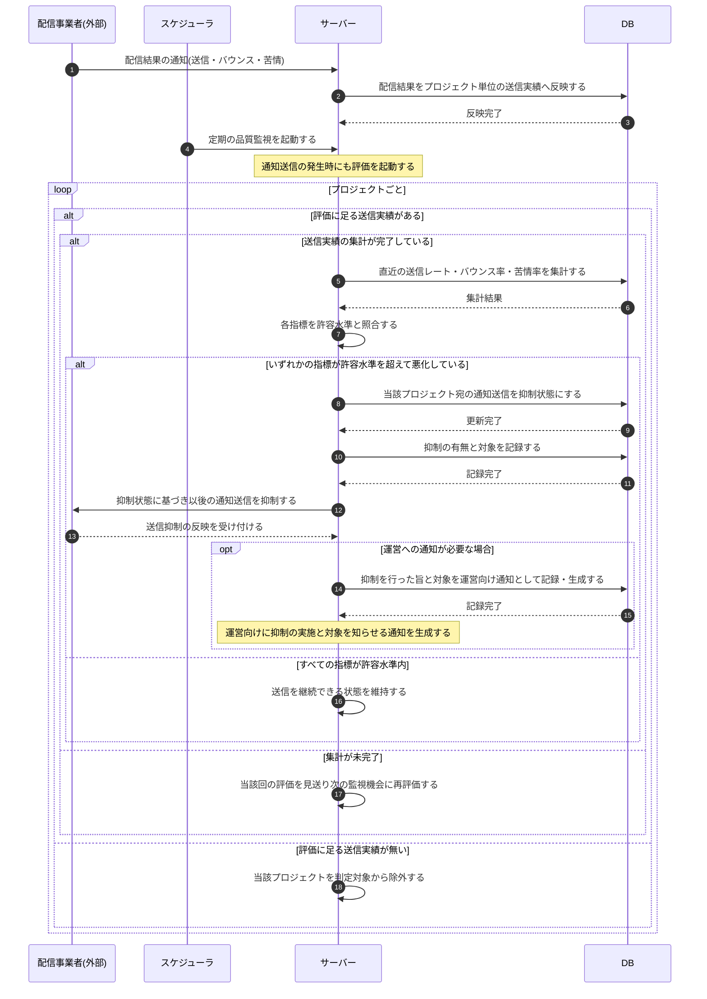

# SEQ-111: 送信品質監視による通知送信抑制

> **このページは、業務ユースケース UC-065(システムが送信指標を監視して送信を抑制する)のシーケンス図を定義します。**

| ID | シーケンス名 |
|----|----|
| SEQ-111 | 送信品質監視による通知送信抑制 |

| 関連項目 | 内容 |
|----|----| 
| 業務ユースケース | [UC-065](../../01_requirements/04_business_usecases/UC-065.md#UC-065) |
| イベント | — |
| 関連画面 | — |
| 関連API | [API-058](../02_backend/03_apis/API-058.md#API-058) / [API-059](../02_backend/03_apis/API-059.md#API-059) |
| テーブル | [TBL-002](../02_backend/04_database/TBL-002.md#TBL-002) / [TBL-007](../02_backend/04_database/TBL-007.md#TBL-007) / [TBL-026](../02_backend/04_database/TBL-026.md#TBL-026) |
| エラー(ERR) | — |
| メッセージ(MSG) | [MSG-013](../06_messages/MSG-013.md#MSG-013) |

## 概要

システムは、通知送信の発生または定期監視を契機として、配信事業者からの配信結果をもとにプロジェクト単位の送信品質を評価する。直近の送信レート・バウンス率・苦情率を集計して許容水準と照合し、いずれかの指標が許容水準を超えて悪化したプロジェクト宛の通知送信を抑制状態にする。抑制の有無と対象を記録し、必要に応じて運営へ知らせる。評価に足る実績が無いプロジェクトは判定対象から除外し、集計が未完了の場合は当該回の評価を見送って次の監視機会に再評価する。

## シーケンス図

## 備考

- 本図は基本設計レベルの抽象度(システム起点は外部システム・スケジューラ・バッチを参加者に置く)で記述する。DB 操作は DB アクターへのメッセージで表し、テーブル別 CRUD は本図に書かず 関連テーブル 欄で示す。
- 図の出典は業務ユースケース [UC-065](../../01_requirements/04_business_usecases/UC-065.md#UC-065)。
