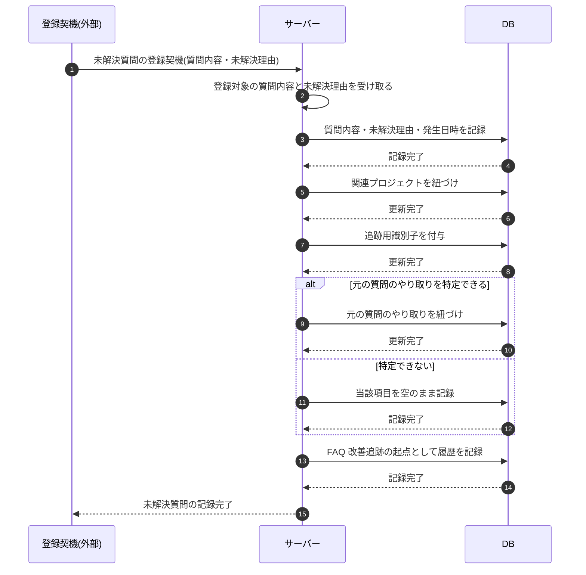

# SEQ-112: 未解決質問の記録

> **このページは、業務ユースケース UC-054(システムが未解決質問に必要項目を記録する)のシーケンス図を定義します。**

| ID | シーケンス名 |
|----|----|
| SEQ-112 | 未解決質問の記録 |

| 関連項目 | 内容 |
|----|----| 
| 業務ユースケース | [UC-054](../../01_requirements/04_business_usecases/UC-054.md#UC-054) |
| イベント | — |
| 関連画面 | — |
| 関連API | [API-039](../02_backend/03_apis/API-039.md#API-039) |
| テーブル | [TBL-017](../02_backend/04_database/TBL-017.md#TBL-017) / [TBL-029](../02_backend/04_database/TBL-029.md#TBL-029) |
| エラー(ERR) | — |
| メッセージ(MSG) | — |

## 概要

未解決質問の登録契機が発生したとき、サーバーが質問内容・未解決理由・発生日時を未解決質問として記録し、関連プロジェクトと元となった質問のやり取りを紐づけ、追跡用識別子を付与する。元の質問のやり取りを特定できない場合は、当該項目を空のまま記録する。

## シーケンス図

## 備考

- 本図は基本設計レベルの抽象度(システム起点は外部システム・スケジューラ・バッチを参加者に置く)で記述する。DB 操作は DB アクターへのメッセージで表し、テーブル別 CRUD は本図に書かず 関連テーブル 欄で示す。
- 図の出典は業務ユースケース [UC-054](../../01_requirements/04_business_usecases/UC-054.md#UC-054)。
