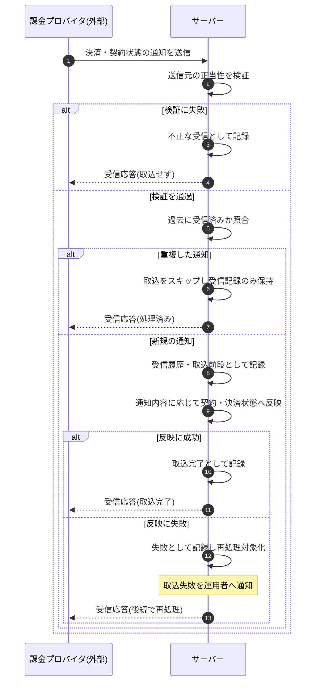

<!-- portal-top -->
[設計ポータル](../../README.md) ／ [基本設計](../index.md) ／ [シーケンス設計](index.md) ／ **SEQ-113: 課金プロバイダ通知の受信・検証・取込**
<!-- /portal-top -->

# SEQ-113: 課金プロバイダ通知の受信・検証・取込

> **このページは、業務ユースケース UC-061(システムが課金プロバイダ通知を受信・検証・再処理する)のシーケンス図を定義します。**

*版数 v1.0 ・ 更新 2026-06-23 ・ ステータス ドラフト*

## 項目

| 項目 | 内容 |
|---|---|
| SEQ ID | `SEQ-113` |
| 対応業務ユースケース | [UC-061](../../01_requirements/04_business_usecases/UC-061.md#UC-061) |
| 業務要件 (BR) | [BR-068](../../01_requirements/01_BusinessRequirement/03_usage-br.md#BR-068) |
| 機能要件 (FR) | [FR-099](../../01_requirements/02_FunctionalRequirement/03_usage-fr.md#FR-099) |
| 画面イベント (EVT) | — |
| 関連画面 | — |
| 関連 API | [API-060](../02_backend/03_apis/API-060.md#API-060) |
| 関連テーブル | [TBL-032](../02_backend/04_database/TBL-032.md#TBL-032) ・ [TBL-002](../02_backend/04_database/TBL-002.md#TBL-002) ・ [TBL-018](../02_backend/04_database/TBL-018.md#TBL-018) ・ [TBL-019](../02_backend/04_database/TBL-019.md#TBL-019) |
| エラー (ERR) | — |
| メッセージ (MSG) | [MSG-013](../06_messages/MSG-013.md#MSG-013) |

## 概要

課金プロバイダから届く決済・契約状態の通知を受信し、送信元の正当性を検証する。検証を通過した通知のみを重複排除して受信履歴に記録し、契約・サブスクリプション・請求書へ反映する。送信元検証に失敗した通知は不正な受信として記録して取り込まず、重複した通知は取込をスキップし受信記録のみ残す。反映に失敗した通知は失敗として記録・通知し、再処理の対象とする。

## シーケンス図

## 備考

- 本図は基本設計レベルの抽象度(システム起点は外部システム・スケジューラ・バッチを参加者に置く)で記述する。DB 操作はサーバー自己メッセージで表し、テーブル別 CRUD は本図に書かず 関連テーブル 欄で示す。
- 図の出典は業務ユースケース [UC-061](../../01_requirements/04_business_usecases/UC-061.md#UC-061)。

---

<!-- portal-bottom -->
[← シーケンス設計](index.md) ・ [基本設計](../index.md) ・ [↑ 設計ポータル](../../README.md)
<!-- /portal-bottom -->
