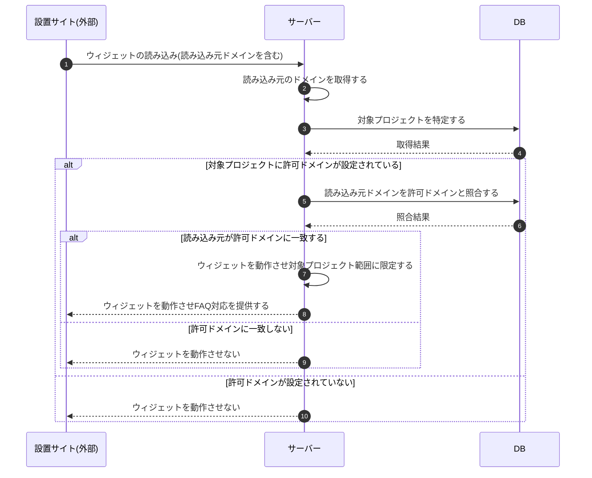

# SEQ-114: 許可ドメイン照合によるウィジェット起動可否判定

> **このページは、業務ユースケース UC-062(システムが許可ドメイン上でのみウィジェットを動作させる)のシーケンス図を定義します。**

## 項目

| 項目 | 内容 |
|---|---|
| SEQ ID | `SEQ-114` |
| 対応業務ユースケース | [UC-062](../../01_requirements/04_business_usecases/UC-062.md#UC-062) |
| 業務要件 (BR) | [BR-088](../../01_requirements/01_business_requirement/04_widget-br.md#BR-088) |
| 機能要件 (FR) | [FR-127](../../01_requirements/02_functional_requirement/04_widget-fr.md#FR-127) |
| 画面イベント (EVT) | — |
| 関連画面 | — |
| 関連 API | [API-037](../02_backend/03_apis/API-037.md#API-037) |
| 関連テーブル | [TBL-004](../02_backend/04_database/TBL-004.md#TBL-004) ・ [TBL-005](../02_backend/04_database/TBL-005.md#TBL-005) |
| エラー (ERR) | — |
| メッセージ (MSG) | — |

## 概要

設置サイトでウィジェットが読み込まれると、サーバーが読み込み元のドメインを取得し、対象プロジェクトに登録された許可ドメインと照合する。読み込み元が許可ドメインに一致する場合のみウィジェットを動作させ、対象プロジェクトの範囲内でFAQ・回答を取り扱う。許可ドメインに一致しない場合、および許可ドメインが設定されていない場合はウィジェットを動作させず、不正設置や他契約・他プロジェクトのデータ参照を防ぐ。

## シーケンス図

## 備考

- 本図は基本設計レベルの抽象度(システム起点は外部システム・スケジューラ・バッチを参加者に置く)で記述する。DB 操作は DB アクターへのメッセージで表し、テーブル別 CRUD は本図に書かず 関連テーブル 欄で示す。
- 図の出典は業務ユースケース [UC-062](../../01_requirements/04_business_usecases/UC-062.md#UC-062)。
