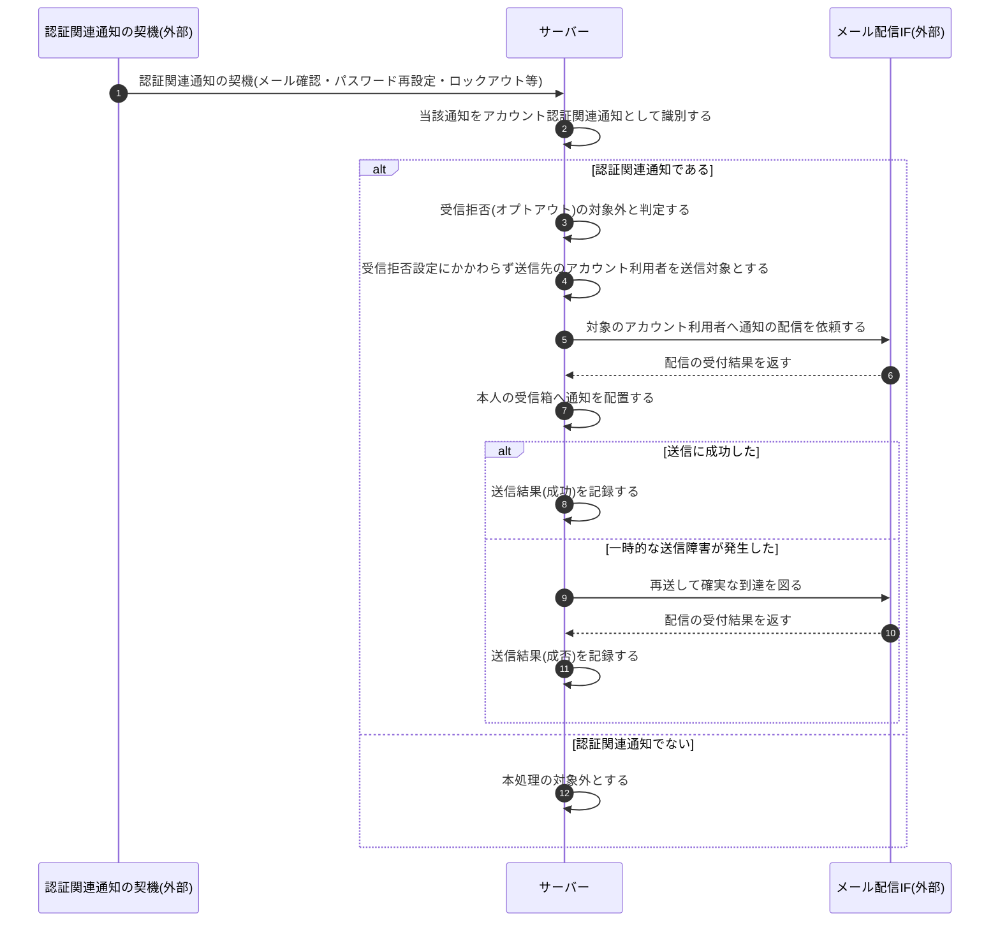

<!-- portal-top -->
[設計ポータル](../../README.md) ／ [基本設計](../index.md) ／ [シーケンス設計](index.md) ／ **SEQ-115: アカウント認証関連通知のオプトアウト不可送信**
<!-- /portal-top -->

# SEQ-115: アカウント認証関連通知のオプトアウト不可送信

> **このページは、業務ユースケース UC-069(システムがアカウント認証関連通知をオプトアウト不可で送信する)のシーケンス図を定義します。**

*版数 v1.0 ・ 更新 2026-06-23 ・ ステータス ドラフト*

## 項目

| 項目 | 内容 |
|---|---|
| SEQ ID | `SEQ-115` |
| 対応業務ユースケース | [UC-069](../../01_requirements/04_business_usecases/UC-069.md#UC-069) |
| 業務要件 (BR) | [BR-085](../../01_requirements/01_BusinessRequirement/05_notification-br.md#BR-085) |
| 機能要件 (FR) | [FR-116](../../01_requirements/02_FunctionalRequirement/05_notification-fr.md#FR-116) |
| 画面イベント (EVT) | — |
| 関連画面 | — |
| 関連 API | [API-058](../02_backend/03_apis/API-058.md#API-058) |
| 関連テーブル | [TBL-022](../02_backend/04_database/TBL-022.md#TBL-022) ・ [TBL-026](../02_backend/04_database/TBL-026.md#TBL-026) |
| エラー (ERR) | — |
| メッセージ (MSG) | [MSG-001](../06_messages/MSG-001.md#MSG-001) ・ [MSG-002](../06_messages/MSG-002.md#MSG-002) ・ [MSG-005](../06_messages/MSG-005.md#MSG-005) |

## 概要

メールアドレス確認・パスワード再設定・ロックアウト通知などアカウント認証に関わる通知の契機が発生すると、サーバーは当該通知を認証関連通知として識別し、受信拒否(オプトアウト)の対象外と判定する。利用者が受信拒否を設定していても送信対象から外さず、配信用の連携先を介して対象本人へ確実に送信し、本人の受信箱へ配置したうえで送信結果(成否)を記録する。一時的な送信障害で届かなかった場合は再送して確実な到達を図り、なりすましや乗っ取りのリスクから利用者を守る。

## シーケンス図

## 備考

- 本図は基本設計レベルの抽象度(システム起点は外部システム・スケジューラ・バッチを参加者に置く)で記述する。DB 操作はサーバー自己メッセージで表し、テーブル別 CRUD は本図に書かず 関連テーブル 欄で示す。
- 図の出典は業務ユースケース [UC-069](../../01_requirements/04_business_usecases/UC-069.md#UC-069)。

---

<!-- portal-bottom -->
[← シーケンス設計](index.md) ・ [基本設計](../index.md) ・ [↑ 設計ポータル](../../README.md)
<!-- /portal-bottom -->
