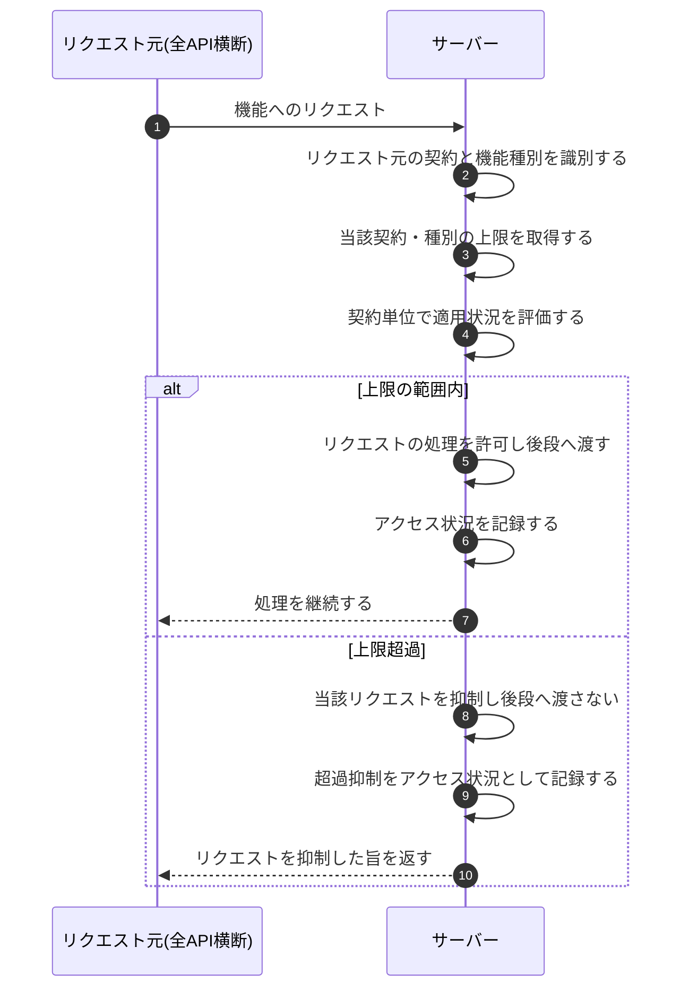

# SEQ-117: 契約単位レート制限の適用

> **このページは、業務ユースケース UC-076(システムが契約単位のレート制限を適用する)のシーケンス図を定義します。**

## 項目

| 項目 | 内容 |
|---|---|
| SEQ ID | `SEQ-117` |
| 対応業務ユースケース | [UC-076](../../01_requirements/04_business_usecases/UC-076.md#UC-076) |
| 業務要件 (BR) | [BR-102](../../01_requirements/01_business_requirement/06_security-br.md#BR-102) |
| 機能要件 (FR) | [FR-095](../../01_requirements/02_functional_requirement/03_usage-fr.md#FR-095) |
| 画面イベント (EVT) | — |
| 関連画面 | — |
| 関連 API | 横断(全 API) |
| 関連テーブル | [TBL-008](../02_backend/04_database/TBL-008.md#TBL-008) ・ [TBL-009](../02_backend/04_database/TBL-009.md#TBL-009) ・ [TBL-027](../02_backend/04_database/TBL-027.md#TBL-027) ・ [TBL-028](../02_backend/04_database/TBL-028.md#TBL-028) |
| エラー (ERR) | — |
| メッセージ (MSG) | — |

## 概要

各機能へのリクエストが発生すると、サーバーがゲートウェイ層でリクエスト元の契約と機能種別を識別し、当該契約・種別に適用するレート制限の上限を契約単位で評価する。上限の範囲内であればリクエストの処理を許可して後段の業務処理へ渡し、上限を超過していれば当該リクエストを抑制して後段へ渡さない。いずれの場合もアクセス状況を記録し、超過抑制を濫用検知につなげて、DDoS・Bot・暴走による過負荷からサービスを防御する。本処理は全 API 横断のため特定の機能 API には結線しない。

## シーケンス図

## 備考

- 本図は基本設計レベルの抽象度(システム起点は外部システム・スケジューラ・バッチを参加者に置く)で記述する。DB 操作はサーバー自己メッセージで表し、テーブル別 CRUD は本図に書かず 関連テーブル 欄で示す。
- 本処理はゲートウェイ層で全 API 横断に作用するため、関連 API は横断(全 API)とし特定の機能 API に結線しない。計数アルゴリズム等の詳細は対応システム [SYS-010](../02_backend/01_system/SYS-010.md#SYS-010) の詳細設計への移管候補で扱う。
- 図の出典は業務ユースケース [UC-076](../../01_requirements/04_business_usecases/UC-076.md#UC-076)。
