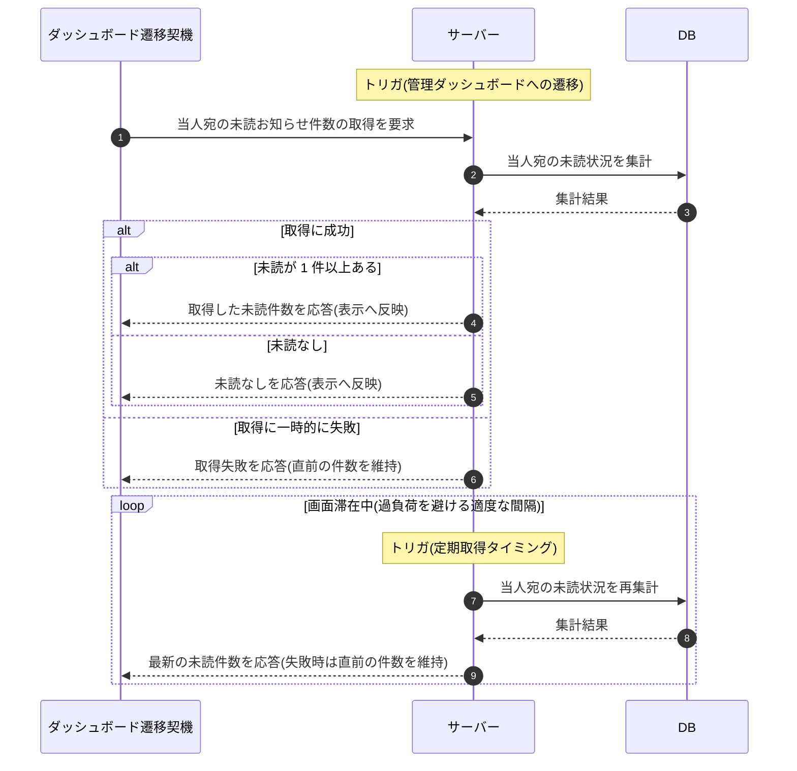

# SEQ-118: 管理ダッシュボード遷移時の未読お知らせ件数取得・更新

> **このページは、業務ユースケース UC-080(システムが未読件数を遷移時に取得し更新する)のシーケンス図を定義します。**

| ID | シーケンス名 |
|----|----|
| SEQ-118 | 管理ダッシュボード遷移時の未読お知らせ件数取得・更新 |

| 関連項目 | 内容 |
|----|----| 
| 業務ユースケース | [UC-080](../../01_requirements/04_business_usecases/UC-080.md#UC-080) |
| イベント | — |
| 関連画面 | — |
| 関連API | [API-051](../02_backend/03_apis/API-051.md#API-051) |
| テーブル | [TBL-022](../02_backend/04_database/TBL-022.md#TBL-022) / [TBL-021](../02_backend/04_database/TBL-021.md#TBL-021) |
| エラー(ERR) | — |
| メッセージ(MSG) | — |

## 概要

アカウント利用者が管理ダッシュボードへ遷移すると、システムは当人宛の未読お知らせ件数を取得して表示へ反映する。画面に滞在している間も、過大な負荷を生まない適度な間隔で未読件数を取得し直して最新化する。未読が 1 件もない場合は未読なしとして反映し、取得に一時的に失敗した場合は直前に表示していた件数を維持して次の取得タイミングで再取得する。

## シーケンス図

## 備考

- 本図は基本設計レベルの抽象度(システム起点は外部システム・スケジューラ・バッチを参加者に置く)で記述する。DB 操作は DB アクターへのメッセージで表し、テーブル別 CRUD は本図に書かず 関連テーブル 欄で示す。
- 図の出典は業務ユースケース [UC-080](../../01_requirements/04_business_usecases/UC-080.md#UC-080)。
