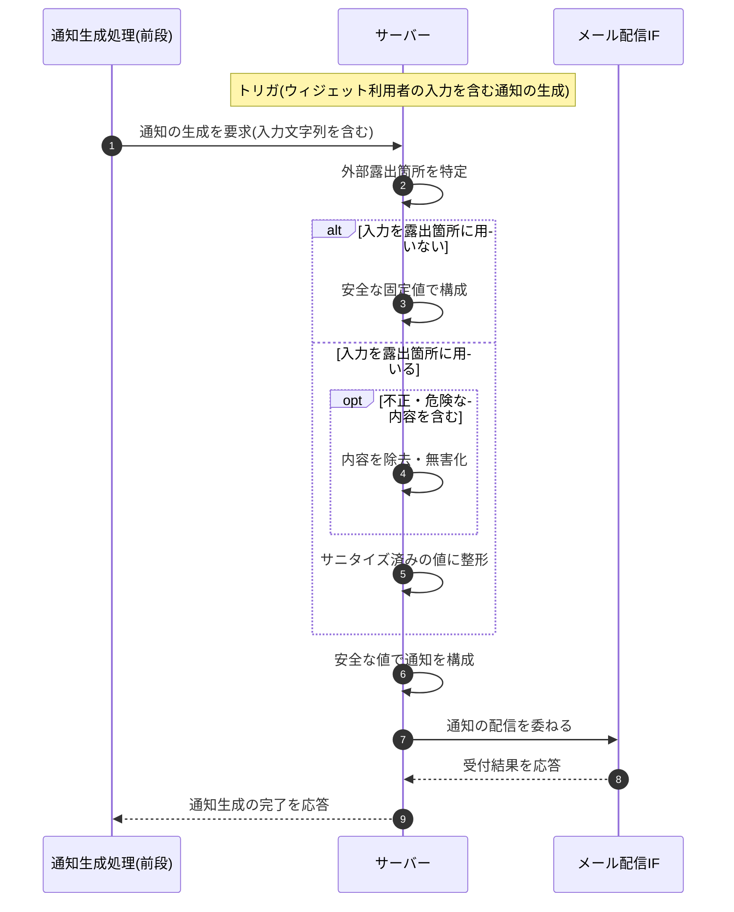

<!-- portal-top -->
[設計ポータル](../../README.md) ／ [基本設計](../index.md) ／ [シーケンス設計](index.md) ／ **SEQ-118: 外部露出箇所の入力サニタイズ**
<!-- /portal-top -->

# SEQ-118: 外部露出箇所の入力サニタイズ

> **このページは、業務ユースケース UC-077(システムがウィジェット入力を外部露出箇所からサニタイズする)のシーケンス図を定義します。**

*版数 v1.0 ・ 更新 2026-06-23 ・ ステータス ドラフト*

## 項目

| 項目 | 内容 |
|---|---|
| SEQ ID | `SEQ-118` |
| 対応業務ユースケース | [UC-077](../../01_requirements/04_business_usecases/UC-077.md#UC-077) |
| 業務要件 (BR) | [BR-086](../../01_requirements/01_BusinessRequirement/05_notification-br.md#BR-086) |
| 機能要件 (FR) | [FR-118](../../01_requirements/02_FunctionalRequirement/05_notification-fr.md#FR-118) |
| 画面イベント (EVT) | — |
| 関連画面 | — |
| 関連 API | [API-058](../02_backend/03_apis/API-058.md#API-058) |
| 関連テーブル | — |
| エラー (ERR) | — |
| メッセージ (MSG) | — |

## 概要

ウィジェット利用者の入力を含む通知を生成する際、サーバーは外部に露出する箇所(件名・送信元情報など)を特定し、入力文字列をそのまま使わず安全な固定値またはサニタイズ済みの値で構成する。露出箇所に入力を用いる場合は、不正・危険とみなす内容を除去・無害化したうえで整形する。これにより入力を悪用したスパム埋め込み・なりすましを防ぎ、安全な値で構成した通知を配信 IF へ引き渡す。

## シーケンス図

## 備考

- 本図は基本設計レベルの抽象度(システム起点は外部システム・スケジューラ・バッチを参加者に置く)で記述する。DB 操作はサーバー自己メッセージで表し、テーブル別 CRUD は本図に書かず 関連テーブル 欄で示す(本処理は横断的でテーブルへ結線しない)。
- 図の出典は業務ユースケース [UC-077](../../01_requirements/04_business_usecases/UC-077.md#UC-077)。

---

<!-- portal-bottom -->
[← シーケンス設計](index.md) ・ [基本設計](../index.md) ・ [↑ 設計ポータル](../../README.md)
<!-- /portal-bottom -->
