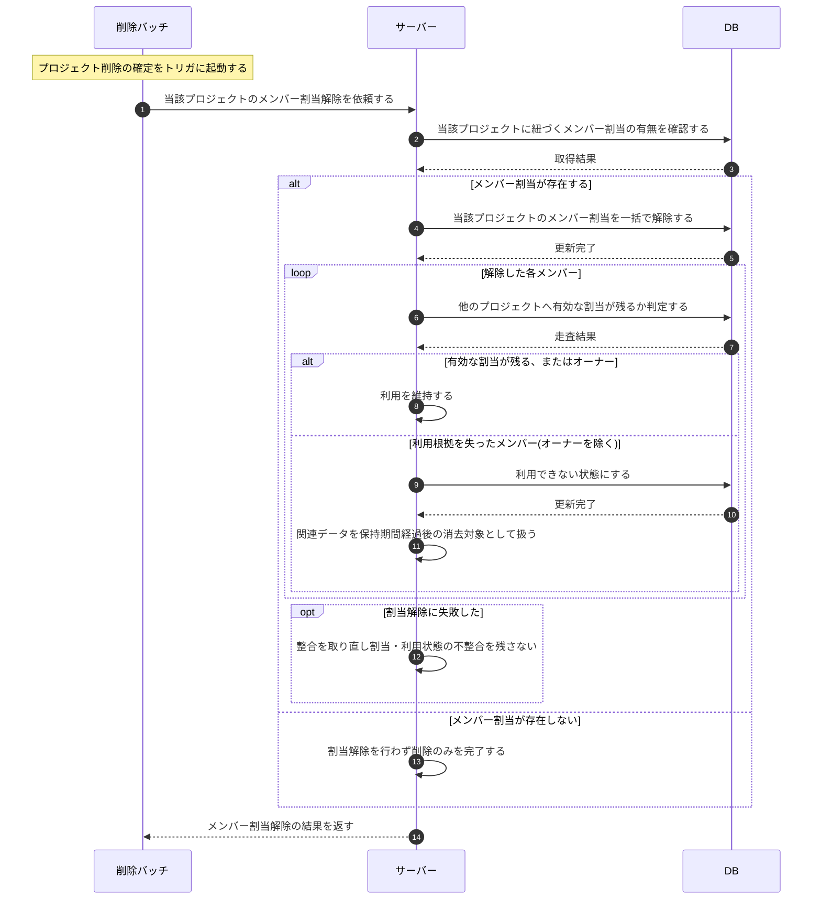

# SEQ-119: プロジェクト削除に伴うメンバー割当解除

> **このページは、業務ユースケース UC-077(システムがプロジェクト削除時にメンバー割当を解除する)のシーケンス図を定義します。**

| ID | シーケンス名 |
|----|----|
| SEQ-119 | プロジェクト削除に伴うメンバー割当解除 |

| 関連項目 | 内容 |
|----|----| 
| 業務ユースケース | [UC-077](../../01_requirements/04_business_usecases/UC-077.md#UC-077) |
| イベント | — |
| 関連画面 | — |
| 関連API | [API-018](../02_backend/03_apis/API-018.md#API-018) / [API-023](../02_backend/03_apis/API-023.md#API-023) |
| テーブル | [TBL-001](../02_backend/04_database/TBL-001.md#TBL-001) / [TBL-003](../02_backend/04_database/TBL-003.md#TBL-003) / [TBL-004](../02_backend/04_database/TBL-004.md#TBL-004) |
| エラー(ERR) | — |
| メッセージ(MSG) | — |

## 概要

プロジェクト削除が確定すると、削除バッチが当該プロジェクトに紐づくメンバー割当の有無を確認し、割当があれば一括で解除する。割当があった各メンバーについて他のプロジェクトへ有効な割当が残るかを判定し、残るメンバーやオーナーは利用を維持して当該プロジェクトの割当のみを解除する。利用根拠を失ったメンバー(オーナーを除く)は利用できない状態にし、その関連データを保持期間の経過後に消去対象として扱う。割当が存在しない場合は削除のみを完了し、解除に失敗した場合は整合を取り直して不整合を残さない。

## シーケンス図

## 備考

- 本図は基本設計レベルの抽象度(システム起点は外部システム・スケジューラ・バッチを参加者に置く)で記述する。DB 操作は DB アクターへのメッセージで表し、テーブル別 CRUD は本図に書かず 関連テーブル 欄で示す。
- 図の出典は業務ユースケース [UC-077](../../01_requirements/04_business_usecases/UC-077.md#UC-077)。
