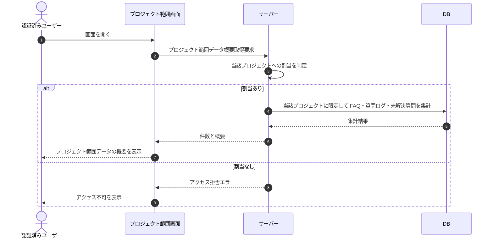

# SEQ-120: プロジェクト範囲データ概要表示

> **このページは、プロジェクト範囲データ概要表示のシーケンス図を定義します。** 当該プロジェクトに範囲を限定した FAQ・質問ログ・未解決質問の件数と概要を取得して表示する。

| ID | 業務ユースケースID | イベント(画面ID EVT-NN) | テーブルID |
|----|----|----|----|
| SEQ-120 | [UC-074](../../01_requirements/04_business_usecases/UC-074.md#UC-074) | — | [TBL-004](../02_backend/04_database/TBL-004.md#TBL-004) ・ [TBL-006](../02_backend/04_database/TBL-006.md#TBL-006) ・ [TBL-017](../02_backend/04_database/TBL-017.md#TBL-017) ・ [TBL-025](../02_backend/04_database/TBL-025.md#TBL-025) |

## 概要

プロジェクト範囲の画面で、当該プロジェクトに属する FAQ・質問ログ・未解決質問の件数と概要を取得して表示する。集計は常に当該プロジェクトに限定し、他プロジェクトのデータを混在させない(プロジェクト単位のデータ分離)。割当のないプロジェクトへのアクセスや存在しないプロジェクトはエラーを返す。

## シーケンス図

## 例外フロー

- 当該プロジェクトに割当のないユーザーのアクセスはアクセス拒否エラーを返す。
- 対象プロジェクトが存在しない場合は未検出エラーを返す。

## 備考

- 本図は基本設計レベルの抽象度(ユーザー / 画面 / サーバー / DB)で記述する。DB 操作は DB アクターへのメッセージで表し、テーブル別 CRUD は本図に書かず 関連テーブル 欄で示す。
- 集計は常に当該プロジェクトに範囲を限定し、他プロジェクトのデータを混在させないことでデータ分離を担保する。
