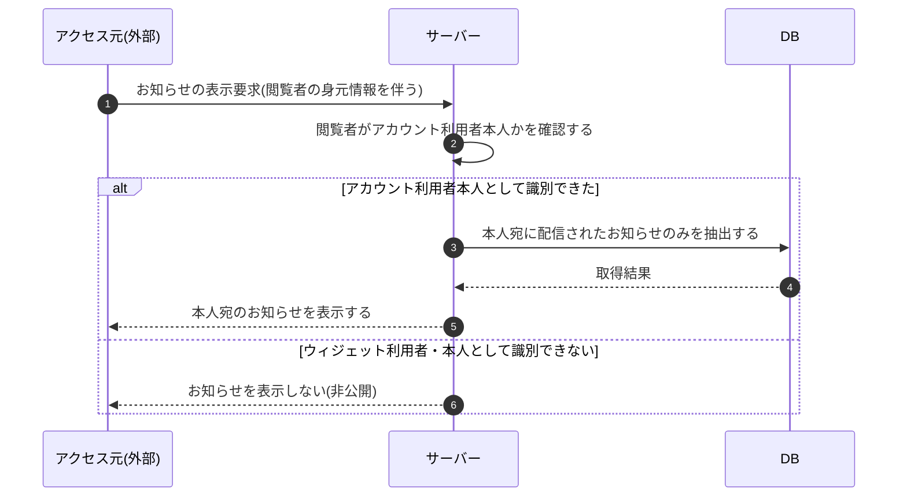

# SEQ-120: お知らせ閲覧範囲のアカウント利用者限定

> **このページは、業務ユースケース UC-085(システムがお知らせをアカウント利用者のみに表示する)のシーケンス図を定義します。**

## 項目

| 項目 | 内容 |
|---|---|
| SEQ ID | `SEQ-120` |
| トレーサビリティID | [TR-085](../00_traceability/index.md#TR-085) |
| 画面イベント (EVT) | — |
| 関連画面 | — |
| 関連 API | [API-048](../02_backend/03_apis/API-048.md#API-048) |
| 関連テーブル | [TBL-010](../02_backend/04_database/TBL-010.md#TBL-010) ・ [TBL-022](../02_backend/04_database/TBL-022.md#TBL-022) |
| エラー (ERR) | — |
| メッセージ (MSG) | — |

## 概要

システムは、お知らせの表示要求を契機として、閲覧者がアカウント利用者本人であることを確認する。本人として識別できた場合のみ、本人宛に配信されたお知らせを抽出して本人に表示する。ウィジェット利用者や本人として識別できない閲覧者にはお知らせを一切公開せず、閲覧範囲を本人に限定することで契約の機微情報の漏えいを防ぐ。

## シーケンス図

## 備考

- 本図は基本設計レベルの抽象度(システム起点は外部システム・スケジューラ・バッチを参加者に置く)で記述する。DB 操作は DB アクターへのメッセージで表し、テーブル別 CRUD は本図に書かず 関連テーブル 欄で示す。
- 図の出典は業務ユースケース [UC-085](../../01_requirements/04_business_usecases/UC-085.md#UC-085)。
