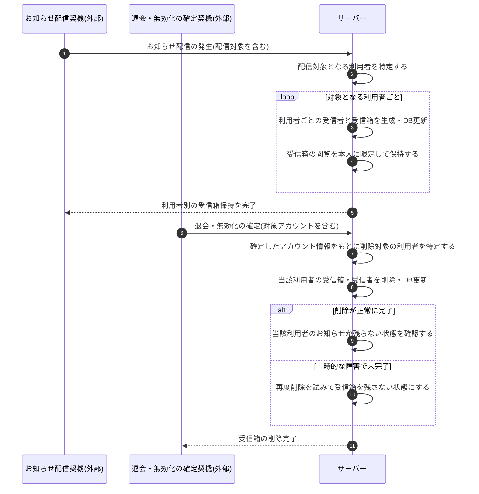

# SEQ-121: お知らせ受信箱の利用者別保持と退会時削除

> **このページは、業務ユースケース UC-087(システムがお知らせ受信箱を利用者ごとに保持し退会時に削除する)のシーケンス図を定義します。**

*版数 v1.0 ・ 更新 2026-06-23 ・ ステータス ドラフト*

## 項目

| 項目 | 内容 |
|---|---|
| SEQ ID | `SEQ-121` |
| 対応業務ユースケース | [UC-087](../../01_requirements/04_business_usecases/UC-087.md#UC-087) |
| 業務要件 (BR) | [BR-113](../../01_requirements/01_business_requirement/05_notification-br.md#BR-113) ・ [BR-114](../../01_requirements/01_business_requirement/05_notification-br.md#BR-114) |
| 機能要件 (FR) | [FR-165](../../01_requirements/02_functional_requirement/05_notification-fr.md#FR-165) |
| 画面イベント (EVT) | — |
| 関連画面 | — |
| 関連 API | [API-056](../02_backend/03_apis/API-056.md#API-056) |
| 関連テーブル | [TBL-001](../02_backend/04_database/TBL-001.md#TBL-001) ・ [TBL-021](../02_backend/04_database/TBL-021.md#TBL-021) ・ [TBL-022](../02_backend/04_database/TBL-022.md#TBL-022) |
| エラー (ERR) | — |
| メッセージ (MSG) | — |

## 概要

サーバーは、お知らせ配信時に対象となるアカウント利用者ごとに受信者と受信箱を生成し、各受信箱の閲覧を本人に限定して本人専用の受信状態として保持する。アカウント利用者の退会・無効化が確定すると、サーバーは確定したアカウント情報をもとに対象利用者を特定し、当該利用者の受信箱と受信者を削除して、退会後に契約の機微情報が残らない状態へ収束させる。削除が一時的な障害で完了しなかった場合は、再度削除を試みて受信箱を残さない状態にする。

## シーケンス図

## 備考

- 本図は基本設計レベルの抽象度(システム起点は外部システム・スケジューラ・バッチを参加者に置く)で記述する。DB 操作はサーバー自己メッセージで表し、テーブル別 CRUD は本図に書かず 関連テーブル 欄で示す。
- 図の出典は業務ユースケース [UC-087](../../01_requirements/04_business_usecases/UC-087.md#UC-087)。
