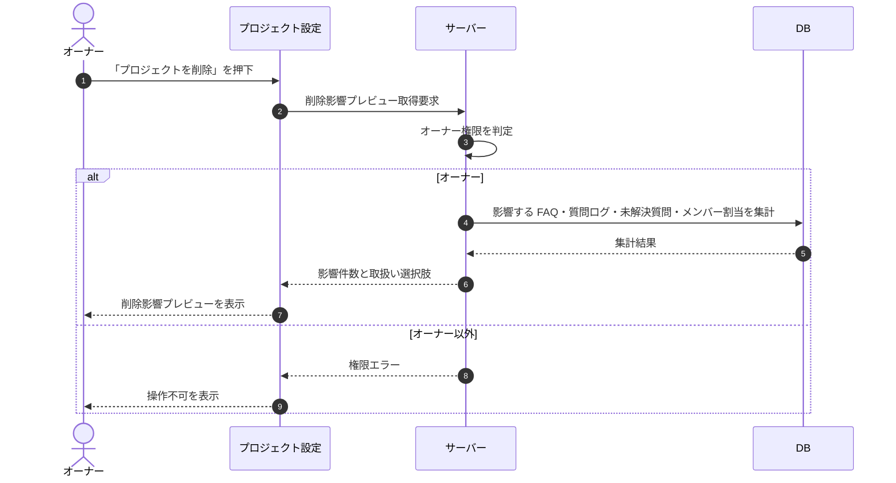

# SEQ-121: プロジェクト削除影響プレビュー

> **このページは、プロジェクト削除影響プレビューのシーケンス図を定義します。** プロジェクト削除の確定前に、影響する関連データの件数と取扱い選択肢を取得して表示する。

| ID | 業務ユースケースID | イベント(画面ID EVT-NN) | テーブルID |
|----|----|----|----|
| SEQ-121 | [UC-073](../../01_requirements/04_business_usecases/UC-073.md#UC-073) | — | [TBL-001](../02_backend/04_database/TBL-001.md#TBL-001) ・ [TBL-003](../02_backend/04_database/TBL-003.md#TBL-003) ・ [TBL-004](../02_backend/04_database/TBL-004.md#TBL-004) ・ [TBL-005](../02_backend/04_database/TBL-005.md#TBL-005) ・ [TBL-006](../02_backend/04_database/TBL-006.md#TBL-006) ・ [TBL-013](../02_backend/04_database/TBL-013.md#TBL-013) ・ [TBL-014](../02_backend/04_database/TBL-014.md#TBL-014) ・ [TBL-017](../02_backend/04_database/TBL-017.md#TBL-017) ・ [TBL-025](../02_backend/04_database/TBL-025.md#TBL-025) ・ [TBL-027](../02_backend/04_database/TBL-027.md#TBL-027) |

## 概要

プロジェクト削除の確定前に、削除で影響する関連データ(FAQ・質問ログ・未解決質問・メンバー割当)の件数と取扱い選択肢を取得して表示する。本シーケンスは参照(プレビュー)のみを扱い、実際の削除は別系統が行う。オーナー以外のアクセスや存在しないプロジェクトはエラーを返す。

## シーケンス図

## 例外フロー

- オーナー以外のユーザーのアクセスは権限エラーを返す。
- 対象プロジェクトが存在しない場合は未検出エラーを返す。

## 備考

- 本図は基本設計レベルの抽象度(ユーザー / 画面 / サーバー / DB)で記述する。DB 操作は DB アクターへのメッセージで表し、テーブル別 CRUD は本図に書かず 関連テーブル 欄で示す。
- 本シーケンスは削除確定前のプレビュー(参照)のみを扱い、実際の削除と関連データの取扱いは [API-018](../02_backend/03_apis/API-018.md#API-018) が担う。
