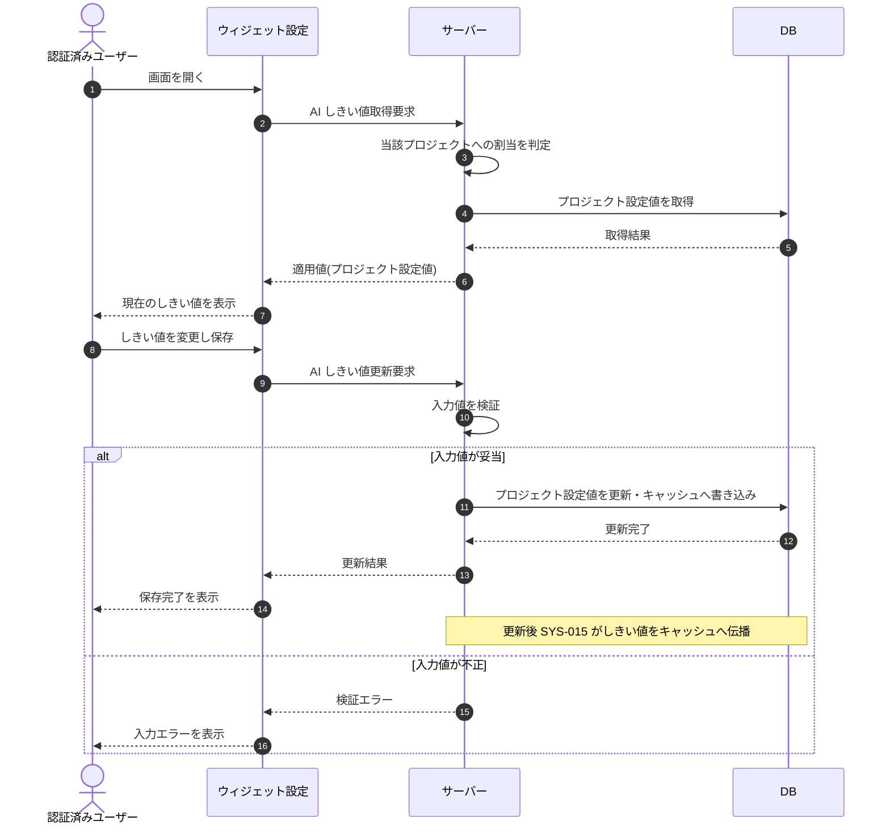

# SEQ-122: AIしきい値設定

> **このページは、AIしきい値設定のシーケンス図を定義します。** 回答可否の信頼度・関連度しきい値をプロジェクト単位で取得・更新し、更新後はキャッシュへ伝播する。

| ID | 業務ユースケースID | イベント(画面ID EVT-NN) | テーブルID |
|----|----|----|----|
| SEQ-122 | [UC-075](../../01_requirements/04_business_usecases/UC-075.md#UC-075) | — | [TBL-004](../02_backend/04_database/TBL-004.md#TBL-004) ・ [TBL-031](../02_backend/04_database/TBL-031.md#TBL-031) |

## 概要

回答可否の信頼度・関連度しきい値をプロジェクト単位で取得・更新する。しきい値はプロジェクト作成時に必ず設定されているため、適用元は常に当該プロジェクトの設定値でグローバル既定値などのフォールバック先は持たない。更新後はシステム処理 SYS-015 が AI しきい値キャッシュへ伝播する。割当のないプロジェクトへのアクセス・入力値不正・存在しないプロジェクトはエラーを返す。

## シーケンス図

## 例外フロー

- 当該プロジェクトに割当のないユーザーのアクセスはアクセス拒否エラーを返す。
- 入力値が不正な場合は検証エラーを返す。
- 対象プロジェクトが存在しない場合は未検出エラーを返す。

## 備考

- 本図は基本設計レベルの抽象度(ユーザー / 画面 / サーバー / DB)で記述する。DB 操作は DB アクターへのメッセージで表し、テーブル別 CRUD は本図に書かず 関連テーブル 欄で示す。
- しきい値更新後は [SYS-015](../02_backend/01_system/SYS-015.md#SYS-015) が `TP_AI_THRESH_CACHE` へプロジェクト設定値を伝播する。AI 推論側はフォールバック先を持たないため、取得不能時は推論不可として扱う。
