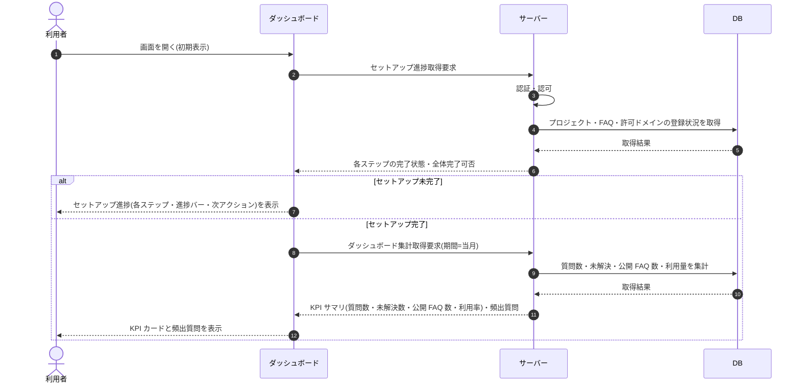

# SEQ-123: ダッシュボード初期表示(セットアップ進捗判定と KPI 表示の切替)

> **このページは、業務ユースケース UC-033(ダッシュボード初期表示)のうち、セットアップ進捗の判定と表示パターン(セットアップ進捗 / KPI 表示)の切替のシーケンス図を定義します。**

## 項目

| 項目 | 内容 |
|---|---|
| SEQ ID | `SEQ-123` |
| トレーサビリティID | [TR-033](../00_traceability/index.md#TR-033) ・ [TR-036](../00_traceability/index.md#TR-036) |
| 画面イベント (EVT) | EVT-212 |
| 関連画面 | [SCR-033](../01_frontend/01_screens/SCR-033.md#SCR-033) |
| 関連 API | [API-063](../02_backend/03_apis/API-063.md#API-063) ・ [API-062](../02_backend/03_apis/API-062.md#API-062) |
| 関連テーブル | [TBL-004](../02_backend/04_database/TBL-004.md#TBL-004) ・ [TBL-006](../02_backend/04_database/TBL-006.md#TBL-006) ・ [TBL-005](../02_backend/04_database/TBL-005.md#TBL-005) ・ [TBL-025](../02_backend/04_database/TBL-025.md#TBL-025) ・ [TBL-017](../02_backend/04_database/TBL-017.md#TBL-017) ・ [TBL-020](../02_backend/04_database/TBL-020.md#TBL-020) ・ [TBL-009](../02_backend/04_database/TBL-009.md#TBL-009) |
| エラー (ERR) | [ERR-001](../05_errors/ERR-001.md#ERR-001) ・ [ERR-019](../05_errors/ERR-019.md#ERR-019) |
| メッセージ (MSG) | — |

## 概要

利用者がダッシュボードを開くと、サーバーがまずセットアップ進捗(プロジェクト作成・FAQ 登録・ウィジェット埋め込み)の完了状態を判定する。未完了の場合はセットアップ進捗パターン(各ステップ・進捗・次アクション)を表示し、全完了の場合は KPI 表示パターン(質問数・未解決数・公開 FAQ 数・利用率と頻出質問)を集計して表示する。

## シーケンス図

## 例外フロー

- メンバーが対象プロジェクトを指定せずに KPI 表示を要求した場合は、入力不備としてエラーを表示する([ERR-001](../05_errors/ERR-001.md#ERR-001))。
- 当該プロジェクトへのアクセス権がない場合は、権限不足としてアクセスを拒否する([ERR-019](../05_errors/ERR-019.md#ERR-019))。

## 備考

- 本図は基本設計レベルの抽象度(ユーザー / 画面 / サーバー、システム起点は外部システム・スケジューラ・バッチを加える)で記述する。DB 操作は DB アクターへのメッセージで表し、テーブル別 CRUD は本図に書かず 関連テーブル 欄で示す。
- 図の出典は業務ユースケース [UC-033](../../01_requirements/04_business_usecases/UC-033.md#UC-033)。セットアップ進捗 / KPI 表示の切替は [FR-191](../../01_requirements/02_functional_requirement/03_usage-fr.md#FR-191) を参照。
