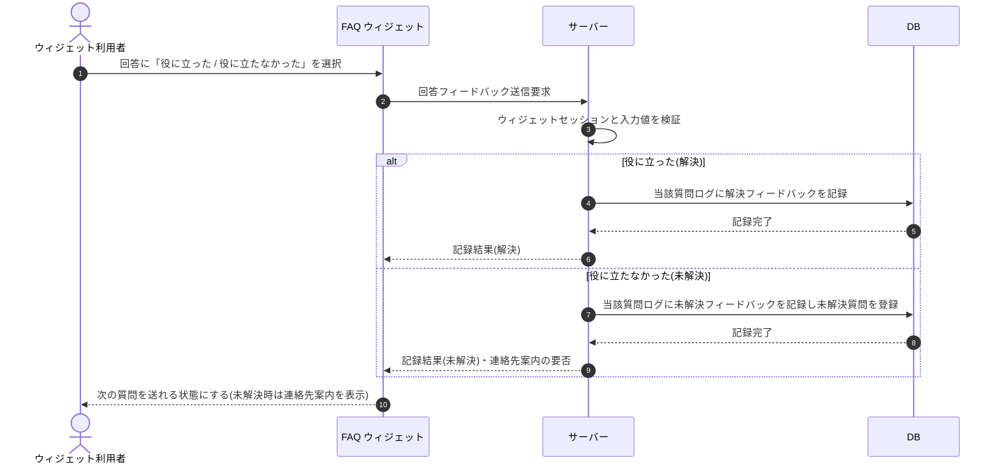

# SEQ-123: 回答フィードバック送信

> **このページは、業務ユースケース UC-083（ウィジェット利用者が回答の解決・未解決をフィードバックする）のシーケンス図を定義します。**

| ID | 業務ユースケースID | イベント(画面ID EVT-NN) | テーブルID |
|----|----|----|----|
| SEQ-123 | [UC-083](../../01_requirements/04_business_usecases/UC-083.md#UC-083) | SCR-030 EVT-08 | [TBL-025](../02_backend/04_database/TBL-025.md#TBL-025) ・ [TBL-017](../02_backend/04_database/TBL-017.md#TBL-017) |

## 概要

ウィジェット利用者が AI 回答に対して「役に立った(解決)」/「役に立たなかった(未解決)」を選び、サーバーがフィードバックを記録する。未解決選択時は当該質問を未解決質問として登録し、連絡先が設定済みなら連絡先案内の要否を返す。記録後は次の質問送信が可能になる。フィードバックは次の質問送信の前提として必須。

## シーケンス図

## 例外フロー

- ウィジェットセッションが無効な場合は記録せずエラーを返す。
- 入力値(対象質問・フィードバック種別)が不正な場合は検証エラーを返す。
- 記録に失敗した場合はエラーを返し、利用者に再度のフィードバックを促す(記録できるまで次の質問は送れない)。

## 備考

- 本図は基本設計レベルの抽象度(ユーザー / 画面 / サーバー)で記述する。DB 操作は DB アクターへのメッセージで表し、テーブル別 CRUD は本図に書かず 関連テーブル 欄で示す。
- 図の出典は業務ユースケース [UC-083](../../01_requirements/04_business_usecases/UC-083.md#UC-083)。画面イベントとの対応は UC-083 を参照。
