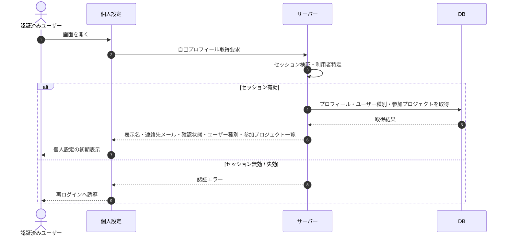

# SEQ-124: 自己プロフィール初期表示

> **このページは、自己プロフィール初期表示のシーケンス図を定義します。** 個人設定画面の初期表示で、認証中の利用者のプロフィールと参加プロジェクト一覧を取得して表示する。

## 項目

| 項目 | 内容 |
|---|---|
| SEQ ID | `SEQ-124` |
| トレーサビリティID | [TR-008](../00_traceability/index.md#TR-008) |
| 画面イベント (EVT) | — |
| 関連画面 | [SCR-022](../01_frontend/01_screens/SCR-022.md#SCR-022) |
| 関連 API | [API-064](../02_backend/03_apis/API-064.md#API-064) |
| 関連テーブル | [TBL-001](../02_backend/04_database/TBL-001.md#TBL-001) ・ [TBL-002](../02_backend/04_database/TBL-002.md#TBL-002) ・ [TBL-003](../02_backend/04_database/TBL-003.md#TBL-003) ・ [TBL-004](../02_backend/04_database/TBL-004.md#TBL-004) |
| エラー (ERR) | [ERR-033](../05_errors/ERR-033.md#ERR-033) |
| メッセージ (MSG) | — |

## 概要

個人設定画面の初期表示で、認証中の利用者の表示名・連絡先メールと確認状態・ユーザー種別(オーナー / メンバー)・参加プロジェクト一覧を取得して表示する。セッションが無効または失効している場合はエラーを返す。

## シーケンス図

## 例外フロー

- セッションが無効または失効している場合は認証エラーを返し、再ログインへ誘導する。

## 備考

- 本図は基本設計レベルの抽象度(ユーザー / 画面 / サーバー / DB)で記述する。DB 操作は DB アクターへのメッセージで表し、テーブル別 CRUD は本図に書かず 関連テーブル 欄で示す。
- プロフィールの更新は別系統([API-012](../02_backend/03_apis/API-012.md#API-012))が担い、本シーケンスは参照(初期表示)のみを扱う。
