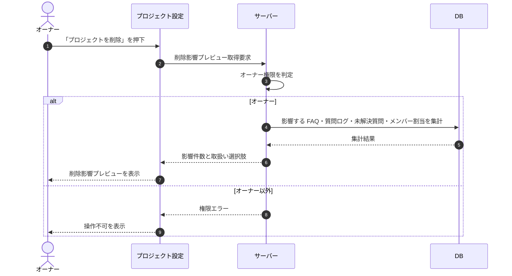

# SEQ-126: プロジェクト削除影響プレビュー

> **このページは、プロジェクト削除影響プレビューのシーケンス図を定義します。** プロジェクト削除の確定前に、影響する関連データの件数と取扱い選択肢を取得して表示する。

## 項目

| 項目 | 内容 |
|---|---|
| SEQ ID | `SEQ-126` |
| トレーサビリティID | [TR-079](../00_traceability/index.md#TR-079) |
| 画面イベント (EVT) | — |
| 関連画面 | [SCR-004](../01_frontend/01_screens/SCR-004.md#SCR-004) ・ [SCR-005](../01_frontend/01_screens/SCR-005.md#SCR-005) |
| 関連 API | [API-066](../02_backend/03_apis/API-066.md#API-066) |
| 関連テーブル | [TBL-003](../02_backend/04_database/TBL-003.md#TBL-003) ・ [TBL-004](../02_backend/04_database/TBL-004.md#TBL-004) ・ [TBL-006](../02_backend/04_database/TBL-006.md#TBL-006) ・ [TBL-017](../02_backend/04_database/TBL-017.md#TBL-017) ・ [TBL-025](../02_backend/04_database/TBL-025.md#TBL-025) |
| エラー (ERR) | [ERR-011](../05_errors/ERR-011.md#ERR-011) ・ [ERR-015](../05_errors/ERR-015.md#ERR-015) |
| メッセージ (MSG) | — |

## 概要

プロジェクト削除の確定前に、削除で影響する関連データ(FAQ・質問ログ・未解決質問・メンバー割当)の件数と取扱い選択肢を取得して表示する。本シーケンスは参照(プレビュー)のみを扱い、実際の削除は別系統が行う。オーナー以外のアクセスや存在しないプロジェクトはエラーを返す。

## シーケンス図

## 例外フロー

- オーナー以外のユーザーのアクセスは権限エラーを返す。
- 対象プロジェクトが存在しない場合は未検出エラーを返す。

## 備考

- 本図は基本設計レベルの抽象度(ユーザー / 画面 / サーバー / DB)で記述する。DB 操作は DB アクターへのメッセージで表し、テーブル別 CRUD は本図に書かず 関連テーブル 欄で示す。
- 本シーケンスは削除確定前のプレビュー(参照)のみを扱い、実際の削除と関連データの取扱いは [API-018](../02_backend/03_apis/API-018.md#API-018) が担う。
