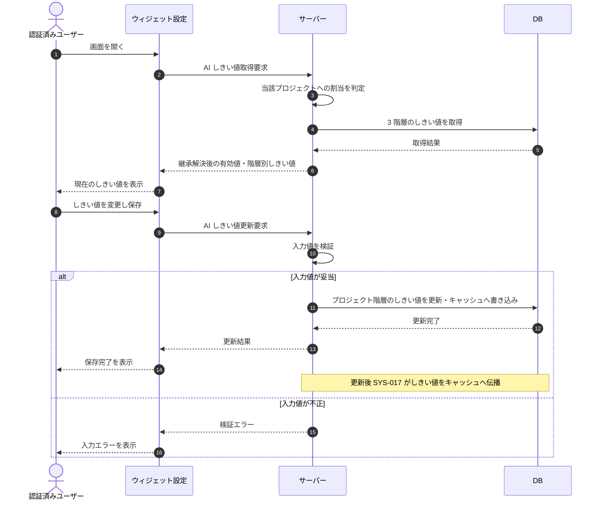

# SEQ-127: AIしきい値設定

> **このページは、AIしきい値設定のシーケンス図を定義します。** 回答可否の信頼度・関連度しきい値を 3 階層で取得・更新し、更新後はキャッシュへ伝播する。

## 項目

| 項目 | 内容 |
|---|---|
| SEQ ID | `SEQ-127` |
| トレーサビリティID | [TR-080](../00_traceability/index.md#TR-080) |
| 画面イベント (EVT) | — |
| 関連画面 | [SCR-011](../01_frontend/01_screens/SCR-011.md#SCR-011) |
| 関連 API | [API-067](../02_backend/03_apis/API-067.md#API-067) |
| 関連テーブル | [TBL-004](../02_backend/04_database/TBL-004.md#TBL-004) ・ [TBL-031](../02_backend/04_database/TBL-031.md#TBL-031) |
| エラー (ERR) | [ERR-001](../05_errors/ERR-001.md#ERR-001) ・ [ERR-011](../05_errors/ERR-011.md#ERR-011) ・ [ERR-019](../05_errors/ERR-019.md#ERR-019) |
| メッセージ (MSG) | — |

## 概要

回答可否の信頼度・関連度しきい値を 3 階層(グローバル / オーナー / プロジェクト)で取得・更新する。より具体的な階層を優先適用し、未設定の階層は上位を継承する。更新後はシステム処理 SYS-017 が AI しきい値キャッシュへ伝播する。割当のないプロジェクトへのアクセス・入力値不正・存在しないプロジェクトはエラーを返す。

## シーケンス図

## 例外フロー

- 当該プロジェクトに割当のないユーザーのアクセスはアクセス拒否エラーを返す。
- 入力値が不正な場合は検証エラーを返す。
- 対象プロジェクトが存在しない場合は未検出エラーを返す。

## 備考

- 本図は基本設計レベルの抽象度(ユーザー / 画面 / サーバー / DB)で記述する。DB 操作は DB アクターへのメッセージで表し、テーブル別 CRUD は本図に書かず 関連テーブル 欄で示す。
- しきい値更新後は [SYS-017](../02_backend/01_system/SYS-017.md#SYS-017) が `TP_AI_THRESH_CACHE` へ伝播し、AI 推論側はキャッシュをフォールバックで参照する。
