<!-- portal-top -->
[設計ポータル](../../README.md) ／ [基本設計](../index.md) ／ **DB設計**
<!-- /portal-top -->

# データベース設計書

**メインシステムのデータベース(Cloudflare D1 / SQLite)全 31 テーブルを機能ドメイン別に定義する設計書です。** 全ユーザーは `M_USER`、契約は `M_CONTRACT`(オーナー判定 + プロジェクトの親)で管理します。各テーブルの詳細はテーブル名のリンクから辿れます。

*版数 v3.6 ・ 更新 2026-06-21 ・ テーブル数 31 ・ 独立設計書*

## 1.データストア構成

D1
<h4>Cloudflare D1(SQLite)</h4>
全 31 テーブル。契約境界は <code>contract_id</code>(<code>M_CONTRACT.id</code>)で表す。

KV
<h4>Workers KV</h4>
セッション / トークン / レート制限のキャッシュ。

R2
<h4>R2 オブジェクト</h4>
CSV 添付・ウィジェット静的アセット。

## 2.テーブル一覧

全 31 テーブルを 7 ドメインに分類しています。テーブル名は個別ページ(概要 / カラム定義 / インデックス / コード値)へのリンクです。

#### 認証・アカウント・契約 (7)

全ユーザーの認証(M_USER)、契約とオーナー判定(M_CONTRACT)、プロジェクトメンバー割当、セッション・トークン・規約。

| 物理名 | 論理名 | 分類 / 保持 | 概要 |
|----|----|----|----|
| [`M_USER`](TBL-M-001.md) | ユーザーマスタ | マスタ | オーナー・メンバーを含む全ユーザーの認証情報を一元保持。 |
| [`M_CONTRACT`](TBL-M-002.md) | 契約マスタ | マスタ | 契約を管理。id が契約境界キー、user_id でオーナーを判定。プロジェクトの親。 |
| [`M_PRJ_USERS`](TBL-M-003.md) | プロジェクトメンバー(割当) | マスタ | ユーザーをプロジェクトへ割り当て(役割差は持たない)。 |
| [`T_SESSIONS`](TBL-T-001.md) | セッション | トランザクション | 複数デバイス対応のログインセッション。 |
| [`T_ACCESS_TOKENS`](TBL-T-002.md) | アクセストークン | トランザクション | 招待・パスワード再設定・メール確認などの短期トークン。 |
| [`M_TERMS_VER`](TBL-M-012.md) | 規約版数 | マスタ | 利用規約・プライバシーポリシーの版。 |
| [`T_TERMS_AGREE`](TBL-T-012.md) | 規約同意 | トランザクション | 利用者ごとの規約同意履歴。 |

#### プロジェクト・ウィジェット (3)

FAQ プロジェクト本体(契約の子)、許可ドメイン、ウィジェット鍵。

| 物理名 | 論理名 | 分類 / 保持 | 概要 |
|----|----|----|----|
| [`M_PROJECTS`](TBL-M-004.md) | プロジェクト | マスタ | FAQ プロジェクトとウィジェット設定。契約(M_CONTRACT)の子テーブル。 |
| [`M_ALLOWED_DOMAINS`](TBL-M-005.md) | 許可ドメイン | マスタ | ウィジェット埋め込みを許可するドメイン。 |
| [`T_PRJ_LEGACY_KEYS`](TBL-T-003.md) | レガシー API キー | トランザクション | 鍵ローテーション時に旧キーを 24 時間だけ有効化。 |

#### FAQ・質問・未解決 (6)

FAQ 本体と全文検索、質問ログ、参照 FAQ、未解決質問、FAQ 化履歴。

| 物理名 | 論理名 | 分類 / 保持 | 概要 |
|----|----|----|----|
| [`M_FAQS`](TBL-M-006.md) | FAQ | マスタ | FAQ 本体(質問・回答・公開状態)。契約境界は project_id で導出。 |
| [`TP_FAQ_FTS`](TBL-TP-001.md) | FAQ 全文検索 | ワーク | FTS5 仮想テーブル(trigram)。 |
| [`H_QUESTION_LOGS`](TBL-H-001.md) | 質問ログ | 履歴 | ウィジェット利用者の質問と AI 推論結果。 |
| [`T_QLOG_FAQ_REFS`](TBL-T-004.md) | 参照 FAQ(M:N) | トランザクション | 質問ログと参照 FAQ の中間テーブル。 |
| [`T_INQUIRIES`](TBL-T-005.md) | 未解決質問 | トランザクション | FAQ 登録前の未解決質問。 |
| [`H_INQUIRY_FAQ`](TBL-H-005.md) | 未解決質問 FAQ 化履歴 | 履歴 | 未解決質問から FAQ への移行履歴(データコピー方式)。 |

#### 利用量・課金・上限 (5)

利用量計測、サブスク・請求書(7 年保持)、利用上限・無料枠。

| 物理名 | 論理名 | 分類 / 保持 | 概要 |
|----|----|----|----|
| [`T_USAGE_METER`](TBL-T-008.md) | 利用量計測 | トランザクション 課金7年 | 質問数・FAQ 件数をプロジェクト単位で計測し契約単位で集計。 |
| [`T_BILL_SUBS`](TBL-T-006.md) | 課金サブスクリプション | トランザクション 課金7年 | Stripe サブスクと連動。 |
| [`T_BILL_INVOICES`](TBL-T-007.md) | 請求書 | トランザクション 課金7年 | 月次請求書(電子帳簿保存法 7 年)。 |
| [`M_PRJ_QUOTA_LIMITS`](TBL-M-009.md) | プロジェクト別利用設定 | マスタ | 質問数の月次上限・無料枠・アラート。 |
| [`M_OWNER_QUOTA_OVR`](TBL-M-008.md) | 契約別レート上書き | マスタ | 契約単位のレート制限上書き(contract 単位)。 |

#### お知らせ・通知 (5)

運営お知らせ、配信対象、受信者集計、受信箱、メール通知ログ。

| 物理名 | 論理名 | 分類 / 保持 | 概要 |
|----|----|----|----|
| [`M_SERVICE_ANNOUNCE`](TBL-M-010.md) | お知らせ(Control Plane) | マスタ | お知らせ本体。 |
| [`M_ANNOUNCE_AUD`](TBL-M-011.md) | お知らせ配信対象(M:N) | マスタ | 配信先を限定指定。 |
| [`T_ANNOUNCE_RCPT`](TBL-T-009.md) | お知らせ受信者 | トランザクション | 実配信先・配信集計・監査。 |
| [`T_INBOX_MSG`](TBL-T-010.md) | 受信箱(Tenant Plane) | トランザクション | 利用者が受け取る通知の既読状態。 |
| [`H_NOTIF_LOGS`](TBL-H-002.md) | 通知ログ | 履歴 | メール通知の送信履歴。 |

#### 退会・データ管理 (1)

退会申請(90 日猶予)とデータ削除モード。

| 物理名 | 論理名 | 分類 / 保持 | 概要 |
|----|----|----|----|
| [`T_WITHDRAW_REQ`](TBL-T-011.md) | 退会申請 | トランザクション | 退会申請レコード(90 日猶予)。 |

#### システム・ログ・運用 (4)

監査ログ、エラーログ、メールサプレス、AI しきい値キャッシュ。

| 物理名 | 論理名 | 分類 / 保持 | 概要 |
|----|----|----|----|
| [`H_AUDIT_LOGS`](TBL-H-003.md) | 監査ログ | 履歴 一部課金 | メイン側 API 操作ログ。 |
| [`H_ERROR_LOGS`](TBL-H-004.md) | エラーログ | 履歴 | サーバーエラー記録。 |
| [`M_EMAIL_SUPPRESS`](TBL-M-007.md) | メールサプレスリスト | マスタ | バウンス・苦情アドレス(全契約横断)。 |
| [`TP_AI_THRESH_CACHE`](TBL-TP-002.md) | AI しきい値キャッシュ | ワーク | 3 階層しきい値の永続キャッシュ。 |

## 3.ER 図(親子関係)

全 31 テーブルの親子関係を、機能ドメイン別の ER 図で示します。

**(1) アカウント・契約・メンバー**

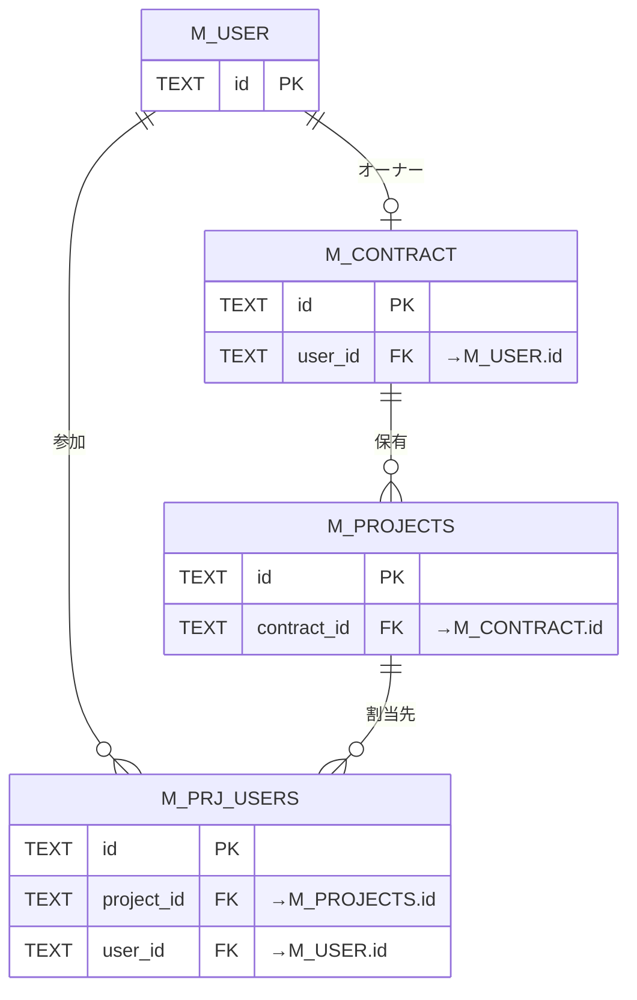

**(2) 認証 — セッション**

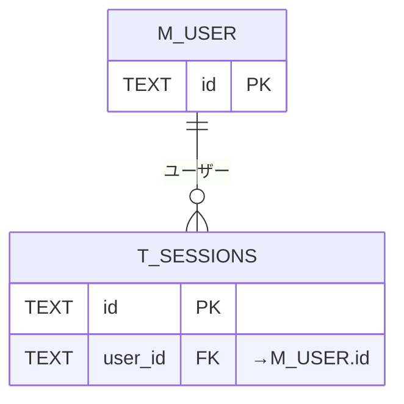

**(3) 認証 — トークン**

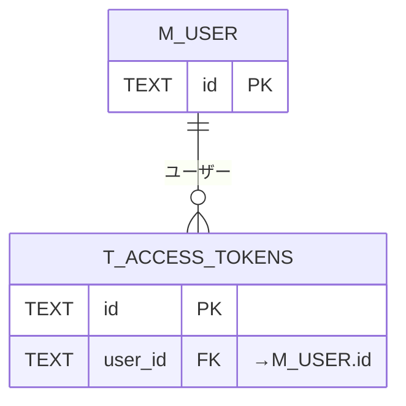

**(4) 認証 — 規約同意**

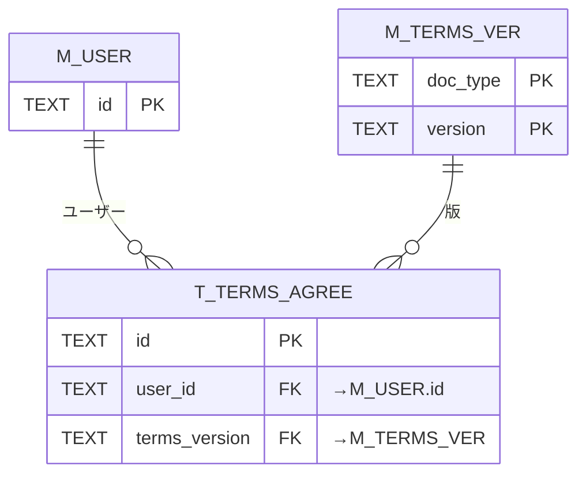

**(5) プロジェクト・ウィジェット**

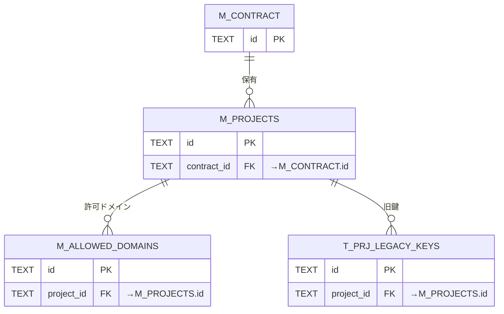

**(6) FAQ**

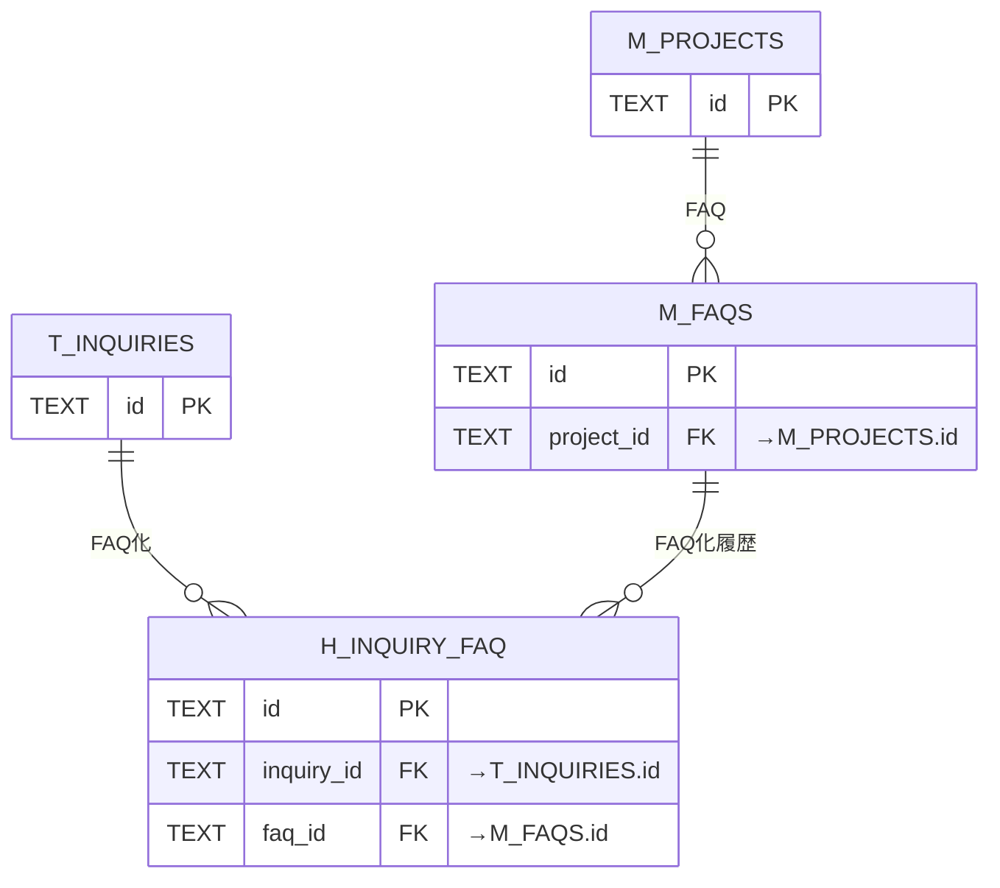

**(7) 質問ログ・参照 FAQ**

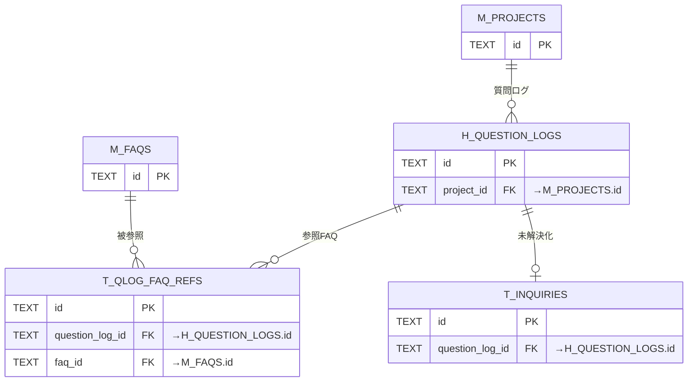

**(8) 未解決質問**

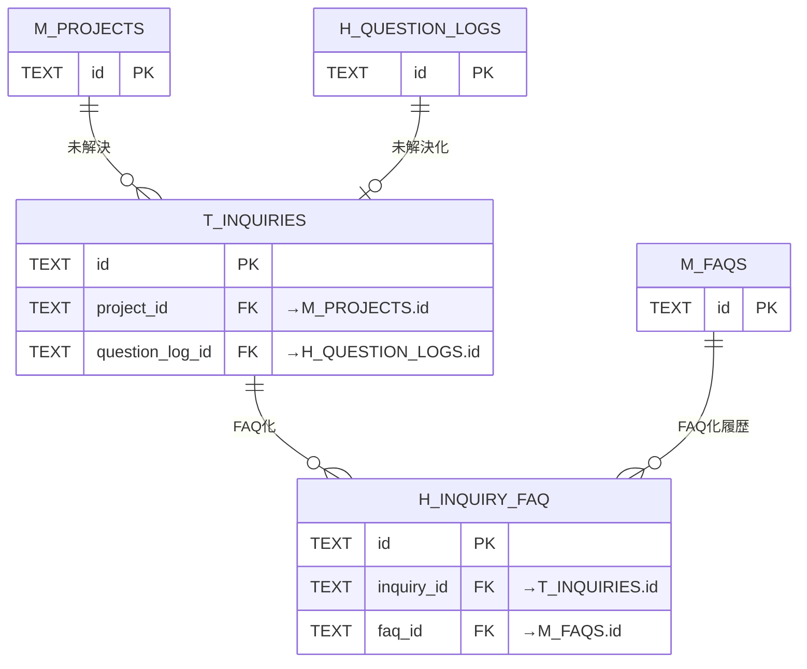

**(9) 利用量・課金・上限**

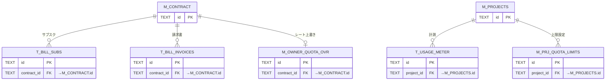

**(10) お知らせ・通知**

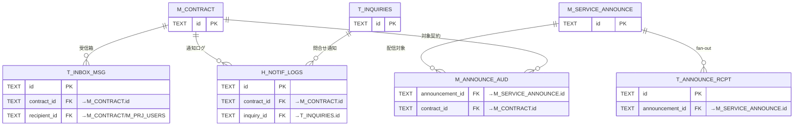

**(11) 退会・データ管理**

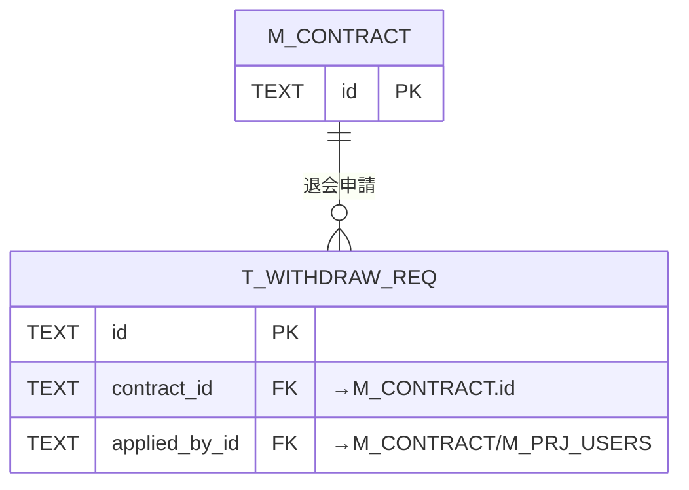

**(12) システム・ログ・運用**

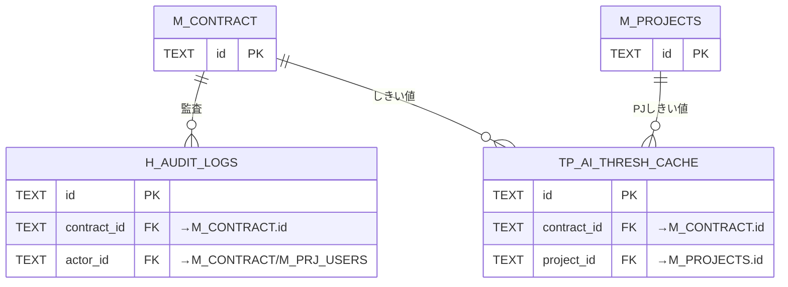

## 4.命名・分類規約

| 接頭辞 | 分類             | 用途                 |
|--------|------------------|----------------------|
| `M_`   | マスタ           | マスタ・設定         |
| `T_`   | トランザクション | トランザクション     |
| `H_`   | 履歴             | 履歴・ログ(追記専用) |
| `TP_`  | ワーク           | ワーク・派生         |

---

<!-- portal-bottom -->
[基本設計](../index.md) ・ [↑ 設計ポータル](../../README.md)
<!-- /portal-bottom -->
