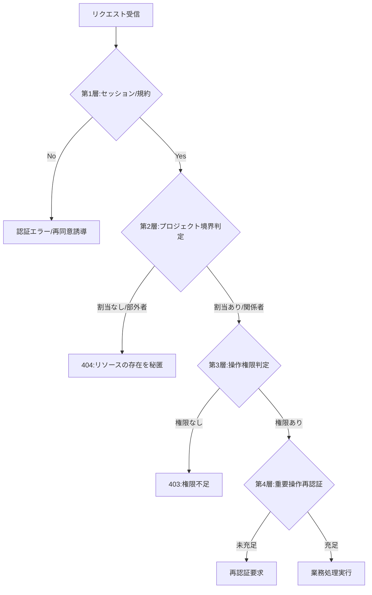

# PERM-002: 認可判定の順序

> **このページは 1 リクエストを許可するまでに通す認可判定の段と、各段の拒否時エラーを定義します。判定はグローバルなバイパスを持たず、常に対象プロジェクト単位で評価します。**

| ID | 権限名 | 業務ユースケースID | イベント(画面ID+イベントID) | API ID |
|----|----|----|----|----|
| PERM-002 | 認可判定の順序 | [UC-071](../../01_requirements/04_business_usecases/UC-071.md#UC-071) | — | — |
*種別 権限定義 ・ ステータス ドラフト*

## 1. 判定基準（ビジネスロジック）

判定はリクエストごとに以下の 4 層を上から順に評価します。いずれかの層で拒否されると後続は評価しません。

詳細な判定段（11 段）は以下の通りです。各段は拒否時に対応するエラー分類へ落とし、エラー定義の正本は [エラー設計](../05_errors/index.md) です。

| \# | 判定段 | 業務的な条件 | 拒否時のエラー |
|----|----|----|----|
| 1 | セッション検証 | 無操作 30 分 / 絶対 12 時間を満たす有効セッションがあること | [ERR-033](../05_errors/ERR-033.md#ERR-033)（認証切れ） |
| 2 | アカウント有効性 | アカウントが利用可能状態であること（無効化済みなら再ログインへ誘導） | — |
| 3 | 規約再同意ゲート | 改定済みで未同意の文書がなければ通過。あれば再同意画面へ割込み | [SCR-020](../01_frontend/01_screens/SCR-020.md#SCR-020) へ誘導（エラーではなくゲート） |
| 4 | 課金アカウント状態 / アカウント状態ゲート | 対象プロジェクトのオーナーの課金アカウントが停止状態でないこと、かつ本人のアカウントが退会済み・削除済みでないことを確認し、該当時はアクセス制限を適用 | [ERR-004](../05_errors/ERR-004.md#ERR-004) 等 |
| 5 | 対象プロジェクトのオーナー判定 | 対象プロジェクトの作成者とアクセス主体が一致するなら当該プロジェクト内を許可（対象プロジェクト単位の判定） | — |
| 6 | プロジェクト所有境界判定 | オーナーとしての操作は、対象プロジェクトが自分の所有するプロジェクトであることを要求。所有外は 404 偽装 | [ERR-017](../05_errors/ERR-017.md#ERR-017)（所有境界違反） |
| 7 | プロジェクト割当境界判定 | 非オーナーは対象プロジェクトへの有効な割当があること。割当なしは 404 偽装 | [ERR-019](../05_errors/ERR-019.md#ERR-019) / [ERR-030](../05_errors/ERR-030.md#ERR-030) |
| 8 | オーナー専有機能判定 | 専有機能を非オーナーが要求した場合は 403 | [ERR-015](../05_errors/ERR-015.md#ERR-015) |
| 9 | オーナー保護・自己操作禁止 | 不可制約（オーナーへの操作・自己操作）に該当すれば拒否 | [ERR-021](../05_errors/ERR-021.md#ERR-021) / [ERR-022](../05_errors/ERR-022.md#ERR-022) |
| 10 | 再認証判定 | 重要操作で「当該操作 1 回 + 15 分以内」の再認証を満たすか | [ERR-013](../05_errors/ERR-013.md#ERR-013)（再認証要求） |
| 11 | 利用上限判定 | 認可通過後に上限を確認（レート = オーナー単位、上限・無料枠 = プロジェクト単位） | [課金・請求設計書](../05_billing-design.md) |

## 2. 不変条件（ビジネスルール）

- **上から順に評価し、拒否されたら後続は評価しません。** 段をスキップするバイパスは設けません。
- **割当変更の反映**: 割当変更は既存セッションを即時失効させず、次回認可チェック時に反映します（一定の反映遅延を許容）。
- **利用上限判定は最後**: 上限確認は認可の通過後に行います。認可要件とは独立した判定です。

## 3. 権限不足時の挙動

各段の拒否時挙動は判定段テーブルの「拒否時のエラー」列が正本です。エラーコードの定義は [エラー設計](../05_errors/index.md) を参照します。

- **404 偽装**（段 6・7）: セキュリティ保護のため、アクセス権のないリソースは「未検出」として振る舞い、存在を明かしません。
- **403**（段 8・9）: 存在は確認できるが操作権限が不足している場合に返します。
- **再誘導**（段 2・3）: エラーではなく、適切な画面（ログイン・再同意）へ誘導します。

## 4. 関連トレーサビリティ

| 観点 | 結線 |
|----|----|
| 対応画面SCR | — |
| 対応EVT | — |
| 対応API | — |
