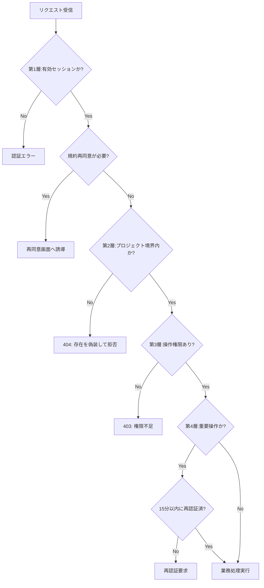

# 権限設計

> **このページは、認可判定フロー・ロール別業務UC遂行可否マトリクス・ロール別操作権限の一覧と、UC / 画面(SCR)/ 画面イベント(EVT)/ API から権限への対応表です。** 認証後のユーザーは、アクセス対象プロジェクトとの関係に基づき「オーナー（対象プロジェクトの作成者）」または「メンバー（当該プロジェクトへの有効な割当を持つ非オーナー）」として導出されます。各権限ルールは `PERM-NNN.md` で個別定義し、拒否時のエラーは [エラー設計](../05_errors/index.md)、画面文言・メールは [メッセージ設計](../06_messages/index.md) を参照します。

*ステータス ドラフト*

## 読み順

要件定義(FR / BR / RULE)＞ 本権限設計 ＞ API設計 / エラー設計 / メッセージ設計。認可判定の各段は [PERM-002](PERM-002.md#PERM-002) を参照する。

## 0. 認可判定フロー（4層モデル）

1 リクエストが業務処理へ到達するまでに通す 4 つの業務的関門です。上から順に評価し、いずれかで拒否されると後続の関門には進みません。

| 関門 | 業務的意味 | 拒否パターン | 参照 |
|----|----|----|----|
| 第1層: セッション・規約 | 本人確認済みで、アカウントが有効かつ規約に同意しているか | 認証エラー・再同意誘導 | [PERM-007](PERM-007.md#PERM-007) [PERM-008](PERM-008.md#PERM-008) [PERM-009](PERM-009.md#PERM-009) [PERM-010](PERM-010.md#PERM-010) |
| 第2層: プロジェクト境界 | 対象リソースが自分の所有または割当プロジェクト範囲内か | 404 偽装（存在を明かさない） | [PERM-005](PERM-005.md#PERM-005) |
| 第3層: 操作権限 | ロールとして許可された操作か（オーナー専有・保護制約含む） | 403 権限不足 | [PERM-001](PERM-001.md#PERM-001) [PERM-003](PERM-003.md#PERM-003) [PERM-004](PERM-004.md#PERM-004) |
| 第4層: 重要操作再認証 | 不可逆・高リスク操作の直前に本人確認を再実施 | 再認証要求 | [PERM-006](PERM-006.md#PERM-006) |

## 1. ロール別業務UC遂行可否マトリクス

アクター定義: **未認証ユーザー** = ログイン前の利用者。**プロジェクトオーナー** = 対象プロジェクトの作成者（管理・課金責任を負う全権者）。**プロジェクトメンバー** = 当該プロジェクトに有効な割当を持つ利用者（オーナー除く）。◯ = 実行可 / × = 実行不可 / — = 対象外（当該アクターの文脈で発生しない操作）。備考欄は △（制限あり）の場合のみ具体的内容を記載。

> [!NOTE]
> **データ分離**: 所有・割当のいずれも満たさないプロジェクトへのアクセスは「404 偽装」で拒否します（存在を明かさない）。詳細は [PERM-005](PERM-005.md#PERM-005)。

| 業務カテゴリ | 業務内容（TR-ID / UC名） | 未認証 | オーナー | メンバー | 備考 |
|----|----|----|----|----|-----|
| **認証・アカウント登録** | [TR-001](../00_traceability/index.md#TR-001) / UC-001 ログイン | ◯ | × | × | ログイン前にのみ実行 |
| | [TR-002](../00_traceability/index.md#TR-002) / UC-002 アカウント新規作成 | ◯ | × | × | |
| | [TR-003](../00_traceability/index.md#TR-003) / UC-003 登録確認メール検証 | ◯ | × | × | |
| | [TR-004](../00_traceability/index.md#TR-004) / UC-004 パスワード再設定要求 | ◯ | × | × | |
| | [TR-005](../00_traceability/index.md#TR-005) / UC-005 新しいパスワードを設定 | ◯ | × | × | |
| | [TR-006](../00_traceability/index.md#TR-006) / UC-006 招待受諾 | ◯ | × | × | 招待リンクから有効化 |
| **アカウント管理** | [TR-007](../00_traceability/index.md#TR-007) / UC-007 連絡先メールアドレス確認 | × | ◯ | ◯ | |
| | [TR-008](../00_traceability/index.md#TR-008) / UC-008 個人プロフィール閲覧 | × | ◯ | ◯ | |
| | [TR-009](../00_traceability/index.md#TR-009) / UC-009 個人プロフィール編集 | × | ◯ | ◯ | △ 再認証必須 |
| | [TR-010](../00_traceability/index.md#TR-010) / UC-010 パスワード変更 | × | ◯ | ◯ | △ 再認証必須 |
| | [TR-011](../00_traceability/index.md#TR-011) / UC-011 利用規約閲覧 | × | ◯ | ◯ | |
| | [TR-012](../00_traceability/index.md#TR-012) / UC-012 プライバシーポリシー閲覧 | × | ◯ | ◯ | |
| | [TR-013](../00_traceability/index.md#TR-013) / UC-013 改定文書への再同意 | × | ◯ | ◯ | アカウント単位（立場を問わない） |
| | [TR-023](../00_traceability/index.md#TR-023) / UC-023 アカウント退会 | × | ◯ | ◯ | △ 再認証必須・アカウント単位 |
| **プロジェクト管理** | [TR-014](../00_traceability/index.md#TR-014) / UC-014 My プロジェクト一覧閲覧 | × | ◯ | × | 自身が所有するプロジェクト一覧 |
| | [TR-015](../00_traceability/index.md#TR-015) / UC-015 プロジェクト作成 | × | ◯ | × | オーナー専有 |
| | [TR-016](../00_traceability/index.md#TR-016) / UC-016 プロジェクト編集 | × | ◯ | × | オーナー専有 |
| | [TR-017](../00_traceability/index.md#TR-017) / UC-017 プロジェクト削除 | × | ◯ | × | △ オーナー専有・再認証必須 |
| | [TR-022](../00_traceability/index.md#TR-022) / UC-022 プロジェクト設定編集 | × | ◯ | ◯ | △ 課金・CRUD 設定はオーナー専有 |
| | [TR-079](../00_traceability/index.md#TR-079) / UC-079 プロジェクト削除時データ取扱い選択 | × | ◯ | × | オーナー専有 |
| | [TR-090](../00_traceability/index.md#TR-090) / UC-090 Join プロジェクト一覧閲覧 | × | ◯ | ◯ | メンバーとして参加中のプロジェクト一覧 |
| **メンバー管理** | [TR-018](../00_traceability/index.md#TR-018) / UC-018 メンバー一覧閲覧 | × | ◯ | ◯ | |
| | [TR-019](../00_traceability/index.md#TR-019) / UC-019 メンバー招待 | × | ◯ | ◯ | △ 再認証必須 |
| | [TR-020](../00_traceability/index.md#TR-020) / UC-020 メンバー情報編集 | × | ◯ | ◯ | |
| | [TR-021](../00_traceability/index.md#TR-021) / UC-021 メンバー削除 | × | ◯ | ◯ | △ 再認証必須。オーナーへの実行は不可（[PERM-004](PERM-004.md#PERM-004)） |
| | [TR-047](../00_traceability/index.md#TR-047) / UC-047 権限不足ガードからダッシュボードへ戻る | × | × | ◯ | 割当なし状態のメンバーのみ対象 |
| **FAQ・質問管理** | [TR-024](../00_traceability/index.md#TR-024) / UC-024 FAQ 一覧閲覧 | × | ◯ | ◯ | |
| | [TR-025](../00_traceability/index.md#TR-025) / UC-025 FAQ 作成・編集 | × | ◯ | ◯ | |
| | [TR-026](../00_traceability/index.md#TR-026) / UC-026 FAQ 削除 | × | ◯ | ◯ | |
| | [TR-027](../00_traceability/index.md#TR-027) / UC-027 FAQ 公開状態一括変更 | × | ◯ | ◯ | |
| | [TR-028](../00_traceability/index.md#TR-028) / UC-028 FAQ インポート（CSV） | × | ◯ | ◯ | |
| | [TR-029](../00_traceability/index.md#TR-029) / UC-029 FAQ エクスポート（CSV） | × | ◯ | ◯ | |
| | [TR-030](../00_traceability/index.md#TR-030) / UC-030 未解決質問一覧閲覧 | × | ◯ | ◯ | |
| | [TR-031](../00_traceability/index.md#TR-031) / UC-031 未解決質問詳細確認 | × | ◯ | ◯ | |
| | [TR-032](../00_traceability/index.md#TR-032) / UC-032 未解決質問対応状況更新 | × | ◯ | ◯ | |
| | [TR-078](../00_traceability/index.md#TR-078) / UC-078 プロジェクト範囲の FAQ・質問ログ・未解決操作 | × | ◯ | ◯ | |
| | [TR-080](../00_traceability/index.md#TR-080) / UC-080 信頼度・関連度しきい値の 3 階層調整 | × | ◯ | ◯ | |
| | [TR-081](../00_traceability/index.md#TR-081) / UC-081 FAQ・質問ログ検索 | × | ◯ | ◯ | |
| **ダッシュボード・利用量** | [TR-033](../00_traceability/index.md#TR-033) / UC-033 プロジェクト概要ダッシュボード閲覧 | × | ◯ | ◯ | |
| | [TR-034](../00_traceability/index.md#TR-034) / UC-034 利用量と上限の閲覧 | × | ◯ | ◯ | |
| | [TR-035](../00_traceability/index.md#TR-035) / UC-035 利用上限・アラート閾値設定 | × | ◯ | ◯ | △ 再認証必須 |
| **請求・課金** | [TR-036](../00_traceability/index.md#TR-036) / UC-036 請求管理（プロジェクト別課金状況）閲覧 | × | ◯ | × | オーナー専有 |
| | [TR-037](../00_traceability/index.md#TR-037) / UC-037 請求情報閲覧 | × | ◯ | × | オーナー専有 |
| | [TR-038](../00_traceability/index.md#TR-038) / UC-038 支払方法登録・更新 | × | ◯ | ◯ | △ 再認証必須・アカウント単位（プロジェクトの立場を問わない） |
| | [TR-088](../00_traceability/index.md#TR-088) / UC-088 退会済みユーザーによる請求情報閲覧 | × | ◯ | × | 退会後も本人のみ閲覧可 |
| **ウィジェット設定** | [TR-039](../00_traceability/index.md#TR-039) / UC-039 ウィジェット設定編集 | × | ◯ | ◯ | |
| | [TR-040](../00_traceability/index.md#TR-040) / UC-040 ウィジェット公開キー再発行 | × | ◯ | ◯ | |
| **お知らせ** | [TR-044](../00_traceability/index.md#TR-044) / UC-044 お知らせ一覧閲覧 | × | ◯ | ◯ | |
| | [TR-045](../00_traceability/index.md#TR-045) / UC-045 お知らせ詳細閲覧 | × | ◯ | ◯ | |
| | [TR-046](../00_traceability/index.md#TR-046) / UC-046 お知らせ既読化 | × | ◯ | ◯ | |
| **ウィジェット利用者主体** | [TR-041](../00_traceability/index.md#TR-041)〜[TR-043](../00_traceability/index.md#TR-043) / UC-041〜UC-043 ウィジェット操作（チャット / 検索 / 案内） | — | — | — | ウィジェット利用者（公開キー認証）が主体 |
| | [TR-061](../00_traceability/index.md#TR-061) / UC-061 許可ドメイン上でのみウィジェット動作 | — | — | — | システムによる制御。ウィジェット利用者の前提条件 |
| **システム主体の自動処理** | [TR-048](../00_traceability/index.md#TR-048)〜[TR-057](../00_traceability/index.md#TR-057) / UC-048〜UC-057 利用量・AI 推論・上限制御 | — | — | — | システムが主体の処理。ユーザーロール権限外 |
| | [TR-058](../00_traceability/index.md#TR-058)〜[TR-060](../00_traceability/index.md#TR-060) / UC-058〜UC-060 月次請求確定・サスペンション・課金 Webhook | — | — | — | システム・外部連携が主体 |
| | [TR-062](../00_traceability/index.md#TR-062)〜[TR-069](../00_traceability/index.md#TR-069) / UC-062〜UC-069 メール配信・通知自動生成 | — | — | — | システムが主体の処理 |
| | [TR-070](../00_traceability/index.md#TR-070)〜[TR-077](../00_traceability/index.md#TR-077) / UC-070〜UC-077 データ削除・セッション管理・監査・レート制限 | — | — | — | システムが主体の処理 |
| | [TR-082](../00_traceability/index.md#TR-082)〜[TR-087](../00_traceability/index.md#TR-087)・[TR-089](../00_traceability/index.md#TR-089) / UC-082〜UC-087・UC-089 通知管理・保持期間超過データ自動削除 | — | — | — | システムが主体の処理 |

## 2. ロール別操作権限一覧（11）

権限ルールの索引です。各 PERM の定義（判定基準・不変条件・権限不足時の挙動）は個別ファイルが正本です。ロールはオーナー / メンバー（割当あり）/ メンバー（割当なし）/ 未認証 / ウィジェット利用者の 5 区分です。

| PERM ID | 権限ルール | 概要 | 由来要件 |
|----|----|----|----|
| [PERM-001](PERM-001.md#PERM-001) | ユーザー種別とオーナー判定 | 認可の起点となるユーザー種別(オーナー / メンバー / ウィジェット利用者)の判定方法と権限の表し方を定義します。 | [FR-013](../../01_requirements/02_functional_requirement/01_account-fr.md#FR-013) [FR-014](../../01_requirements/02_functional_requirement/01_account-fr.md#FR-014) [FR-016](../../01_requirements/02_functional_requirement/01_account-fr.md#FR-016) [FR-035](../../01_requirements/02_functional_requirement/01_account-fr.md#FR-035) [FR-182](../../01_requirements/02_functional_requirement/01_account-fr.md#FR-182) |
| [PERM-002](PERM-002.md#PERM-002) | 認可判定の順序 | 1 リクエストを許可するまでに通す認可判定の段(セッション → 課金アカウント状態 / アカウント状態 → 対象プロジェクトのオーナー判定 → 所有境界 / 割当境界 → 専有 → 再認証 → 利用上限)と、各段の拒否時エラーを定義します。 | [FR-184](../../01_requirements/02_functional_requirement/01_account-fr.md#FR-184) [FR-185](../../01_requirements/02_functional_requirement/01_account-fr.md#FR-185) [FR-187](../../01_requirements/02_functional_requirement/01_account-fr.md#FR-187) |
| [PERM-003](PERM-003.md#PERM-003) | オーナー専有機能 | 非オーナーに付与してはならないオーナー専有機能(当該プロジェクトの課金・請求確認・プロジェクト CRUD)と、アカウント本人単位の操作(退会・規約再同意)、その判定段を定義します。 | [FR-015](../../01_requirements/02_functional_requirement/01_account-fr.md#FR-015) [BR-017](../../01_requirements/01_business_requirement/01_account-br.md#BR-017) |
| [PERM-004](PERM-004.md#PERM-004) | オーナー保護・自己操作禁止 | 運用が止まらないための保護制約(オーナーへの退会・停止・削除・降格・譲渡の禁止、自己操作の禁止)を定義します。 | [FR-179](../../01_requirements/02_functional_requirement/01_account-fr.md#FR-179) [FR-180](../../01_requirements/02_functional_requirement/01_account-fr.md#FR-180) |
| [PERM-005](PERM-005.md#PERM-005) | オーナー境界・プロジェクト境界判定 | 他オーナー・他プロジェクトのデータへ越境させない境界チェック(プロジェクト所有境界・プロジェクト割当)と、404 偽装による拒否を定義します。 | [FR-181](../../01_requirements/02_functional_requirement/01_account-fr.md#FR-181) [FR-185](../../01_requirements/02_functional_requirement/01_account-fr.md#FR-185) |
| [PERM-006](PERM-006.md#PERM-006) | 重要操作の再認証 | 不可逆・高リスクな操作の直前に求める再認証(当該操作 1 回 + 15 分以内)と、対象 5 操作を定義します。 | [FR-005](../../01_requirements/02_functional_requirement/01_account-fr.md#FR-005) [BR-002](../../01_requirements/01_business_requirement/01_account-br.md#BR-002) |
| [PERM-007](PERM-007.md#PERM-007) | セッションとログイン失敗ロックアウト | セッションの寿命(無操作 30 分・絶対 12 時間)・複数デバイス同時ログイン・失効優先順位と、5 回連続失敗による 15 分ロックアウトを定義します。 | [FR-007](../../01_requirements/02_functional_requirement/01_account-fr.md#FR-007) [FR-008](../../01_requirements/02_functional_requirement/01_account-fr.md#FR-008) [FR-011](../../01_requirements/02_functional_requirement/01_account-fr.md#FR-011) [FR-178](../../01_requirements/02_functional_requirement/01_account-fr.md#FR-178) [FR-184](../../01_requirements/02_functional_requirement/01_account-fr.md#FR-184) [BR-004](../../01_requirements/01_business_requirement/01_account-br.md#BR-004) [BR-005](../../01_requirements/01_business_requirement/01_account-br.md#BR-005) [BR-006](../../01_requirements/01_business_requirement/01_account-br.md#BR-006) |
| [PERM-008](PERM-008.md#PERM-008) | アカウント状態と利用可否 | アカウント状態(有効 / 招待中 / メール未確認 / ロック中 / 無効化)ごとのログイン可否と利用範囲を定義します。 | [FR-003](../../01_requirements/02_functional_requirement/01_account-fr.md#FR-003) [FR-021](../../01_requirements/02_functional_requirement/01_account-fr.md#FR-021) [FR-031](../../01_requirements/02_functional_requirement/01_account-fr.md#FR-031) [FR-185](../../01_requirements/02_functional_requirement/01_account-fr.md#FR-185) |
| [PERM-009](PERM-009.md#PERM-009) | 課金アカウント状態・アカウント状態によるアクセス制限 | 課金アカウント状態(停止中)・アカウント状態(退会済み / 削除済み)ごとに管理画面で許す操作とセッションの扱いを定義します。 | [FR-097](../../01_requirements/02_functional_requirement/03_usage-fr.md#FR-097) |
| [PERM-010](PERM-010.md#PERM-010) | 規約再同意の認可割込み | 規約・プライバシーポリシー改定時に、ログイン後の認可フローへ再同意画面を割り込ませる発火条件と段階適用を定義します。 | [FR-010](../../01_requirements/02_functional_requirement/01_account-fr.md#FR-010) [FR-015](../../01_requirements/02_functional_requirement/01_account-fr.md#FR-015) |
| [PERM-011](PERM-011.md#PERM-011) | critical 通知の宛先解決 | critical 通知を「誰に送るか」を決める宛先解決(オーナー + 当該プロジェクトの有効メンバーの 2 系統合算・重複排除)を定義します。 | [FR-034](../../01_requirements/02_functional_requirement/01_account-fr.md#FR-034) [FR-181](../../01_requirements/02_functional_requirement/01_account-fr.md#FR-181) |

## 3. 認可判定の順序（正本）

1 リクエストを許可するまでに通す認可判定の段です。上から評価し、各段の拒否時エラーは [エラー設計](../05_errors/index.md) が正本です。詳細は [PERM-002](PERM-002.md#PERM-002)。

| \# | 判定段 | 内容 | 拒否時のエラー |
|----|----|----|----|
| 1 | セッション検証 | 無操作 30 分 / 絶対 12 時間を満たす有効セッションか | [`E-AUTH-SESSION-EXPIRED`](../05_errors/index.md) |
| 2 | アカウント有効性 | アカウントが利用可能状態か（無効化済みなら再ログインへ誘導） | — |
| 3 | 規約再同意ゲート | 改定済みで未同意の文書があれば再同意画面へ割込み | `E-AUTHZ-TERMS` |
| 4 | 課金アカウント状態 / アカウント状態ゲート | 対象プロジェクトのオーナーの課金アカウントが停止状態か、本人のアカウントが退会済み・削除済みかを確認し、該当時はアクセス制限を適用 | [ERR-004](../05_errors/ERR-004.md#ERR-004) 等 |
| 5 | 対象プロジェクトのオーナー判定 | 対象プロジェクトの作成者とアクセス主体が一致するなら当該プロジェクト内を許可（グローバルなバイパスではなく対象プロジェクト単位の判定） | — |
| 6 | プロジェクト所有境界判定 | オーナーとしての操作は、対象プロジェクトが自分の所有するプロジェクトであることを要求。所有外は 404 偽装 | `E-AUTHZ-OWNER-BOUNDARY` |
| 7 | プロジェクト割当境界判定 | 非オーナーは対象プロジェクトへの有効な割当があること。割当なしは 404 偽装 | [ERR-019](../05_errors/ERR-019.md#ERR-019) / [ERR-030](../05_errors/ERR-030.md#ERR-030) |
| 8 | オーナー専有機能判定 | 専有機能を非オーナーが要求した場合は 403 | [ERR-015](../05_errors/ERR-015.md#ERR-015) |
| 9 | オーナー保護・自己操作禁止 | 不可制約に該当すれば拒否 | [ERR-021](../05_errors/ERR-021.md#ERR-021) / [ERR-022](../05_errors/ERR-022.md#ERR-022) |
| 10 | 再認証判定 | 重要操作で再認証が「当該操作 1 回 + 15 分以内」を満たすか | `E-AUTH-REAUTH-REQUIRED` |
| 11 | 利用上限判定 | 認可通過後に上限を確認（レート = オーナー単位、上限・無料枠 = プロジェクト単位） | [課金・請求設計書](../05_billing-design.md) |

## 4. 画面 / EVT / API ↔ 権限 対応表（トレーサビリティ付き）

各権限ルールのトレーサビリティID（TR）と、適用される画面・イベント・API の結線一覧です。結線の無い欄は `—` とします。関連業務UC は TR から [トレーサビリティ一覧](../00_traceability/index.md) で辿れます。

| PERM ID | トレーサビリティID | 対応画面SCR | 対応EVT | 対応API |
|----|----|----|----|----|
| [PERM-001](PERM-001.md#PERM-001) | [TR-018](../00_traceability/index.md#TR-018) | [SCR-013](../01_frontend/01_screens/SCR-013.md#SCR-013) | — | [API-002](../02_backend/03_apis/API-002.md#API-002) |
| [PERM-002](PERM-002.md#PERM-002) | [TR-071](../00_traceability/index.md#TR-071) | — | — | — |
| [PERM-003](PERM-003.md#PERM-003) | [TR-013](../00_traceability/index.md#TR-013) ・ [TR-015](../00_traceability/index.md#TR-015) ・ [TR-016](../00_traceability/index.md#TR-016) ・ [TR-017](../00_traceability/index.md#TR-017) ・ [TR-022](../00_traceability/index.md#TR-022) ・ [TR-023](../00_traceability/index.md#TR-023) ・ [TR-036](../00_traceability/index.md#TR-036) ・ [TR-037](../00_traceability/index.md#TR-037) ・ [TR-038](../00_traceability/index.md#TR-038) | [SCR-005](../01_frontend/01_screens/SCR-005.md#SCR-005) [SCR-019](../01_frontend/01_screens/SCR-019.md#SCR-019) [SCR-028](../01_frontend/01_screens/SCR-028.md#SCR-028) | — | [API-014](../02_backend/03_apis/API-014.md#API-014) [API-015](../02_backend/03_apis/API-015.md#API-015) [API-017](../02_backend/03_apis/API-017.md#API-017) [API-018](../02_backend/03_apis/API-018.md#API-018) [API-045](../02_backend/03_apis/API-045.md#API-045) [API-056](../02_backend/03_apis/API-056.md#API-056) |
| [PERM-004](PERM-004.md#PERM-004) | — | [SCR-013](../01_frontend/01_screens/SCR-013.md#SCR-013) | — | [API-023](../02_backend/03_apis/API-023.md#API-023) [API-024](../02_backend/03_apis/API-024.md#API-024) |
| [PERM-005](PERM-005.md#PERM-005) | — | [SCR-013](../01_frontend/01_screens/SCR-013.md#SCR-013) | — | [API-018](../02_backend/03_apis/API-018.md#API-018) [API-021](../02_backend/03_apis/API-021.md#API-021) [API-047](../02_backend/03_apis/API-047.md#API-047) |
| [PERM-006](PERM-006.md#PERM-006) | [TR-009](../00_traceability/index.md#TR-009) | [SCR-019](../01_frontend/01_screens/SCR-019.md#SCR-019) | — | [API-005](../02_backend/03_apis/API-005.md#API-005) [API-012](../02_backend/03_apis/API-012.md#API-012) [API-013](../02_backend/03_apis/API-013.md#API-013) [API-045](../02_backend/03_apis/API-045.md#API-045) [API-056](../02_backend/03_apis/API-056.md#API-056) |
| [PERM-007](PERM-007.md#PERM-007) | [TR-001](../00_traceability/index.md#TR-001) | [SCR-001](../01_frontend/01_screens/SCR-001.md#SCR-001) | SCR-001 EVT-02 | [API-002](../02_backend/03_apis/API-002.md#API-002) [API-003](../02_backend/03_apis/API-003.md#API-003) |
| [PERM-008](PERM-008.md#PERM-008) | [TR-002](../00_traceability/index.md#TR-002) | [SCR-018](../01_frontend/01_screens/SCR-018.md#SCR-018) [SCR-023](../01_frontend/01_screens/SCR-023.md#SCR-023) | SCR-018 EVT-01 SCR-023 EVT-04 | [API-006](../02_backend/03_apis/API-006.md#API-006) [API-008](../02_backend/03_apis/API-008.md#API-008) [API-023](../02_backend/03_apis/API-023.md#API-023) |
| [PERM-009](PERM-009.md#PERM-009) | [TR-059](../00_traceability/index.md#TR-059) | — | — | [API-002](../02_backend/03_apis/API-002.md#API-002) [API-037](../02_backend/03_apis/API-037.md#API-037) |
| [PERM-010](PERM-010.md#PERM-010) | [TR-013](../00_traceability/index.md#TR-013) | [SCR-020](../01_frontend/01_screens/SCR-020.md#SCR-020) | SCR-015 EVT-03 SCR-020 EVT-06 | [API-052](../02_backend/03_apis/API-052.md#API-052) [API-054](../02_backend/03_apis/API-054.md#API-054) [API-055](../02_backend/03_apis/API-055.md#API-055) |
| [PERM-011](PERM-011.md#PERM-011) | [TR-056](../00_traceability/index.md#TR-056) | — | — | [API-021](../02_backend/03_apis/API-021.md#API-021) [API-024](../02_backend/03_apis/API-024.md#API-024) |

## 5. 認証フロー（参照）

認証（本人確認）の各フロー — ログイン / ログアウト / パスワード再設定 / 招待受諾（メンバー有効化）/ メール確認 / 強制ログアウト — のシーケンスは、各画面起点の業務ユースケース（[業務ユースケース設計](../../01_requirements/04_business_usecases/index.md)）のシーケンス図が正本です。本権限設計は判定段とロール別可否を正本化します。

| 認証フロー | 主な根拠要件 | 関連 PERM |
|----|----|----|
| ログイン | [FR-001](../../01_requirements/02_functional_requirement/01_account-fr.md#FR-001) | [PERM-007](PERM-007.md#PERM-007) |
| ログイン失敗ロックアウト | [RULE-001](../../01_requirements/01_business_requirement/08_rule.md#RULE-001) | [PERM-007](PERM-007.md#PERM-007) |
| パスワード再設定 | [RULE-003](../../01_requirements/01_business_requirement/08_rule.md#RULE-003) | [PERM-008](PERM-008.md#PERM-008) |
| 招待受諾（メンバー有効化） | [RULE-007](../../01_requirements/01_business_requirement/08_rule.md#RULE-007) | [PERM-008](PERM-008.md#PERM-008) |
| メール確認 | [FR-003](../../01_requirements/02_functional_requirement/01_account-fr.md#FR-003) | [PERM-008](PERM-008.md#PERM-008) |
| 強制ログアウト（サスペンション / アカウント停止時） | [FR-011](../../01_requirements/02_functional_requirement/01_account-fr.md#FR-011) | [PERM-007](PERM-007.md#PERM-007) [PERM-009](PERM-009.md#PERM-009) |
