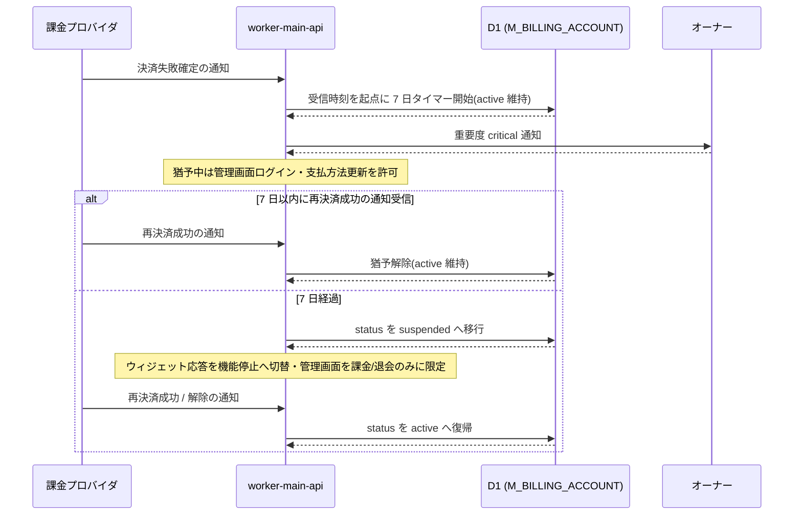
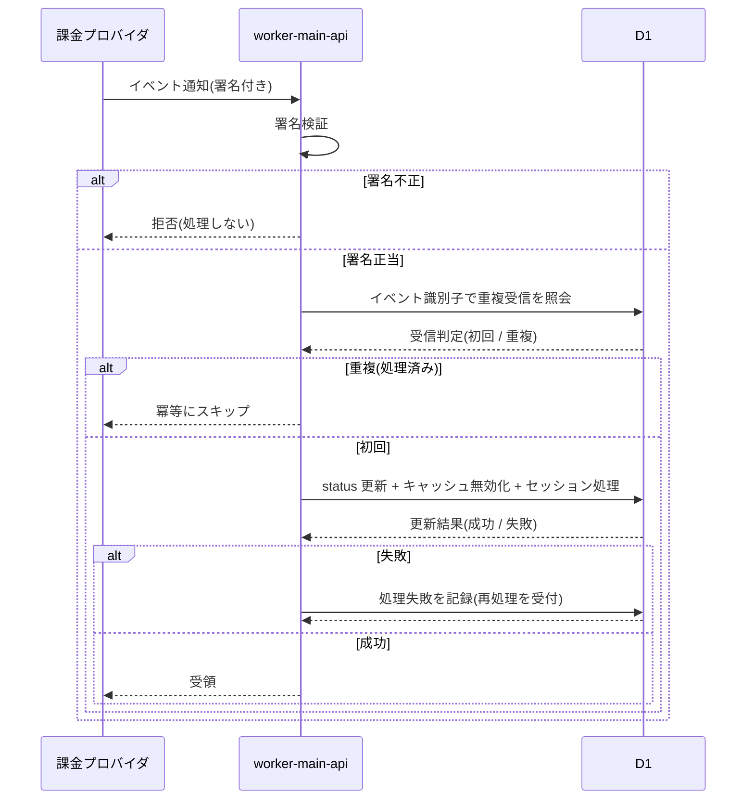

# 課金・請求設計書

> **このページは、メインシステムの課金ロジック・課金アカウント状態遷移・利用量集計方針・課金プロバイダ Webhook 受信方針を定義します。**

## 1. 課金モデルと判定単位

メインシステムは完全従量課金 + 月次無料枠の単一モデルを全アカウントに適用する。無料枠・月次上限は**プロジェクト単位**、レート制限は**オーナー単位**で判定し、計測はプロジェクト単位・請求集計はオーナー単位(課金アカウント単位)とする。階層プランは MVP では持たない。

| 観点 | 方針 | 判定 / 集計単位 |
|----|----|----|
| 課金モデル | 完全従量課金 + 月次無料枠(無料トライアルなし) | — |
| 月次境界 | JST 暦月。無料枠は毎月 1 日 00:00 JST にリセット(BR-059) | — |
| 無料枠 / 月次上限件数 | 質問数:無料枠 **1,000 件 / 月**・超過単価 0.5 円 / 件。FAQ 件数:無料枠 **100 件**・超過単価 5 円 / 件 / 月。プロジェクト単位で [`M_PRJ_QUOTA_LIMITS`](02_backend/04_database/TBL-009.md) に保持。 | プロジェクト |
| レート制限(DDoS / Bot / 暴走対策) | `M_OWNER_QUOTA_OVR` で保持([TBL-008](02_backend/04_database/TBL-008.md) 正本)。上限件数・無料枠とは別軸 | オーナー |
| 利用量計測 / 請求集計 | `T_USAGE_METER` をプロジェクト単位で計測し、オーナー単位で集計して請求([TBL-020](02_backend/04_database/TBL-020.md) 正本) | 計測=プロジェクト / 請求=オーナー |

> [!NOTE]
> **テーブル定義は 03 が正本** `T_BILL_SUBS` / `T_BILL_INVOICES` / `T_USAGE_METER` / `M_OWNER_QUOTA_OVR` / `M_PRJ_QUOTA_LIMITS` のカラム・制約・コード値は [データベース設計 §2 テーブル一覧](02_backend/04_database/index.md)(各テーブルファイル)を正本とする。本ページは判定ロジックと状態遷移のみを扱う。

### 1.1 課金対象と無料枠初期値

課金対象は質問数・FAQ 件数・AI 利用コストの 3 種。質問数のみが月次上限件数による停止対象で、FAQ 件数は上限なしで従量課金を継続する。AI 利用コストは MVP ではサービス側が吸収する社内可視化指標とする。無料枠・超過単価の MVP 初期値は **質問数:1,000 件 / 月・0.5 円 / 件**、**FAQ 件数:100 件・5 円 / 件 / 月**(AI コストはサービス側が吸収)。正本は FR09 BR-059。

| 課金対象 | 無料枠 / 超過単価 | 計測単位 | 計測タイミング | 失敗時の扱い | 上限件数判定 |
|----|----|----|----|----|----|
| 質問数 | **1,000 件 / 月** / 0.5 円・件 | ウィジェット利用者が「送信」した 1 リクエスト | リクエスト到達時(同期。質問応答 API が同期トランザクション内で `T_USAGE_METER.question_count` を加算・質問ログ ID で冪等) | AI 推論失敗(`ai_unavailable`)時も総質問数にはカウントするが `T_USAGE_METER.unbillable_question_count` に別計上し課金対象外として区別 | 対象(月次上限件数・100% 停止) |
| FAQ 件数 | **100 件** / 5 円・件・月 | 公開状態の FAQ 件数(下書き・非公開・削除除外) | 月末 23:59:59 JST スナップショット | — | 対象外(上限なし・従量課金のみ継続) |
| AI 利用コスト(原価) | — / MVP 吸収 | 推論呼び出しのトークン換算(社内可視化用) | 呼び出し成功時のみ | 失敗は計測のみ・課金対象外。再試行は最初の 1 回のみ計測 | 対象外(オーナー単位の社内指標) |

> [!IMPORTANT]
> **無料枠と上限件数は別の境界** 無料枠は課金が始まる**課金境界**、月次上限件数は質問数の**受付停止境界**である。FAQ 件数は無料枠を超えても受付を止めず、超過分を従量課金する。無料枠・超過単価の初期値は **質問数:無料枠 1,000 件 / 月・超過 0.5 円 / 件**、**FAQ 件数:無料枠 100 件・超過 5 円 / 件 / 月**(AI コストは MVP 吸収)。正本は FR09 BR-059。

### 1.2 上限・無料枠設定の優先順位

プロジェクトの質問数上限・アラートはオーナー / 当該プロジェクトのメンバーが設定する。優先順位はプロジェクト設定 \> デフォルト推奨値とする。メンバー(SCR-026 / SCR-027)が触れるのは質問数の上限とアラートだけで、無料枠はオーナー / 当該プロジェクトのメンバーが設定する。

| 設定対象 | 設定主体 | 優先順位 | 主管画面 |
|----|----|----|----|
| 質問数の月次上限件数・アラート閾値 | オーナー / 当該プロジェクトのメンバー | プロジェクト設定 \> デフォルト推奨値 | [SCR-026 / SCR-027](01_frontend/01_screens/SCR-027.md) |
| 課金対象別の無料枠 | オーナー / 当該プロジェクトのメンバー | プロジェクト設定 \> デフォルト値 | [SCR-026 / SCR-027](01_frontend/01_screens/SCR-027.md) |

質問数は月次上限件数を設定した場合を上限オン、設定しない場合を上限オフとして扱う。FAQ 件数は上限・アラートの対象とせず、メンバー向けの設定も提供しない。上限オフ時は利用率の算出・アラート・上限到達停止を行わない。

> **上限オンは支払方法登録が前提。** 月次上限の有効化(オン)は課金アカウントに支払方法が登録済み([API-045](02_backend/03_apis/API-045.md#API-045) の `registered=true`)であることを前提とする。支払方法未登録のまま上限を有効化する操作([API-047](02_backend/03_apis/API-047.md#API-047))は `PAYMENT_METHOD_REQUIRED`([ERR-038](05_errors/ERR-038.md#ERR-038))で拒否し、支払方法登録([SCR-028](01_frontend/01_screens/SCR-028.md#SCR-028))へ誘導する。支払方法未登録のプロジェクトは上限を持てず、無料枠超過時は支払方法ゲート(§4)で受付停止となる。この前提により、上限到達停止(`usage_limit_reached`・§2)と支払方法ゲート停止(`payment_required`・§4)は**同一プロジェクトで同時成立しない**(上限オン ⟹ 支払方法登録済み ⟹ 支払方法ゲートは発火しない)ため、両者の判定順序は不要である。

## 2. 質問数上限とウィジェット受付停止

プロジェクトの質問数上限がオンのとき(上限オンは支払方法登録済みを含意する。§1.2)、利用が上限件数の 100% に達した時点で当該プロジェクトのウィジェット新規質問受付を停止する。当該オーナーの課金アカウントは `active` のまま、ウィジェット利用者には安全な定型文を表示し送信を無効化する。125% は集計遅延・誤差対策の最終ガードとして追加通知する。

| 到達点(上限件数比) | システム動作 | 支払方法の有無 |
|----|----|----|
| 選択アラート閾値(25 / 50 / 80 / 90 / 100%) | 当月初回到達時にメンバー向けアラートメールを送信(§3) | 無関係 |
| **100%** | 当該プロジェクトのウィジェット新規質問受付を停止。ウィジェット利用者へプロジェクト連絡先メール誘導の定型文をチャット内システム返信として表示し、入力・送信を無効化。課金アカウントは `active` を維持 | 有無を問わず停止 |
| **125%** | 既に停止中。集計遅延・誤差の最終ガードとしてエスカレーション通知 | 無関係 |

復帰は次のいずれかで即時とする。

1.  翌月 1 日の月次リセット
2.  質問数上限の引き上げ(SCR-027)
3.  質問数上限のオフ

> [!NOTE]
> **支払方法ゲートとは別経路** 支払方法未登録のアカウントでプロジェクトが無料枠を超過した場合も同様にウィジェット受付を停止するが、これは上限件数 100% 停止ではなく支払方法ゲート(§4)による。両者ともウィジェット受付のみを止め、課金アカウントはサスペンションしない。

### 2.1 停止状態とウィジェット応答(横断一覧)

ウィジェットの新規質問受付が止まる状態は次の 3 経路。利用者・運用者が現象から原因を切り分けられるよう、契機・課金アカウント状態・ウィジェット応答・解除条件を一覧化する。各値の数値根拠は [システム仕様書 §2](07_system-spec.md#2-課金利用量上限)、状態定義は [状態モデル §2](08_state-model.md)、文言・HTTP の正本は対応 ERR / [ウィジェット質問送信 API](02_backend/03_apis/API-038.md#API-038) のエラー仕様。

| 停止状態 | 契機 | 課金アカウント状態 | ウィジェット新規質問の応答 | 解除条件 |
|----|----|----|----|----|
| 質問数 100% 停止(§2) | 当該プロジェクトの当月質問数が月次上限件数の 100% に到達 | `active` を維持 | 受付停止。チャット内に連絡先メール誘導の定型文をシステム返信として表示し送信を無効化(graceful。エラー応答にしない) | 翌月リセット / 上限引き上げ(SCR-027) / 上限オフ のいずれかで即時 |
| 支払方法ゲート停止(§4) | 支払方法未登録のまま当該プロジェクトが無料枠を超過 | `active` を維持(サスペンションしない) | 受付停止。チャット内に支払方法登録を促す定型文を表示し送信を無効化(graceful) | 支払方法登録(Setup Intent 成功)で即時 |
| サスペンション(§5・[ERR-004](05_errors/ERR-004.md#ERR-004)) | 決済失敗確定から猶予(7 日)経過 | `suspended` | 当該オーナーの全プロジェクトで機能停止の旨を示す応答([FR-097](../01_requirements/02_functional_requirement/03_usage-fr.md#FR-097)・`BILLING_ACCOUNT_SUSPENDED`) | 再決済成功 / 解除通知の受信で即時 `active` 復帰 |

> [!NOTE]
> **応答コードの正本** 質問数 100% 停止・支払方法ゲート停止は「受付停止」を示す graceful 応答(エラー応答にはしない)、サスペンションは [ERR-004](05_errors/ERR-004.md#ERR-004)。受付停止の応答は [API-038](02_backend/03_apis/API-038.md#API-038) の 200 `type=unanswered` で表し、質問数 100% 停止は `reason=usage_limit_reached`、支払方法ゲート停止は `reason=payment_required` を返す(ウィジェットは送信を無効化し定型文を表示)。サスペンションは `BILLING_ACCOUNT_SUSPENDED`([FR-097](../01_requirements/02_functional_requirement/03_usage-fr.md#FR-097))。レート制限(429)・許可ドメイン外(403)は引き続きエラー応答。

## 3. 上限アラート通知方針

プロジェクトごとに選択した質問数上限アラート閾値へ当月初回到達した時点で、宛先へメールを送信する。宛先はオーナー + 当該プロジェクトの有効メンバー(`M_PRJ_USERS.valid=1`)とし、同一メールアドレスは重複排除する。全閾値未選択時はアラート通知を行わない。

| 項目 | 方針 |
|----|----|
| 選択可能な閾値 | 25% / 50% / 80% / 90% / 100%(複数選択可) |
| 送信契機 | 選択した各閾値へ**当月初回到達した時のみ**(同一月の同一閾値で再送しない) |
| 宛先 | オーナー + 当該プロジェクトの有効メンバー。同一メールアドレスは重複排除 |
| 全閾値未選択時 | アラート通知なし。ただし 100% 到達によるウィジェット受付停止処理自体は行う |
| FAQ 件数 | アラート対象外 |

> [!NOTE]
> **通知契機・件名本文は別正本** 通知契機表(配信先・重要度)は [メッセージ設計](06_messages/index.md)、メール件名・本文テンプレート全文は [メッセージ設計](06_messages/index.md) を正本とする。本ページは送信条件と宛先解決ルールのみを扱う。

## 4. 支払方法ゲート

新規アカウントは支払方法未登録でも無料枠内を利用できる。いずれかのプロジェクトが無料枠 80% に到達したら事前告知し、支払方法未登録のまま無料枠を超過したら当該プロジェクトのウィジェット受付のみを停止する。課金アカウントはサスペンションせず管理画面は継続利用でき、支払方法登録で即時再開する。支払方法はユーザー(アカウント)単位で 1 件登録し、本人が作成した全プロジェクトの請求に用いる。

> [!NOTE]
> **支払方法ゲートの 80% はシステム固定であり、質問数上限のアラート閾値とは別物。** ここでの「無料枠 80%」は支払方法登録を促す事前告知の発火点としてシステムが固定保持する値で、利用者は変更できない。質問数上限に対してユーザーが選択する到達率アラート(`alert_thresholds` / [RULE-014](../01_requirements/01_business_requirement/08_rule.md#RULE-014))とは契機・対象・保持場所が異なり、同じ「80%」でも混同しないこと。

| 段階 | 契機 | システム動作 | 課金状態 |
|----|----|----|----|
| 事前告知 | いずれかのプロジェクトが無料枠 80% 到達 | 利用状況(SCR-021)・お知らせ・メールで支払方法登録が必要になる旨を告知 | `active` |
| 受付停止 | 支払方法未登録のまま無料枠を超過 | 当該プロジェクトのウィジェット新規質問受付のみを停止し、支払方法登録へ誘導。管理画面は全機能継続。オーナー + 当該プロジェクトのメンバーへ通知 | `active`(サスペンションしない) |
| 再開 | 支払方法登録(Setup Intent 成功) | 当該プロジェクトのウィジェット受付を即時再開。以降の無料枠超過分は事後課金 | `active` |

> [!WARNING]
> **支払方法ゲート ≠ サスペンション** 支払方法ゲートはウィジェット受付のみを止める措置で、課金アカウント `status` は `active` のままである。決済失敗起因のサスペンション(§5)とは別経路であり、混同しないこと。支払方法登録済のアカウントは全課金対象の無料枠超過分を事後課金とし、受付は止めない(質問数上限件数 100% 停止は別途適用)。

## 5. 課金アカウント状態ライフサイクル

`M_BILLING_ACCOUNT.status` は `active` / `suspended` / `withdrawn` / `deleted` の 4 値。状態定義そのものは [状態モデル §2](./08_state-model.md#2-課金アカウント状態) に従う。本ページは課金起因のサスペンション遷移と退会起因の削除遷移を記述する。決済失敗猶予と退会後の保持期間の具体値は [システム仕様書 §4](./07_system-spec.md#4-データ保持期間削除猶予) を正本とする。

| 状態 | 意味 | アカウント利用者の可否 | ウィジェット応答 |
|----|----|----|----|
| `active` | 有効 | 全機能 | 通常応答 |
| `suspended` | サスペンション中(決済失敗猶予経過 / 手動停止) | 課金・退会のみ | 当該オーナーのプロジェクトは機能停止の旨を示す応答(FR-097) |
| `withdrawn` | 退会済み(請求保持中) | ログイン可・請求情報の閲覧のみ | 停止 |
| `deleted` | 削除済み | × | 停止。`status='deleted'` を設定 |

> [!IMPORTANT]
> **status は `M_BILLING_ACCOUNT` 定義に従う** 4 値の定義・テーブル CHECK 制約は [`M_BILLING_ACCOUNT`](02_backend/04_database/TBL-002.md) および [データベース設計書](02_backend/04_database/index.md) を正本とする。本ページは課金 / 退会起因の遷移条件のみを扱う。アカウントの利用可否(ログイン等)は `M_USER` の状態に従う。

### 5.1 決済失敗からサスペンションへ(7 日猶予)

課金プロバイダから決済失敗確定の通知を受信した時刻を起点に 7 日間の猶予を計測する。次のシーケンス図は、猶予開始から猶予経過による `suspended` 移行までの流れと、猶予中 / サスペンション中いずれでも再決済成功・解除の通知受信で即時 `active` へ復帰する分岐を示す。猶予中も管理画面ログインと支払方法更新は可能である。

> [!WARNING]
> **決済失敗猶予と退会猶予は別概念** 決済失敗の猶予値は [システム仕様書 §4](./07_system-spec.md#4-データ保持期間削除猶予) を正本とし、即時退会(猶予なし)とは混同しない。サスペンション中は課金・退会のみ可で、それ以外の管理画面操作とウィジェット応答は停止する。サスペンション中の操作制限は [権限設計](04_permissions/index.md)、対応エラー ID は 各 API のエラー仕様 を正本とする。

### 5.2 退会から削除へ

本人が退会すると、猶予なく即時に `withdrawn` へ移行して、参加(メンバー)プロジェクトからは離脱し、自分が作成した(オーナー)プロジェクトを停止・削除する。運用データを速やかに削除する。アカウント・請求データは [システム仕様書 §4](./07_system-spec.md#4-データ保持期間削除猶予) に従って保持し、保持期間中は本人がログインして請求情報の閲覧のみ行える。保持期間経過後に物理削除バッチが `deleted` へ確定させ、以後はログイン不可とする。退会は本人専有操作とする。

| 遷移 | 契機 | 挙動 |
|----|----|----|
| `active` / `suspended` → `withdrawn` | 本人が退会(再認証を伴う) | 即時に参加プロジェクトから離脱・作成プロジェクトを停止しウィジェット応答を停止。運用データを速やかに削除し、アカウント・請求データは [システム仕様書 §4](./07_system-spec.md#4-データ保持期間削除猶予) に従って保持を開始(日割りなし) |
| `withdrawn`(保持期間中) | — | ログイン可・請求情報の閲覧のみ。再開・撤回はできない |
| `withdrawn` → `deleted` | 保持期間経過後の物理削除バッチ | `M_BILLING_ACCOUNT.status='deleted'` をセットし、課金アカウントは識別子の再利用防止(NFR-051)のため最小限のトムストーンとして残す。請求・利用者・認証の従属データは同一トランザクションで依存順に物理削除。以後ログイン不可 |

> [!IMPORTANT]
> **退会は即時・請求は正本の保持期間に従う** 退会は猶予なく即時成立(`withdrawn`)し、運用データを速やかに削除する。アカウント・請求データの保持期間は [システム仕様書 §4](./07_system-spec.md#4-データ保持期間削除猶予) を正本とし、保持期間経過後に [SYS-034](02_backend/01_system/SYS-034.md#SYS-034)(保持期間経過アカウントの物理削除)が `deleted` へ確定させる。退会撤回・退会猶予・退会発効日(当月末)・退会取消 URL は持たない。退会時の運用データ削除は [SYS-027](02_backend/01_system/SYS-027.md#SYS-027)、アカウント・請求データ物理削除は [SYS-034](02_backend/01_system/SYS-034.md#SYS-034) が担う。

## 6. 利用量集計方針

質問数の計測は**同期加算が正本**である。質問応答 API が同期トランザクション内で `T_USAGE_METER.question_count`(総質問数)を加算し(質問ログ ID で冪等)、推論失敗(`ai_unavailable`)分は同カラムに計上しつつ `T_USAGE_METER.unbillable_question_count`(推論失敗件数)へ別計上して課金対象外を保持する。閾値到達判定・受付停止・最終ガード契機・サマリ反映(SYS-016)は加算せず、同期加算済みの確定値を非同期で参照する。管理画面向けサマリは 5 分以内の遅延で反映する。月次集計はプロジェクト単位で行い、オーナー単位(課金アカウント単位)へ集約して請求する。無料枠消費・受付停止・請求の分母は**課金対象件数=`question_count` − `unbillable_question_count`**(推論失敗は無料枠を消費しない)とする([RULE-013](../01_requirements/01_business_requirement/08_rule.md#RULE-013))。

| 項目 | 方針 |
|----|----|
| 同期加算(正本) | 質問応答 API が同期トランザクション内で `T_USAGE_METER.question_count` を加算(質問ログ ID で冪等)。加算の正本はこの同期処理で、SYS-016 / 月次バッチは加算しない |
| リアルタイム参照・判定 | SYS-016 が同期加算済みの確定値を非同期で参照し、選択アラート閾値到達・100% 停止・125% 通知を判定。判定分母は課金対象件数(`question_count` − `unbillable_question_count`) |
| サマリ反映遅延 | 管理画面向け利用量サマリは 5 分以内に反映(FR-092) |
| 課金対象の区別 | 推論失敗(`ai_unavailable`)の質問は総質問数にカウントしつつ `T_USAGE_METER.unbillable_question_count` へ別計上して課金対象外として区別。AI 利用コストは成功時のみ計測 |
| 月次集計 → 請求 | 請求対象は課金対象件数(`question_count` − `unbillable_question_count`)。プロジェクト単位で月次集計し、オーナー単位で本人が作成した全プロジェクトの超過分を集約して請求書を作成(課金アカウント単位・オーナー宛 1 通、各プロジェクト内訳は明細)。同一月の二重集計は冪等にスキップ |
| サスペンション中 | 月次集計対象外(課金しない) |

## 7. 課金プロバイダ Webhook 受信方針

課金プロバイダからの通知(イベント)を受信する際は、送信元の正当性を検証し、重複処理を冪等に防止する。次のシーケンス図は、署名検証・冪等チェック・課金状態更新までの受信フローと、署名不正 / 重複イベント / 処理失敗の分岐を示す。続く表は、図に表れない受信履歴の保持期間やメイン側で扱う受信種別などのパラメータを補う。

| 項目 | 内容 |
|----|----|
| 受信履歴 | 直近の受信履歴（[システム仕様書 §4](./07_system-spec.md#4-データ保持期間削除猶予)）を保持する(RULE-017) |
| 再処理 | 処理失敗時は再処理を受け付ける |
| メイン側で扱う受信 | 課金状態の停止 / 解除イベント受信による課金アカウント `status` 更新 + キャッシュ無効化 + セッション処理 |

## 8. 請求画面(SCR-028)で確認できる内容

オーナーは請求画面で、支払方法・請求状態・請求履歴・自分が作成したプロジェクト全体の請求見込み・プロジェクト別の課金内訳・上限詳細を確認できる。画面項目・レイアウトは画面設計が正本で、本ページは確認できる情報の範囲を定義する。

- 支払方法(登録有無・更新導線。ユーザー(アカウント)単位)
- 請求状態(未請求 / 請求済 / 支払成功 / 支払失敗確定 等)と請求履歴
- 自分が作成したプロジェクト全体の当月請求見込み(全プロジェクトの超過分をオーナー単位=課金アカウント単位で集約・オーナー宛 1 通)
- プロジェクト別の課金内訳(課金対象別の利用量・超過分)
- プロジェクト単位の上限詳細(当月利用・上限件数・利用率)

> [!NOTE]
> **画面項目は 01 が正本** SCR-028 請求・SCR-026 利用量と上限・SCR-027 質問数上限設定モーダルの項目定義・バリデーションは [SCR-028 ほか](01_frontend/01_screens/SCR-028.md) を正本とする。課金・アカウント関連メッセージ文言は [メッセージ設計](06_messages/index.md) を正本とする。

## 更新履歴

| 版数 | 日付 | 変更内容 |
|----|----|----|
| v2.5 | 2026-07-01 | 質問数計上を「同期加算が正本」に統一。§1.1 計測タイミングに質問応答 API の同期加算(`T_USAGE_METER.question_count` 加算・質問ログ ID 冪等)を明記し、推論失敗(`ai_unavailable`)分を `T_USAGE_METER.unbillable_question_count` へ別計上する旨を追加。§6 利用量集計方針で SYS-016 / 月次バッチは加算せず確定値を非同期参照すること、無料枠消費・受付停止・請求の分母=課金対象件数(`question_count` − `unbillable_question_count`)であることを明記。 |
| v2.4 | 2026-06-26 | 立場のプロジェクト単位化を反映。契約(テナント/ロール境界)を廃止し、課金はユーザー単位の `M_BILLING_ACCOUNT`(課金アカウント)へ。§1 判定単位を「レート=オーナー単位」「請求集計=オーナー単位(課金アカウント単位)」へ、§4 支払方法ゲートの主語を「契約」→「アカウント」、支払方法はユーザー単位 1 件を明記。§5 を「課金アカウント状態ライフサイクル」へ改題し、§5.2 退会をアカウント単位へ。§6 月次集計をオーナー単位集約・オーナー宛 1 通(各PJ内訳は明細)へ。§8 請求画面を「自分が作成したプロジェクト全体」へ。 |
| v2.3 | 2026-06-25 | 退会フロー再設計(即時退会)を反映。§5 契約状態ライフサイクルの `status` 4 値を `active` / `suspended` / `withdrawn` / `deleted` へ更新(`deleted_pending` を廃止)。§5.2 を「退会から削除へ」へ全面改訂し、退会撤回・退会猶予・退会発効日(当月末)・退会取消 URL を全廃。退会は即時に `withdrawn` へ移行・運用データを速やかに削除、契約・請求は正本の保持期間に従い、保持期間経過で `deleted`・物理削除へ。§5.1 決済失敗サスペンションは変更なし。 |
| v2.2 | 2026-06-20 | ユーザー種別をオーナー/メンバーの2種へ統合(プロジェクト管理者を廃止)。上限・アラート・無料枠の設定主体「オーナー / 当該プロジェクト管理者」→「オーナー / 当該プロジェクトのメンバー」、設定可能ユーザーの記述「管理者ユーザー」→「メンバー」へ更新。支払方法ゲートの受付停止通知先・質問数上限アラート宛先「当該プロジェクトの有効な管理者(`role='admin' AND valid=1`)」→「当該プロジェクトの有効メンバー(`M_PRJ_USERS.valid=1`)」へ更新。 |
| v2.1 | 2026-06-17 | 設計書シンプルテンプレ v2 へ整合。処理・状態の流れを説明する節(§5.1 決済失敗→サスペンション、§7 課金プロバイダ Webhook 受信)を Mermaid シーケンス図化。図に表れないパラメータは正本参照へ寄せた。退会→削除の状態遷移(§5.2)・契約状態ライフサイクル(§5)は状態表のまま維持。 |
| v2.0 | 2026-06-17 | 要件 v2(FR09 / BR-059〜095)を根拠に全面改訂。記載スタイル標準(page-summary / doc-meta / section-lead / callout)へ移行。課金ロジック・状態遷移・集計方針・Webhook 方針に範囲を限定し、テーブル定義(03)・エラー ID(05)・通知契機(06)・メール本文(11)・画面項目(01)を各正本への相対パス \#ID リンクへ置換。退会猶予と決済失敗猶予を分離。実在しない参照先・MVP 対象外の階層プラン拡張余地・Stripe 等プロバイダ固有名・未決事項表を除去。 |
