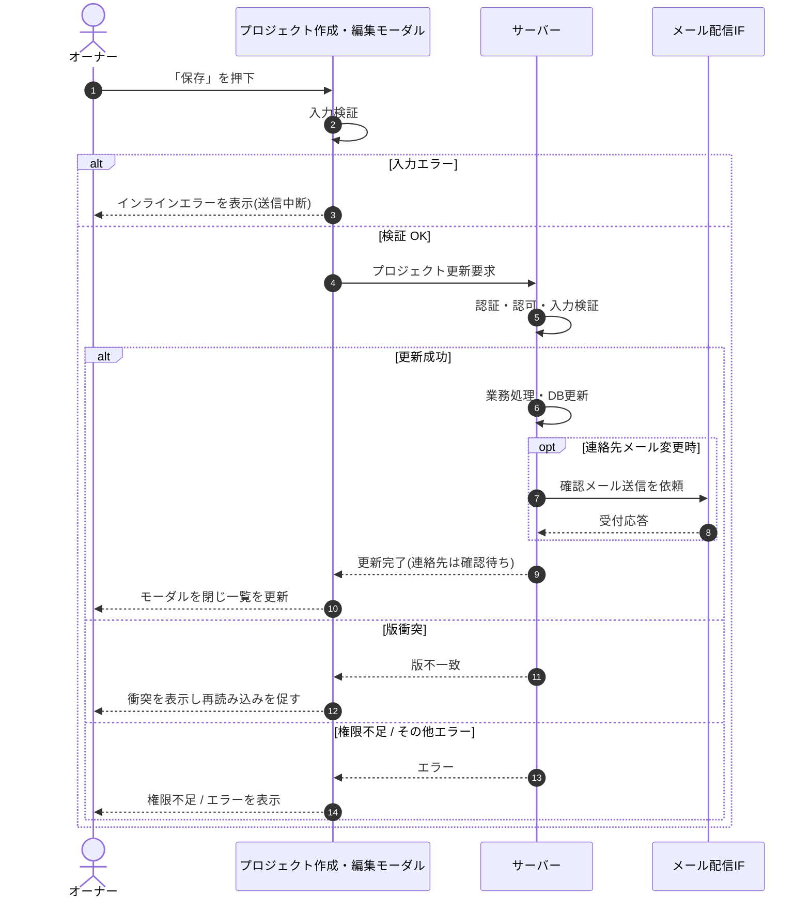

<!-- portal-top -->
[設計ポータル](../../README.md) ／ [基本設計](../index.md) ／ [シーケンス設計](index.md) ／ **SEQ-012: 「保存」を押下**
<!-- /portal-top -->

# SEQ-012: 「保存」を押下

> **このページは、業務ユースケース UC-039（「保存」を押下）のシーケンス図を定義します。**

*版数 v2.0 ・ 更新 2026-06-23 ・ ステータス ドラフト*

## 項目

| 項目 | 内容 |
|---|---|
| SEQ ID | `SEQ-012` |
| 対応業務ユースケース | [UC-039](../../01_requirements/04_business_usecases/UC-039.md#UC-039) |
| 業務要件 (BR) | 要確認 |
| 機能要件 (FR) | [FR-037](../../01_requirements/02_FunctionalRequirement/01_account-fr.md#FR-037) |
| 画面イベント (EVT) | [EVT-039](../02_screen_events/EVT-039.md#EVT-039) |
| 関連画面 | [SCR-005](../01_screens/SCR-005.md#SCR-005) |
| 関連 API | [API-018](../03_apis/API-018.md#API-018) |
| 関連テーブル | [TBL-004](../04_database/TBL-004.md#TBL-004) ・ [TBL-005](../04_database/TBL-005.md#TBL-005) |
| エラー (ERR) | [ERR-017](../07_errors/ERR-017.md#ERR-017) ・ [ERR-019](../07_errors/ERR-019.md#ERR-019) |
| メッセージ (MSG) | 要確認 |

## 概要

オーナーがプロジェクト作成・編集モーダルで「保存」を押下し、入力検証を経てプロジェクトを更新する。連絡先メール変更時は確認メールを自動送信して確認待ちにし、版衝突・権限なし時は更新せずエラーを表示する。

## シーケンス図

## 例外フロー

- 版衝突(楽観ロック): 他者が先に更新済みの場合は更新せず、衝突を表示して再読み込みを促す。
- 権限不足: オーナー以外による操作は拒否し、権限不足を表示する。
- その他エラー: 更新失敗時はモーダルを保持したままエラーを表示する。

## 詳細設計への移管候補

| 内容 | 移管先候補 | 理由 |
|---|---|---|
| 楽観ロックの版管理(版の添付・比較) | 詳細設計 | 基本設計では結果分岐のみ表し、版管理の具体機構は実装方式に依存するため。 |

## 備考

- 本図は基本設計レベルの抽象度(ユーザー / 画面 / サーバー、システム起点は外部システム・スケジューラ・バッチを加える)で記述する。DB 操作はサーバー自己メッセージで表し、テーブル別 CRUD は本図に書かず 関連テーブル 欄で示す。
- 図の出典は業務ユースケース [UC-039](../../01_requirements/04_business_usecases/UC-039.md#UC-039)。画面イベントとの対応は UC-039 を参照。

---

<!-- portal-bottom -->
[← シーケンス設計](index.md) ・ [基本設計](../index.md) ・ [↑ 設計ポータル](../../README.md)
<!-- /portal-bottom -->
