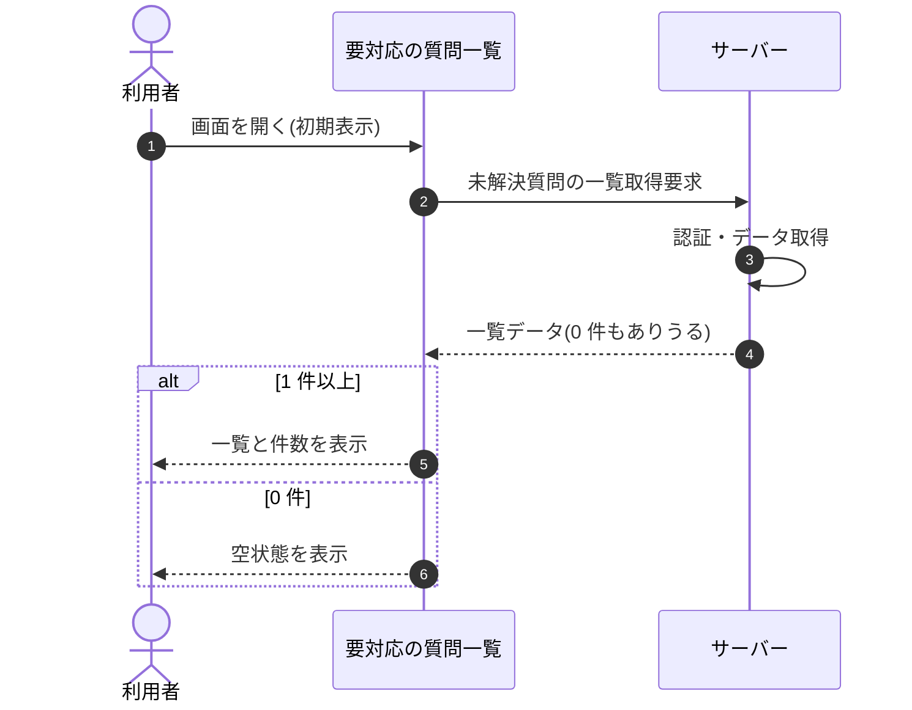

<!-- portal-top -->
[設計ポータル](../../README.md) ／ [基本設計](../index.md) ／ [シーケンス設計](index.md) ／ **SEQ-015: 初期表示**
<!-- /portal-top -->

# SEQ-015: 初期表示

> **このページは、業務ユースケース UC-046（初期表示）のシーケンス図を定義します。**

*版数 v2.0 ・ 更新 2026-06-23 ・ ステータス ドラフト*

## 項目

| 項目 | 内容 |
|---|---|
| SEQ ID | `SEQ-015` |
| 対応業務ユースケース | [UC-046](../../01_requirements/04_business_usecases/UC-046.md#UC-046) |
| 業務要件 (BR) | 要確認 |
| 機能要件 (FR) | [FR-068](../../01_requirements/02_FunctionalRequirement/02_faq-ai-fr.md#FR-068) ・ [FR-069](../../01_requirements/02_FunctionalRequirement/02_faq-ai-fr.md#FR-069) |
| 画面イベント (EVT) | [EVT-046](../02_screen_events/EVT-046.md#EVT-046) |
| 関連画面 | [SCR-006](../01_screens/SCR-006.md#SCR-006) |
| 関連 API | [API-034](../03_apis/API-034.md#API-034) |
| 関連テーブル | [TBL-017](../04_database/TBL-017.md#TBL-017) |
| エラー (ERR) | — |
| メッセージ (MSG) | 要確認 |

## 概要

利用者が要対応の質問一覧画面を開くと、サーバーが未解決質問を取得して返却する。1 件以上のとき一覧と件数を表示し、0 件のとき空状態を表示する。

## シーケンス図

## 備考

- 本図は基本設計レベルの抽象度(ユーザー / 画面 / サーバー、システム起点は外部システム・スケジューラ・バッチを加える)で記述する。DB 操作はサーバー自己メッセージで表し、テーブル別 CRUD は本図に書かず 関連テーブル 欄で示す。
- 図の出典は業務ユースケース [UC-046](../../01_requirements/04_business_usecases/UC-046.md#UC-046)。画面イベントとの対応は UC-046 を参照。

---

<!-- portal-bottom -->
[← シーケンス設計](index.md) ・ [基本設計](../index.md) ・ [↑ 設計ポータル](../../README.md)
<!-- /portal-bottom -->
