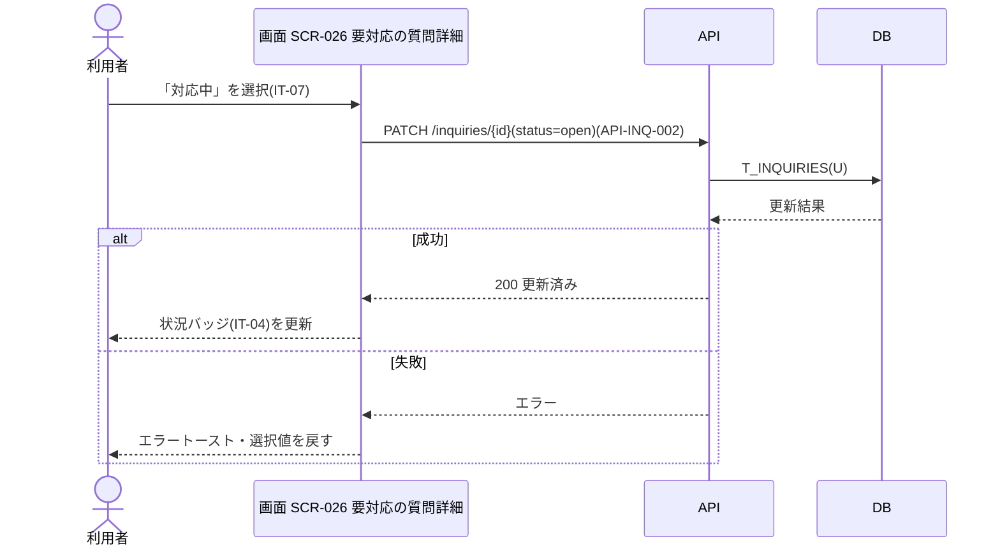

<!-- portal-top -->
[設計ポータル](../../README.md) ／ [基本設計](../index.md) ／ [シーケンス設計](index.md) ／ **SEQ-022: 「対応中」を選択**
<!-- /portal-top -->

# SEQ-022: 「対応中」を選択

> **このページは、業務ユースケース UC-056（「対応中」を選択）のシーケンス図を定義します。**

*版数 v1.0 ・ 更新 2026-06-21 ・ ステータス ドラフト*

## 項目

シーケンス図の対応ユースケースと、図に登場する画面・API・テーブルを示します。

| 項目 | 内容 |
|---|---|
| SEQ ID | `SEQ-022` |
| 対応業務ユースケース | [UC-056](../../01_requirements/02_business_usecases/UC-056.md#UC-056) |
| 関連画面 | [SCR-007](../01_screens/SCR-007.md#SCR-007) |
| 関連 API | [API-035](../03_apis/API-035.md#API-035) |
| 関連テーブル | [TBL-017](../04_database/TBL-017.md#TBL-017) |

## シーケンス図

## 備考

- 本図は基本設計レベルの抽象度（利用者 / 画面 / API / DB / 外部・バッチ・通知、`テーブル名(CRUD)` 表記）で記述する。
- 図の出典は業務ユースケース [UC-056](../../01_requirements/02_business_usecases/UC-056.md#UC-056)。画面イベントとの対応は UC-056 を参照。

---

<!-- portal-bottom -->
[← シーケンス設計](index.md) ・ [基本設計](../index.md) ・ [↑ 設計ポータル](../../README.md)
<!-- /portal-bottom -->
