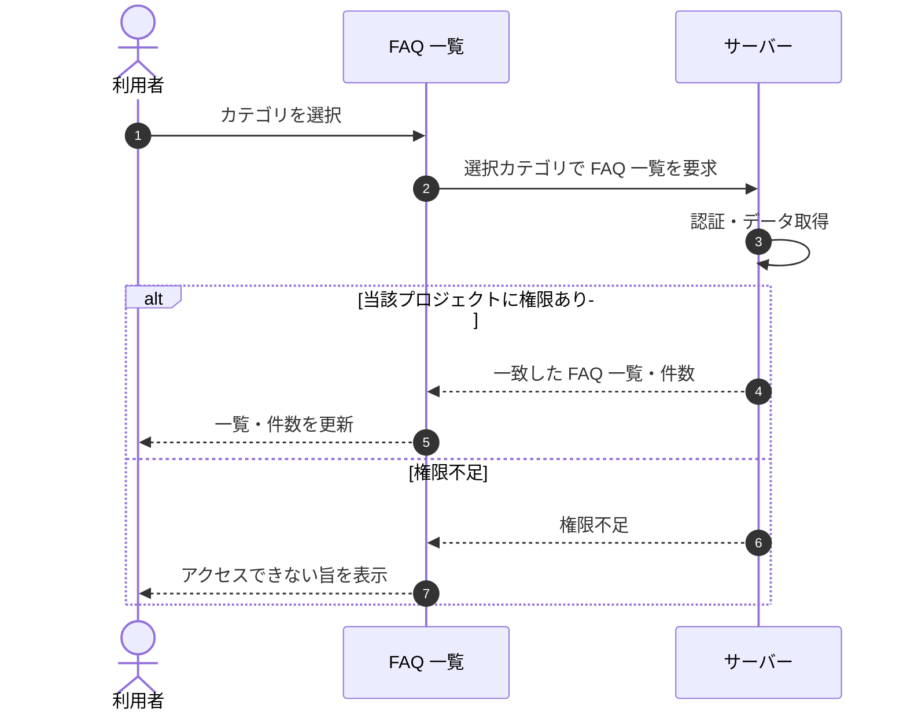

<!-- portal-top -->
[設計ポータル](../../README.md) ／ [基本設計](../index.md) ／ [シーケンス設計](index.md) ／ **SEQ-026: カテゴリを選択**
<!-- /portal-top -->

# SEQ-026: カテゴリを選択

> **このページは、業務ユースケース UC-064（カテゴリを選択）のシーケンス図を定義します。**

*版数 v2.0 ・ 更新 2026-06-23 ・ ステータス ドラフト*

## 項目

| 項目 | 内容 |
|---|---|
| SEQ ID | `SEQ-026` |
| 対応業務ユースケース | [UC-064](../../01_requirements/04_business_usecases/UC-064.md#UC-064) |
| 業務要件 (BR) | 要確認 |
| 機能要件 (FR) | [FR-169](../../01_requirements/02_FunctionalRequirement/04_widget-fr.md#FR-169) ・ [FR-173](../../01_requirements/02_FunctionalRequirement/03_usage-fr.md#FR-173) ・ [FR-174](../../01_requirements/02_FunctionalRequirement/03_usage-fr.md#FR-174) |
| 画面イベント (EVT) | [EVT-064](../02_screen_events/EVT-064.md#EVT-064) |
| 関連画面 | [SCR-008](../01_screens/SCR-008.md#SCR-008) |
| 関連 API | [API-025](../03_apis/API-025.md#API-025) |
| 関連テーブル | [TBL-006](../04_database/TBL-006.md#TBL-006) |
| エラー (ERR) | [ERR-021](../07_errors/ERR-021.md#ERR-021) |
| メッセージ (MSG) | 要確認 |

## 概要

FAQ 一覧画面でカテゴリを選択すると、選択したカテゴリを絞り込み条件としてサーバーへ一覧取得を要求し、一致する FAQ で一覧と件数を更新する。

## シーケンス図

## 例外フロー

- 当該プロジェクトへのアクセス権限がない場合は権限不足として扱い、一覧を更新せずエラーを表示する。

## 備考

- 本図は基本設計レベルの抽象度(ユーザー / 画面 / サーバー、システム起点は外部システム・スケジューラ・バッチを加える)で記述する。DB 操作はサーバー自己メッセージで表し、テーブル別 CRUD は本図に書かず 関連テーブル 欄で示す。
- 図の出典は業務ユースケース [UC-064](../../01_requirements/04_business_usecases/UC-064.md#UC-064)。画面イベントとの対応は UC-064 を参照。

---

<!-- portal-bottom -->
[← シーケンス設計](index.md) ・ [基本設計](../index.md) ・ [↑ 設計ポータル](../../README.md)
<!-- /portal-bottom -->
