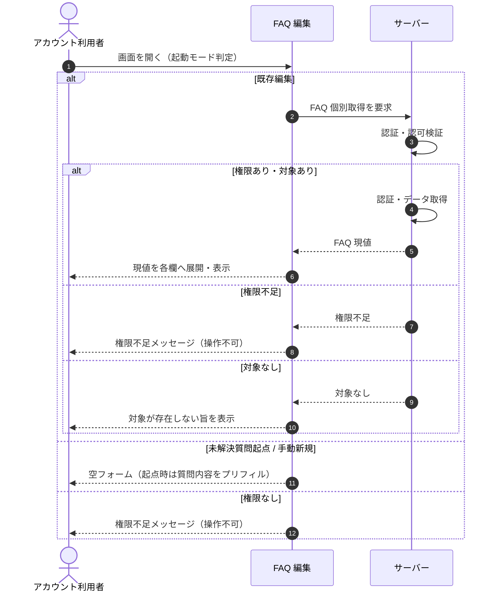

<!-- portal-top -->
[設計ポータル](../../README.md) ／ [基本設計](../index.md) ／ [シーケンス設計](index.md) ／ **SEQ-032: 初期表示**
<!-- /portal-top -->

# SEQ-032: 初期表示

> **このページは、業務ユースケース UC-076（初期表示）のシーケンス図を定義します。**

*版数 v2.0 ・ 更新 2026-06-23 ・ ステータス ドラフト*

## 項目

| 項目 | 内容 |
|---|---|
| SEQ ID | `SEQ-032` |
| 対応業務ユースケース | [UC-076](../../01_requirements/04_business_usecases/UC-076.md#UC-076) |
| 業務要件 (BR) | 要確認 |
| 機能要件 (FR) | [FR-047](../../01_requirements/02_FunctionalRequirement/02_faq-ai-fr.md#FR-047) ・ [FR-053](../../01_requirements/02_FunctionalRequirement/02_faq-ai-fr.md#FR-053) |
| 画面イベント (EVT) | [EVT-076](../02_screen_events/EVT-076.md#EVT-076) |
| 関連画面 | [SCR-009](../01_screens/SCR-009.md#SCR-009) |
| 関連 API | [API-033](../03_apis/API-033.md#API-033) |
| 関連テーブル | — |
| エラー (ERR) | [ERR-019](../07_errors/ERR-019.md#ERR-019) ・ [ERR-021](../07_errors/ERR-021.md#ERR-021) |
| メッセージ (MSG) | 要確認 |

## 概要

アカウント利用者が FAQ 編集画面を開いたとき、起動モード（既存編集 / 未解決質問起点 / 手動新規）に応じたフォームを表示する。既存編集では指定 FAQ の現値を取得して各欄へ展開し、権限がない場合は権限不足メッセージを表示して操作不可とする。

## シーケンス図

## 例外フロー

- 当該プロジェクトへの権限がない場合は、権限不足メッセージを表示して操作不可とする（[ERR-021](../07_errors/ERR-021.md#ERR-021)）。
- 指定した FAQ が存在しない / 論理削除済みの場合は、対象が存在しない旨を表示する（[ERR-019](../07_errors/ERR-019.md#ERR-019)）。

## 備考

- 本図は基本設計レベルの抽象度（ユーザー / 画面 / サーバー、システム起点は外部システム・スケジューラ・バッチを加える）で記述する。DB 操作はサーバー自己メッセージで表し、テーブル別 CRUD は本図に書かず 関連テーブル 欄で示す。
- 図の出典は業務ユースケース [UC-076](../../01_requirements/04_business_usecases/UC-076.md#UC-076)。画面イベントとの対応は UC-076 を参照。

---

<!-- portal-bottom -->
[← シーケンス設計](index.md) ・ [基本設計](../index.md) ・ [↑ 設計ポータル](../../README.md)
<!-- /portal-bottom -->
