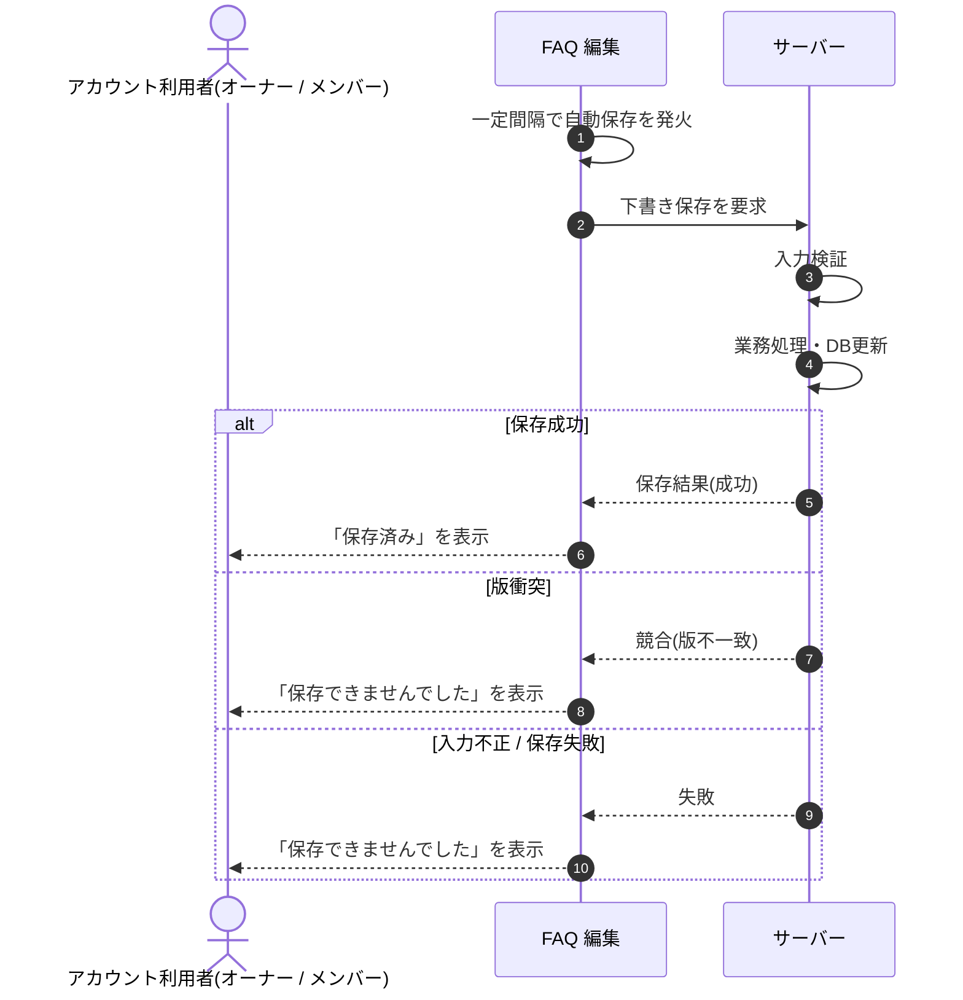

<!-- portal-top -->
[設計ポータル](../../README.md) ／ [基本設計](../index.md) ／ [シーケンス設計](index.md) ／ **SEQ-033: 自動保存**
<!-- /portal-top -->

# SEQ-033: 自動保存

> **このページは、業務ユースケース UC-081（自動保存）のシーケンス図を定義します。**

*版数 v2.0 ・ 更新 2026-06-23 ・ ステータス ドラフト*

## 項目

| 項目 | 内容 |
|---|---|
| SEQ ID | `SEQ-033` |
| 対応業務ユースケース | [UC-081](../../01_requirements/04_business_usecases/UC-081.md#UC-081) |
| 業務要件 (BR) | 要確認 |
| 機能要件 (FR) | [FR-053](../../01_requirements/02_FunctionalRequirement/02_faq-ai-fr.md#FR-053) ・ [FR-047](../../01_requirements/02_FunctionalRequirement/02_faq-ai-fr.md#FR-047) |
| 画面イベント (EVT) | [EVT-081](../02_screen_events/EVT-081.md#EVT-081) |
| 関連画面 | [SCR-009](../01_screens/SCR-009.md#SCR-009) |
| 関連 API | [API-026](../03_apis/API-026.md#API-026) |
| 関連テーブル | — |
| エラー (ERR) | [ERR-001](../07_errors/ERR-001.md#ERR-001) ・ [ERR-025](../07_errors/ERR-025.md#ERR-025) |
| メッセージ (MSG) | 要確認 |

## 概要

編集中の FAQ を自動保存タイマーが一定間隔で発火させ、下書きをサーバーへ保存する。成功時は自動保存インジケータが「保存済み」に、失敗時は「保存できませんでした」に更新される。

## シーケンス図

## 例外フロー

- 楽観ロックの版が一致しない場合は競合として保存を中断し、インジケータを「保存できませんでした」に更新する。
- 入力値が制約(質問・回答の文字数等)に違反する場合は保存せず、インジケータを「保存できませんでした」に更新する。

## 詳細設計への移管候補

| 内容 | 移管先候補 | 理由 |
|---|---|---|
| 自動保存タイマーの発火間隔と多重発火の抑止 | 詳細設計 | 基本設計では相互作用に限定し、間隔値・デバウンス制御は実装詳細のため。 |
| `version` による楽観ロックの版管理 | 詳細設計 | 版採番・比較・再取得手順は実装詳細のため。 |

## 備考

- 本図は基本設計レベルの抽象度(ユーザー / 画面 / サーバー、システム起点は外部システム・スケジューラ・バッチを加える)で記述する。DB 操作はサーバー自己メッセージで表し、テーブル別 CRUD は本図に書かず 関連テーブル 欄で示す。
- 図の出典は業務ユースケース [UC-081](../../01_requirements/04_business_usecases/UC-081.md#UC-081)。画面イベントとの対応は UC-081 を参照。

---

<!-- portal-bottom -->
[← シーケンス設計](index.md) ・ [基本設計](../index.md) ・ [↑ 設計ポータル](../../README.md)
<!-- /portal-bottom -->
