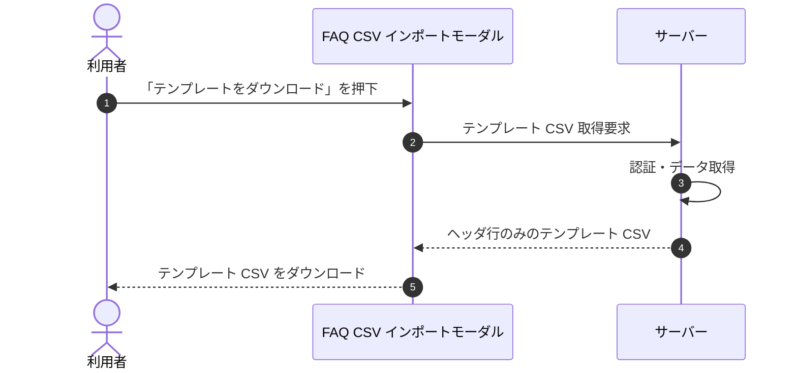

<!-- portal-top -->
[設計ポータル](../../README.md) ／ [基本設計](../index.md) ／ [シーケンス設計](index.md) ／ **SEQ-036: 「テンプレートをダウンロード」を押下**
<!-- /portal-top -->

# SEQ-036: 「テンプレートをダウンロード」を押下

> **このページは、業務ユースケース UC-091（「テンプレートをダウンロード」を押下）のシーケンス図を定義します。**

*版数 v2.0 ・ 更新 2026-06-23 ・ ステータス ドラフト*

## 項目

| 項目 | 内容 |
|---|---|
| SEQ ID | `SEQ-036` |
| 対応業務ユースケース | [UC-091](../../01_requirements/04_business_usecases/UC-091.md#UC-091) |
| 業務要件 (BR) | 要確認 |
| 機能要件 (FR) | [FR-169](../../01_requirements/02_FunctionalRequirement/04_widget-fr.md#FR-169) |
| 画面イベント (EVT) | [EVT-091](../02_screen_events/EVT-091.md#EVT-091) |
| 関連画面 | [SCR-010](../01_screens/SCR-010.md#SCR-010) |
| 関連 API | [API-029](../03_apis/API-029.md#API-029) |
| 関連テーブル | — |
| エラー (ERR) | — |
| メッセージ (MSG) | 要確認 |

## 概要

CSV インポートモーダルでテンプレートのダウンロードを押下し、ヘッダ行のみのテンプレート CSV をダウンロードする。

## シーケンス図

## 備考

- 本図は基本設計レベルの抽象度(ユーザー / 画面 / サーバー、システム起点は外部システム・スケジューラ・バッチを加える)で記述する。DB 操作はサーバー自己メッセージで表し、テーブル別 CRUD は本図に書かず 関連テーブル 欄で示す。
- 図の出典は業務ユースケース [UC-091](../../01_requirements/04_business_usecases/UC-091.md#UC-091)。画面イベントとの対応は UC-091 を参照。

---

<!-- portal-bottom -->
[← シーケンス設計](index.md) ・ [基本設計](../index.md) ・ [↑ 設計ポータル](../../README.md)
<!-- /portal-bottom -->
