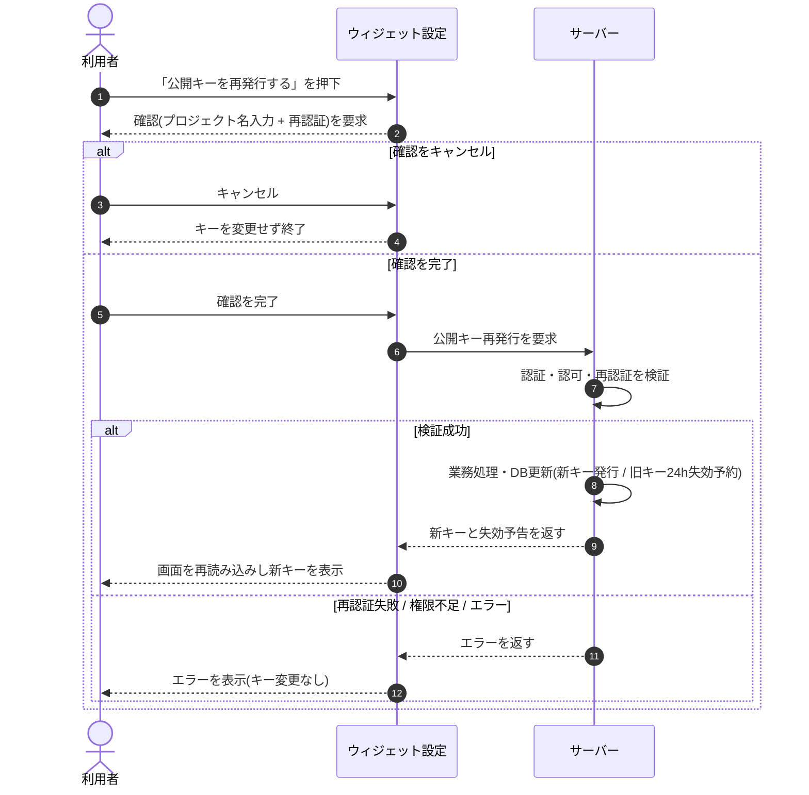

<!-- portal-top -->
[設計ポータル](../../README.md) ／ [基本設計](../index.md) ／ [シーケンス設計](index.md) ／ **SEQ-039: 「公開キーを再発行する」を押下**
<!-- /portal-top -->

# SEQ-039: 「公開キーを再発行する」を押下

> **このページは、業務ユースケース UC-041（「公開キーを再発行する」を押下）のシーケンス図を定義します。**

*版数 v2.0 ・ 更新 2026-06-23 ・ ステータス ドラフト*

## 項目

| 項目 | 内容 |
|---|---|
| SEQ ID | `SEQ-039` |
| 対応業務ユースケース | [UC-041](../../01_requirements/04_business_usecases/UC-041.md#UC-041) |
| 業務要件 (BR) | 要確認 |
| 機能要件 (FR) | [FR-040](../../01_requirements/02_FunctionalRequirement/01_account-fr.md#FR-040) |
| 画面イベント (EVT) | [EVT-104](../02_screen_events/EVT-104.md#EVT-104) |
| 関連画面 | [SCR-011](../01_screens/SCR-011.md#SCR-011) |
| 関連 API | [API-019](../03_apis/API-019.md#API-019) |
| 関連テーブル | [TBL-004](../04_database/TBL-004.md#TBL-004) ・ [TBL-015](../04_database/TBL-015.md#TBL-015) |
| エラー (ERR) | — |
| メッセージ (MSG) | 要確認 |

## 概要

オーナーがウィジェット設定画面で公開キーの再発行を要求し、強い本人確認の完了後に新しい公開キーを発行する。旧キーは 24 時間猶予で失効予告し、画面を再読み込みして新キーを表示する。確認キャンセル時・エラー時はキーを変更しない。

## シーケンス図

## 例外フロー

- 再認証に失敗した場合は公開キーを発行せず、画面はエラーを表示してキーを変更しない。
- オーナー以外（権限不足）の要求は拒否し、キーを変更しない。
- 発行処理がエラーで完了しなかった場合はキーを変更せず、画面はエラーを表示する。

## 備考

- 本図は基本設計レベルの抽象度(ユーザー / 画面 / サーバー、システム起点は外部システム・スケジューラ・バッチを加える)で記述する。DB 操作はサーバー自己メッセージで表し、テーブル別 CRUD は本図に書かず 関連テーブル 欄で示す。
- 図の出典は業務ユースケース [UC-041](../../01_requirements/04_business_usecases/UC-041.md#UC-041)。画面イベントとの対応は UC-041 を参照。

---

<!-- portal-bottom -->
[← シーケンス設計](index.md) ・ [基本設計](../index.md) ・ [↑ 設計ポータル](../../README.md)
<!-- /portal-bottom -->
