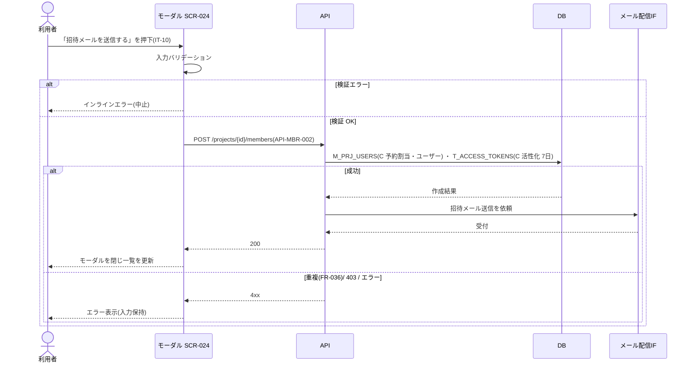

<!-- portal-top -->
[設計ポータル](../../README.md) ／ [基本設計](../index.md) ／ [シーケンス設計](index.md) ／ **SEQ-048: 「招待メールを送信する」を押下**
<!-- /portal-top -->

# SEQ-048: 「招待メールを送信する」を押下

> **このページは、業務ユースケース UC-126（「招待メールを送信する」を押下）のシーケンス図を定義します。**

*版数 v1.0 ・ 更新 2026-06-21 ・ ステータス ドラフト*

## 項目

シーケンス図の対応ユースケースと、図に登場する画面・API・テーブルを示します。

| 項目 | 内容 |
|---|---|
| SEQ ID | `SEQ-048` |
| 対応業務ユースケース | [UC-126](../../01_requirements/04_business_usecases/UC-126.md#UC-126) |
| 関連画面 | [SCR-014](../01_screens/SCR-014.md#SCR-014) |
| 関連 API | [API-021](../03_apis/API-021.md#API-021) |
| 関連テーブル | [TBL-003](../04_database/TBL-003.md#TBL-003) ・ [TBL-014](../04_database/TBL-014.md#TBL-014) |

## シーケンス図

## 備考

- 本図は基本設計レベルの抽象度（利用者 / 画面 / API / DB / 外部・バッチ・通知、`テーブル名(CRUD)` 表記）で記述する。
- 図の出典は業務ユースケース [UC-126](../../01_requirements/04_business_usecases/UC-126.md#UC-126)。画面イベントとの対応は UC-126 を参照。

---

<!-- portal-bottom -->
[← シーケンス設計](index.md) ・ [基本設計](../index.md) ・ [↑ 設計ポータル](../../README.md)
<!-- /portal-bottom -->
